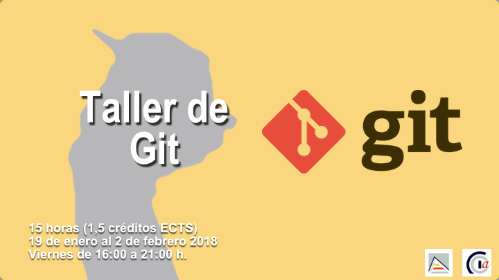
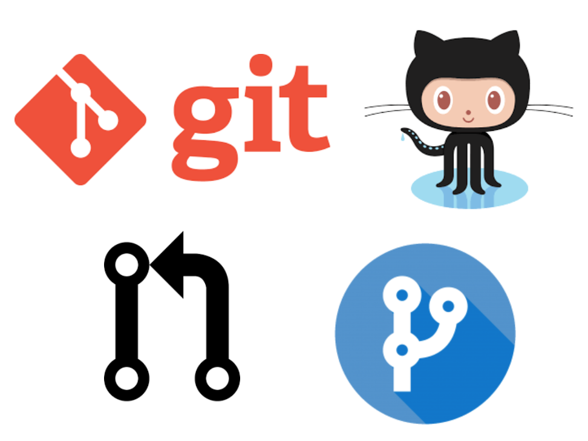
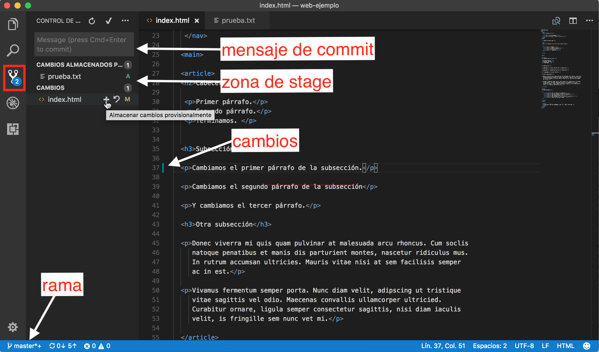

<br/><br/><p style="font-size:90%"><strong>@2018 Depto. de Ciencia de la Computación e I.A.</strong></p>

<!-- Tres líneas en blanco para la siguiente transparencia -->


## Acerca de quien os habla ##


<!-- Tres líneas en blanco para la siguiente transparencia -->


## Mi GitHub ##


<!-- Tres líneas en blanco para la siguiente transparencia -->


## ¿Qué aprenderemos en este curso? ##
<!-- .slide: class="image-right" -->


- Manejo de Git desde la línea de comando
- Soltura en el uso de comandos git
- Saber gestionar repositorios Git en GitHub
- Prácticas para el trabajo en equipo con Git
- Flujos de trabajo para el desarrollo de proyectos con Git
- Iniciación a alguna herramienta gráfica
- Iniciación a flujo de integración continua con GitHub

<!-- Tres líneas en blanco para la siguiente transparencia -->


## ¿Qué necesitamos? ##
<!-- .slide: class="image-right" -->


- Vamos a usar las siguientes herramientas:
   - Git
   - Terminal
   - Cuenta en GitHub
   - Editor: Microsoft Visual Studio Code
   - Herramienta de visualización de Git: Git Kraken
   - Navegador

- En los ordenadores de la EPS tenemos todas las herramientas
  instaladas.
- Todas las herramientas son compatibles con cualquier sistema
  operativo. También las puedes instalar en tu máquina Windows o Mac.

<!-- Tres líneas en blanco para la siguiente transparencia -->


## Planificación ##

- Cada día 5 horas divididas 2 sesiones de 2 h. y 15 m.

- Descanso aprox. 30 m. entre cada sesión

   - **Día 1**: Git para el desarrollo en solitario

   - **Día 2**: Git para el trabajo en equipo

   - **Día 3**: Flujos de trabajo e integración continua


<!-- Tres líneas en blanco para la siguiente transparencia -->


## ¿Cuál es vuestro interés en el curso?  ##


<!-- Tres líneas en blanco para la siguiente transparencia -->


## Índice sesión 1##

- Introducción
- Configuración de Git: instalación, configuración de cliente,
  servidor de git
- Configuración de GitHub: creación y configuración de cuenta
- Creación de repositorios
- Subida al repositorio remoto
- Trabajo en una rama

<!-- Tres líneas en blanco para la siguiente transparencia -->


## Comandos git a aprender en esta sesión##

```txt
$ git config
$ git init
$ git status
$ git add
$ git commit
$ git diff
$ git checkout
$ git tag
```

<!-- Tres líneas en blanco para la siguiente transparencia -->


## Empezamos con lo más básico ##
<!-- .slide: class="image-right" -->


- Un proyecto software se almacena en un conjunto de **ficheros de
  código** en una
  estructura de directorios. Esta estructura se denomina a veces
  **árbol de ficheros**.
- Dos de las características básicas de los **ficheros de código** (código
  fuente, código HTML, CSS, ...) son:
  - Son **ficheros de texto**, no son binarios: el contenido crudo del
    fichero se corresponde directamente con lo que vemos en el
    editor. Normalmente los caracteres están codificados en UTF-8 y no
    existen apenas caracteres de control (fines de línea y tabuladores
    a lo sumo).
  - Son ficheros que estamos **continuamente cambiando**. Conforme se
    desarrolla un proyecto, se añade código en los ficheros, se crean
    nuevos ficheros, se borra código, se reorganizan los directorios
    del proyecto cambiando de sitio los ficheros, etc.
- Gracias a ser ficheros de texto, los cambios entre una versión y
  otra de un fichero se pueden detectar y codificar fácilmente. Esta
  es la base de cualquier sistema de control de versiones.


<!-- Tres líneas en blanco para la siguiente transparencia -->


## Los ficheros cambian ##

- Fichero inicial `index.html`

```html
<!DOCTYPE html>
<html>
  <head>
    <meta charset="utf-8">
        <title>Mi título de página</title>
  </head>
  <body>
  </body>
</html>
```

- Lo cambiamos, añadiendo contenido:

```html
<!DOCTYPE html>
<html>
  <head>
    <meta charset="utf-8">
        <title>Mi título de página</title>
  </head>
  <body>
  <h1>Stark Corp</h1>
  <ul>
    <li><a href="#">Home</a></li>
    <li><a href="#">Nuestra misión</a></li>
    <li><a href="#">Proyectos</a></li>
    <li><a href="#">Contacto</a></li>
  </ul>
  </body>
</html>
```

<!-- Tres líneas en blanco para la siguiente transparencia -->


## Diferencia ##

- La diferencia entre la primera versión y la segunda son las líneas
  que se han añadido en el `body`:

```diff
<body>
+ <h1>Stark Corp</h1>
+ <ul>
+   <li><a href="#">Home</a></li>
+   <li><a href="#">Nuestra misión</a></li>
+   <li><a href="#">Proyectos</a></li>
+   <li><a href="#">Contacto</a></li>
+ </ul>
</body>
```

- El comando `diff` de UNIX/Linux permite comprobar las diferencias
  entre dos ficheros.
<!-- Tres líneas en blanco para la siguiente transparencia -->


## Comando diff ##

- Los comandos `diff` y `patch` son dos comandos creados en el sistema
  operativo UNIX en la década de los 70 que permiten comprobar cambios
  y aplicar cambios a ficheros.
  
- Por ejemplo, si la primera versión la tenemos en el fichero
  `index_2017_10_10.html` y la segunda en `index_actual.html`, el
  comando para obtener los cambios es:


```
$ diff index_2017_10_10.html index_actual.html > cambios.txt
```

- El fichero `cambios.txt`:

```diff
7a8,14
>   <h1>Stark Corp</h1>
>   <ul>
>     <li><a href="#">Home</a></li>
>     <li><a href="#">Nuestra misión</a></li>
>     <li><a href="#">Proyectos</a></li>
>     <li><a href="#">Contacto</a></li>
>   </ul>
```

<!-- Tres líneas en blanco para la siguiente transparencia -->


## Comando patch ##

- El comando anterior diff guarda la diferencia entre los dos ficheros en
  el fichero `cambios.txt`. 
- Podríamos ahora enviar este fichero a un compañero que tuviera la
  primera versión para que la actualice usando el comando `patch` para
  cambiar el fichero inicial y convertirlo en la segunda versión:
  
```
$ patch index.html cambios.txt
```

- Estos comandos son la base del funcionamiento de los sistemas de
  control de versiones, y en concreto de Git.

<!-- Tres líneas en blanco para la siguiente transparencia -->


## Control de versiones rudimentario ##
<!-- .slide: class="image-right" -->

- Una forma de realizar un control de versiones rudimentario de un
  proyecto es manteniendo múltiples versiones del directorio del
  proyecto.


- Vamos a trabajar en esta sesión con un proyecto muy sencillo: una
  simple página web formada por un fichero árbol de directorios
  básico. El directorio principal se llama `web-curso-git` y tiene un
  fichero `index.html` y otro directorio `imagenes` con el fichero
  `increibles.png`.
- La forma más rudimentaria de mantener distintas versiones conforme estamos
  elaborando la web es manteniendo múltiples copias del directorio


- Cuando decidimos fijar una versión del proyecto, le asignamos al
  directorio un nombre único y copiamos todo el directorio en otro
  nuevo en el que seguimos trabajando con la versión actual.

<!-- Tres líneas en blanco para la siguiente transparencia -->


<!-- .slide: data-background-image="imagenes/unacceptable.gif"  -->
<!-- Tres líneas en blanco para la siguiente transparencia -->


## Problemas del control de versiones rudimentario ##

- Esta forma rudimentaria se suele utilizar de forma _casera_, pero **no
  es mantenible ni escalable** en absoluto. 
- Algunos de sus problemas:
   - Obliga a un trabajo manual que genera fácilmente errores y
     que sólo permite guardar las versiones más significativas. ¿Qué
     pasa si queremos guardar como versiones distintas pequeños
     cambios en el proyecto? Por ejemplo el cambio que hemos visto en
     el que hemos añadido un contenido al `index.html`. El número de
     directorios que generaríamos sería inmanejable.
   - No proporciona una forma de probar más de una versión alternativa
     (ramas) y por tanto no permite gestionar a más de una persona
     cambiando el código del proyecto.
   - No hay una forma sencilla de comprobar los cambios que se han
     introducido de una versión a otra o entre dos versiones
     concretas.
   - No se soluciona el problema de tener un repositorio común para
     todos los desarrolladores que estén trabajando en el proyecto.


<!-- Tres líneas en blanco para la siguiente transparencia -->


## Control de versiones al rescate ##

- Un **sistema de control de versiones** (SCV) soluciona los problemas
  anteriores. Es un sistema que registra los **cambios** a lo largo
  del tiempo en un fichero o un conjunto de ficheros, de forma que es
  posible **recuperar** más tarde **versiones específicas**.
- Si eres un desarrollador trabajando en un equipo desarrollando
  conjuntamente un proyecto software, el sistema de control de
  versiones te va a permitir cosas como:
   - **Revertir** un conjunto de ficheros a un estado previo.
   - **Comparar cambios** a lo largo del tiempo.
   - **Consultar** quién ha sido el último que ha modificado algo en algún
     fichero que está causando problemas.
   - Desarrollar en **una rama** independiente del tronco principal e
     integrarla cuando el desarrollo esté terminado.
- Si usas un sistema de control de versiones es posible **recuperar
  un estado anterior estable** si has roto algo en los ficheros que
  estás tocando.


<!-- Tres líneas en blanco para la siguiente transparencia -->


## Un SCV es el elemento fundamental de prácticas de desarrollo más avanzadas  ##
<!-- .slide: class="image-right" -->


- Un sistema de control de versiones es la herramienta básica
  fundamental para el desarrollo de software en equipo.
- Cualquier sistema o metodología de **desarrollo en equipo** tiene como
  prerrequisito la utilización de un sistema de control de
  versiones.
- Ejemplos de utilización del SVC en el desarrollo de software:
   - **Distribución** de tareas entre miembros del equipo e **integración**
     posterior del código.
   - **Revisión de código**.
   - Sistema de **integración continua**, como el que se muestra en la imagen.
   - Mantenimiento de distintas versiones del producto desarrollado.
   - Compartir código con desarrolladores externos.

<!-- Tres líneas en blanco para la siguiente transparencia -->


## Historia de Git ##

<!-- .slide: class="image-right" -->


- Git nace para gestionar el desarrollo del kernel de Linux en 2005.
- La comunidad de Linux, y en especial su creador Linus Torvald, lo
  desarrolla en esa fecha para sustituir un software de control de
  versiones propietario que no cubría las necesidades del equipo.
- Entre los objetivos:
   - Velocidad
   - Diseño simple
   - Soporte para el desarrollo de miles de ramas simultáneas
   - Completamente distribuido
   - Capacidad de manejar proyectos grandes (en tamaño y tiempo) como el kernel de Linux
- Desde su nacimiento en 2005, Git ha evolucionado y madurado,
  convirtiéndose en un sistema increíblemente rápido, muy eficiente
  con proyectos grandes y con una enorme facilidad de gestionar
  cientos de ramas simultáneamente.

<!-- Tres líneas en blanco para la siguiente transparencia -->


## Instalación de Git ##

- Existen versiones de Git para Linux, macOs y Windows.
- La descarga e instalación en los distintos sistemas operativos es
  muy sencilla:
  - Instalación en Linux: [https://git-scm.com/download/linux](https://git-scm.com/download/linux)
  - Instalación en macOS: [https://git-scm.com/download/mac](https://git-scm.com/download/mac)
  - Instalación en Windows: [https://git-scm.com/download/win](https://git-scm.com/download/win)
- Trabajo con línea de comandos
  - Es fundamental aprender los conceptos de Git usando la línea de
    comandos. Después se podrá trasladar fácilmente estos conceptos a
    algún cliente gráfico que queramos usar.
  - En macOs o en Linux puedes usar el terminal. En Windows puedes
    usar PowerShell.
- Ya está instalado en Linux en los ordenadores del aula.

<!-- Tres líneas en blanco para la siguiente transparencia -->


## Comando "git config" ##
<!-- .slide: data-background="#cbe0fc"-->

- Una vez instalado Git, lo primero que debes hacer es configurar tu
  nombre de usuario y tu dirección de e-mail.
- Todos los commits (cambios confirmados) que hagas llevarán esta
  información.

```txt
$ git config --global user.name "Antonio Pérez"
$ git config --global user.email antonio.perez@gmail.com
```

- Puedes configurar muchos otros elementos, como el editor que se
  usará cuando Git necesite que introduzcas un texto:
  
```txt
$ git config --global core.editor nano
```

- Para comprobar los parámetros configurados:

```txt
$ git config --list
```

<!-- Tres líneas en blanco para la siguiente transparencia -->


## Repositorios y copias de trabajo ##
<!-- .slide: class="image-right" -->


- Un sistema de control de versiones usa un **repositorio** (una
  recopilación de todos los cambios) y una copia de trabajo (el
  directorio actual) donde haces tu trabajo.
- La copia de trabajo es tu copia personal de todos los ficheros del
  proyecto. Puedes realizar los cambios que desees en esta copia
  personal sin afectar a la historia. Cuando estás contento con el
  resultado, **confirmas** (_commit_ en inglés) los cambios en el
  repositorio y añades un commit a la historia.
- Es posible que el repositorio contenga cambios de compañeros que no
  se hayan aplicado a tu copia de trabajo. Puedes actualizar
  la copia de trabajo e incorporar los nuevos cambios que se han
  realizado en el repositorio desde la última vez que lo actualizaste.

<!-- Tres líneas en blanco para la siguiente transparencia -->


## Comando "git init" ##
<!-- .slide: data-background="#cbe0fc"-->

- El comando `git init` sirve para inicializar un repositorio de
  Git. Vamos a probarlo.
- Descarga el fichero ZIP `web-ejemplo.zip` de Moodle y descomprímelo
  en un directorio con el mismo nombre. Hazlo,
  por ejemplo, en el escritorio.
- El directorio tiene la siguiente estructura de ficheros

```txt
- web-ejemplo:
   - .gitignore
   - css:
      - layout.css
   - imagenes:
      - increibles.png
   - index.html
```

- Carga el fichero `index.html` en un navegador y observa el aspecto
  de la página. Es una página html cruda, sin ningún adorno. Vamos a
  ir añadiendo elementos CSS y guardando los cambios en el repositorio
  Git.

- Muévete al directorio e inicializa Git con el comando `git init`.

```txt
$ cd web-ejemplo
$ git init
```

<!-- Tres líneas en blanco para la siguiente transparencia -->


## El fichero .gitginore ##

- El fichero `.gitignore` incluye los patrones de los ficheros y
  directorios que no queremos que sean incluidos en el repositorio
  (ficheros que no son código fuente: compilados, librerías, ficheros
  temporales, etc.). 

```
.DS_Store
```

- En nuestro caso se ha incluido en él el patrón
  `.DS_Store` para que no guarde en Git los ficheros ocultos que usa
  macOS. 
- GitHub mantiene una lista de ejemplos de ficheros .gitignore
  para distintos lenguajes de programación: [https://github.com/github/gitignore](https://github.com/github/gitignore)
- Ejemplo para Java:

```
# Compiled class file
*.class

# Log file
*.log

# Package Files #
*.jar
*.war
*.ear
*.zip
*.tar.gz
*.rar
```

<!-- Tres líneas en blanco para la siguiente transparencia -->


## Directorio oculto .git ##
<!-- .slide: data-background="#cbe0fc"-->


- Se habrá creado un directorio oculto `.git` en el que se guardará la
base de datos con de todos los cambios, así como distintos elementos de
la configuración de Git:

```txt
$ ls -la

drwxr-xr-x  10 domingo  staff    320 30 oct 17:36 .git
-rw-r--r--   1 domingo  staff     10 30 oct 17:35 .gitignore
drwxr-xr-x   3 domingo  staff     96 26 oct 13:52 css
drwxr-xr-x   4 domingo  staff    128 26 oct 13:37 imagenes
-rw-r--r--   1 domingo  staff   2501 30 oct 17:33 index.html

$ cd .git
$ ls -la 

-rw-r--r--   1 domingo  staff   23 30 oct 17:36 HEAD
drwxr-xr-x   2 domingo  staff   64 30 oct 17:36 branches
-rw-r--r--   1 domingo  staff  137 30 oct 17:36 config
-rw-r--r--   1 domingo  staff   73 30 oct 17:36 description
drwxr-xr-x  12 domingo  staff  384 30 oct 17:36 hooks
drwxr-xr-x   3 domingo  staff   96 30 oct 17:36 info
drwxr-xr-x   4 domingo  staff  128 30 oct 17:36 objects
drwxr-xr-x   4 domingo  staff  128 30 oct 17:36 refs
```

- En este directorio se guardará el repositorio con todo el histórico
  de cambios cambios. No vamos a estudiarlo, pero es importante que
  conozcas que existe.

<!-- Tres líneas en blanco para la siguiente transparencia -->


## Comando "git status" ##
<!-- .slide: data-background="#cbe0fc"-->

- Vamos a usar muchas veces el comando `git status`:

```txt
$ git status
```

- El comando explica de forma concisa el estado del repositorio:


<!-- Tres líneas en blanco para la siguiente transparencia -->


## Comando "git add" ##
<!-- .slide: data-background="#cbe0fc"-->

- Definimos la versión inicial añadiendo ficheros al
  repositorio, realizando el primer commit.
- El comando `git add` selecciona los ficheros a incorporar en el commit.
- Vamos a añadir el fichero `index.html` y el directorio
  `css`. Dejamos el directorio de imágenes para un commit posterior.

```txt
$ git add index.html
$ git add css
$ git add .gitignore
$ git status
```


<!-- Tres líneas en blanco para la siguiente transparencia -->


## Comando "git commit" ##
<!-- .slide: data-background="#cbe0fc"-->

```txt
$ git commit -m "Primera versión del proyecto"

[master (root-commit) 2442726] Primera versión del proyecto
 3 files changed, 66 insertions(+)
 create mode 100644 .gitignore
 create mode 100644 css/layout.css
 create mode 100644 index.html
``` 

- El parámetro `-m` indica que la cadena que hay a continuación es el
  mensaje del commit.
- Todo commit debe tener un comentario en el que
  se indica el objetivo de los cambios introducido.
- Si no se usa el parámetro `-m` se abrirá el editor por defecto en el
  que se deberá introducir el mensaje.
- Es recomendable que la longitud no sea mayor de 72 caracteres.

<!-- Tres líneas en blanco para la siguiente transparencia -->


<!-- .slide: data-background-image="imagenes/happy.gif"  -->
<!-- Tres líneas en blanco para la siguiente transparencia -->


## Comando "git log" ##
<!-- .slide: data-background="#cbe0fc"-->

- Si usamos el comando `git log` veremos los cambios añadidos en el repositorio.

```txt
$ git log

commit e88ee6540c8f264e5ff735bd291c6bf9d2935039 (HEAD -> master)
Author: Domingo Gallardo <domingo.gallardo@ua.es>
Date:   Thu Nov 30 19:19:36 2017 +0100

    Primera versión del proyecto
```

- En la información podemos ver:
   - Identificador del commit
   - Autor del commit
   - Fecha de realización del commit
   - Comentario introducido en el commit
- Lo ampliaremos más adelante 

<!-- Tres líneas en blanco para la siguiente transparencia -->


## Sistemas de control de versiones distribuidos ##
 
<!-- .slide: class="image-right" -->


-  La solución usada por sistemas modernos como Git y
  Mercurial, son los sistemas de control de versiones **distribuidos**. 
- <!-- .element: class="fragment" --> Cada desarrollador tiene su propio repositorio y su copia de
  trabajo. 
- <!-- .element: class="fragment"--> Después de hacer un commit de tus cambios, los demás no tienen
  acceso a ellos hasta que los subes (_push_) al repositorio remoto
  central. 
- <!-- .element: class="fragment" --> Para obtener los cambios del repositorio central hay que bajarlos
  (_fetch_) al repositorio local y actualizar la copia de trabajo.
- <!-- .element: class="fragment" --> El ciclo de trabajo básico es:
   - Haces uno o varios commits de tus cambios en tu repositorio
     local.
   - Cuando quieres que los compañeros vean todos los cambios haces un
     push al repositorio central.
   - Los compañeros hacen un _fetch_ para actualizar su repositorio
     local.
   - Después actualizan su copia de trabajo.
- <!-- .element: class="fragment" --> Hacer notar que la confirmación y actualización sólo mueven los
  cambios entre la copia de trabajo y el repositorio local. Y al
  contrario, `push` y `fetch` suben y bajan cambios del repositorio
  local al repositorio remoto. 

<!-- Tres líneas en blanco para la siguiente transparencia -->


## Sistemas de control de versiones centralizados ##
<!-- .slide: class="image-right" -->


- Frente a la solución más modernas de sistemas de control de
  versiones distribuidos, los sistemas de control de versiones más
  antiguos como Subversion, CVS o Perforce utilizan un enfoque 
  **centralizado**, en el que el repositorio no está en el propio
  directorio, sino que está centralizado en un ordenador externo.
- Cada usuario trabaja con su propia copia de trabajo pero hay un
  único repositorio central compartido.
- Tan pronto como realizas una confirmación (utilizaremos el término
  en inglés: un _commit_) los compañeros puede actualizar sus copias y
  ver tus cambios.
- Mucho menos flexibles que los SCV distribuidos, que ya se han
  impuesto como el estándar a seguir.

<!-- Tres líneas en blanco para la siguiente transparencia -->


## Repositorios remotos ##

<!-- .slide: class="image-right" -->


- Varias formas de crear el repositorio remoto:
   1. Servidor remoto en el que instalamos Git en modo servidor.
   2. Servicios como GitHub o Bitbucket.
   3. Servidor remoto en el que instalamos un servicio como GitLab.
- La forma más sencilla es la de utilizar GitHub o Bitbucket, y es por
  la que empezaremos.
- Las otras dos estrategias las veremos en la última sesión.

<!-- Tres líneas en blanco para la siguiente transparencia -->


## Alta en GitHub ##
<!-- .slide: data-background="#cbe0fc"-->
<!-- .slide: class="image-right" -->


- Vamos a crear el repositorio remoto en GitHub. En esta sesión vamos
  a trabajar solos, creando un repositorio remoto para cada uno. Más
  adelante trabajaremos en equipo.
- Crea una cuenta en [GitHub](https://github.com). La cuenta gratuita
  permite un número ilimitado de repositorios **públicos**. Para el
  curso será suficiente. Si necesitas repositorios privados, puedes
  usar la cuenta educativa que GitHub ofrece a la UA, poniendo como
  dirección de correo electrónico el correo `@alu.ua.es`.
- Crea un repositorio remoto con el nombre `curso-git-repo1`.

<!-- Tres líneas en blanco para la siguiente transparencia -->


## Comando "git push" ##
<!-- .slide: data-background="#cbe0fc"-->

- Para subir el repositorio local al remoto hay que realizar los comandos
  que indica la página de GitHub
  - El comando `git remote add origin URL` define la URL del
    repositorio remoto denominado `origin`. El nombre `origin` se usa
    por convención como el nombre del repositorio remoto principal (en
    git podemos definir más de un repositorio remoto).
  - El comando `git push -u origin master` sube al repositorio
    `origin` la rama `master` (la única que existe por ahora). La
    opción `-u` hace que `origin` sea el repositorio remoto por
    defecto de la rama. Las siguientes veces que hagamos `push` no
    tendremos que indicar `origin` (en terminología de Git: la rama
    local `master` está haciendo tracking de la rama remota master en `origin`).
  
```txt
$ git remote add origin https://github.com/domingogallardo/curso-git-repo1.git

$ git push -u origin master

Username for 'https://github.com': domingogallardo
Password for 'https://domingogallardo@github.com': 
Counting objects: 6, done.
Delta compression using up to 4 threads.
Compressing objects: 100% (4/4), done.
Writing objects: 100% (6/6), 47.11 KiB | 11.78 MiB/s, done.
Total 6 (delta 0), reused 0 (delta 0)
To https://github.com/domingogallardo/curso-git-repo1.git
 * [new branch]      master -> master
Branch master set up to track remote branch master from origin.
```


<!-- Tres líneas en blanco para la siguiente transparencia -->


## Repositorio subido a GitHub ##
<!-- .slide: data-background="#cbe0fc"-->


- Desde esta página podemos explorar el repositorio subido:
   - Listado de commits realizado
   - Contenido de cada commit (cambios)
   - Características del repositorio (veremos alguna más adelante)
   - Contenido del proyecto

<!-- Tres líneas en blanco para la siguiente transparencia -->


## Comprobamos el estado del repositorio y añadimos el directorio css ## 
<!-- .slide: data-background="#cbe0fc"-->

- Comprobamos el estado del repositorio otra vez con `git status` y
  añadimos el directorio `imagenes` con `git add`.

```txt
$ git status
```


```txt
$ git add imagenes
$ git status
```


- El comando `git add` no añade el fichero al repositorio, sino que lo
  deja preparado para que se añada en el siguiente commit.

<!-- Tres líneas en blanco para la siguiente transparencia -->


## Añadimos un segundo commit y lo subimos al repositorio remoto ##
<!-- .slide: data-background="#cbe0fc"-->

```txt
$ git commit -m "Añadido directorio imagenes"

[master a854b8d] Añadido directorio imagenes
 1 file changed, 0 insertions(+), 0 deletions(-)
 create mode 100644 imagenes/increibles.png

$ git push

Counting objects: 4, done.
Delta compression using up to 4 threads.
Compressing objects: 100% (2/2), done.
Writing objects: 100% (4/4), 369 bytes | 369.00 KiB/s, done.
Total 4 (delta 0), reused 0 (delta 0)
To https://github.com/domingogallardo/curso-git-repo1.git
   e88ee65..0038905  master -> master
```

- El comando `git commit` añade los cambios preparados por `add` al
  repositorio local.
- El comando `git push` sube el commit del repositorio local al remoto
  (GitHub). 
- Exploramos el repositorio remoto para comprobar que el segundo
  commit se ha subido correctamente.

<!-- Tres líneas en blanco para la siguiente transparencia -->


## Zona de trabajo, stage y repositorio ##
<!-- .slide: class="image-right" -->


- Podemos entender mejor el funcionamiento de los comandos `git add` y 
  `git commit` introduciendo el concepto de **zona de stage**.
- En Git no es obligatorio introducir todos los cambios en el
  siguiente commit, sino que es **conveniente seleccionar** los
  cambios que queremos introducir en el commit.
- El comando `git add` añade a la zona de stage los cambios que
  queremos incluir en el nuevo commit. 
- Además de usarlo para añadir nuevos ficheros que antes no
  estaban trackeados, también hay que usarlo incluir cambios que
  queremos que vayan en el siguiente commit.
- El comando `git commit` añade los cambios que están en la zona de
  stage al repositorio.

> El commit debe contener un **conjunto de cambios coherentes**, que
> se agrupan en una unidad lógica que se describe en el mensaje
> del commit.
>
> Un commit representa una nueva versión del proyecto.
>
> No se debe commitear ficheros con errores de compilación o que no
> pasen los tests unitarios.

<!-- Tres líneas en blanco para la siguiente transparencia -->


## Nuevo commit: márgenes en la página web##
<!-- .slide: data-background="#cbe0fc"-->

- Abre el editor Visual Studio Code y añade la carpeta de proyecto
  `web-ejemplo`.
- Añade en el fichero `css/layout.css` lo siguiente:

```css
body {
  width: 70%;
  margin: 0 auto;
}
```

- Comprueba que el cambio funciona correctamente recargando la página
  en el navegador.
- Si hacemos `git status` el terminal veremos lo siguiente:


<!-- Tres líneas en blanco para la siguiente transparencia -->


## Añadimos el cambio al stage ##
<!-- .slide: data-background="#cbe0fc"-->

- Hay ficheros cambiados, pero no hay cambios en el stage.
- Para añadir los cambios al stage podemos hacer cualquiera de los
  siguientes comandos:

   - Añadimos los cambios de los ficheros del directorio `css`:
   ```
   $ git add css 
   ```

   - Añadimos los cambios de todos los ficheros cuyo path empiece por `c`:
   ```txt
   $ git add c*
   ```

   - Añadimos todos los cambios existentes:
   
   ```txt
   $ git add .
   ```

<!-- Tres líneas en blanco para la siguiente transparencia -->


## Realizamos el commit ##
<!-- .slide: data-background="#cbe0fc"-->

- Si comprobamos el status:


- Vemos en verde los cambios que están en stage, que entrarían en el
  siguiente commit.
- Hacemos el commit:

```txt
$ git commit -m "Añadidos márgenes al documento"

[master 45b531a] Añadidos márgenes a la web
 1 file changed, 5 insertions(+)
```

<!-- Tres líneas en blanco para la siguiente transparencia -->


## No subimos todavía al repo remoto ##
<!-- .slide: data-background="#cbe0fc"-->

- Si hacemos `git status` veremos que se han añadido los cambios al
  repositorio:


- Nos informa que nuestra rama local está por delante (_ahead_) de la
  rama remota en origin (`origin/master`) por 1 commit. 
- No subimos los cambios por ahora; seguimos desarrollando el
  repositorio local.

<!-- Tres líneas en blanco para la siguiente transparencia -->


## Nuevo commit: cabecera de navegación ##
<!-- .slide: data-background="#cbe0fc"-->

- Añade en el `css` lo siguiente:

```css
nav {
  height: 100px;
  display: flex;
}

nav img {
   flex-basis: auto;
}

nav ul {
  padding: 0;
  list-style-type: none;
  flex: 2;
  display: flex;
}

nav li {
  display: inline;
  text-align: center;
  flex: 1;
}
```


<!-- Tres líneas en blanco para la siguiente transparencia -->


## Cambiamos el index.html ##
<!-- .slide: data-background="#cbe0fc"-->

- Carga el fichero `index.html` en Visual Studio Code y añade los siguientes cambios:

```diff
   <h1>Header</h1>
   
+  <nav>

   <ul>
     <li><a href="#">Home</a></li>
     <li><a href="#">Nuestro equipo</a></li>
     <li><a href="#">Projectos</a></li>
     <li><a href="#">Contacto</a></li>
   </ul>

+  </nav>
```

- Comprueba en el navegador que el cambio funciona correctamente.

<!-- Tres líneas en blanco para la siguiente transparencia -->


## Realizamos el commit ##
<!-- .slide: data-background="#cbe0fc"-->

- Si hacemos `git status` veremos la siguiente información:


- Hay ficheros modificados y los cambios no se han añadido en el
  stage.
- Para incluir los cambios en el stage hay que hacer `git add` o `git
  commit -a`. Este último comando realiza directamente el commit de
  todos los cambios existentes sin pasar por el _stage_.
- Hacemos esta vez la última sugerencia:

```txt
$ git commit -am "Añadimos cabecera de navegación"

[master 0e1ceb4] Añadimos cabecera de navegación
 2 files changed, 25 insertions(+)
```

<!-- Tres líneas en blanco para la siguiente transparencia -->


## Historia de commits ##
<!-- .slide: data-background="#cbe0fc"-->

- Para ver la historia de commits podemos hacer `git log` con el
  modificador `--oneline` (una línea):

```txt
$ git log --oneline 
```


- Podemos ver:
   - Identificador del commit
   - Ramas (`master` y `origin/master`)
   - HEAD (Indicador de en qué rama nos encontramos)
   - Una línea con la descripción de cada commit
   - La rama `origin/master` (la rama remota) está 2 commits detrás de
     la rama local.

- Examina GitHub para comprobar que se han subido los mismos commits

<!-- Tres líneas en blanco para la siguiente transparencia -->


## Subimos los dos últimos commits ##
<!-- .slide: data-background="#cbe0fc"-->

- Hacemos `git push` para publicar los dos commits en el repositorio
  remoto en GitHub. Como antes hemos hecho `-u` ahora ya no hace falta
  indicar el nombre de la rama remota:
  
```txt
$ git push

Counting objects: 9, done.
Delta compression using up to 4 threads.
Compressing objects: 100% (6/6), done.
Writing objects: 100% (9/9), 981 bytes | 327.00 KiB/s, done.
Total 9 (delta 1), reused 0 (delta 0)
remote: Resolving deltas: 100% (1/1), completed with 1 local object.
To https://github.com/domingogallardo/curso-git-repo1.git
   0038905..0e1ceb4  master -> master
```


<!-- Tres líneas en blanco para la siguiente transparencia -->


## Comandos "git diff" y "git checkout fichero(s)" ##
<!-- .slide: data-background="#cbe0fc"-->

- Supongamos que hemos escrito cambios en el espacio de trabajo y que
  estamos "perdidos". ¿Hay alguna forma de comprobar qué hemos hecho?
- Vamos a comprobarlo:
   - Cambia cosas al azar en los ficheros y graba los cambios en el
     editor.
   - Puedes comprobar qué has cambiado con:
   
   ```txt
   $ git status
   $ git diff
   ```
   
   - El comando `git diff` nos indica exactamente todos los cambios
     entre el anterior commit y el estado actual del espacio de
     trabajo.
   - Si queremos eliminar todos los cambios introducidos en el espacio
     de trabajo (y volver al estado del anterior commit) podemos
     hacer:
   
   ```txt
   $ git checkout .
   ```

<!-- Tres líneas en blanco para la siguiente transparencia -->


## Algunos comandos vistos hasta ahora ##


|Comando | Explicación |
|-------|--------------|
| `git init` | Inicializa el repositorio Git |
| `git status` | Muestra el estado de los cambios en el directorio de trabajo y el área stage |
| `git add <fichero(s)>` | Añade cambios al stage e incorpora (_traking_) ficheros nuevos también al stage |
| `git checkout <fichero(s)>` | Elimina los cambios del espacio de trabajo |
| `git commit -m` | Añade un commit con los cambios en el stage y la descripción definida en el mensaje |
| `git commit -am` | Añade todas las modificaciones directamente al commit, sin tener que hacer `add` |
| `git log --oneline` | Muestra la historia resumida de los commits añadidos al repositorio |
| `git push -u origin master`| Sube los commits realizados en la rama `master` al repositorio origin y conecta ambas ramas |
| `git push` | Sube los commits realizados en la rama actual |

<!-- Tres líneas en blanco para la siguiente transparencia -->


## Comandos y áreas de trabajo  ##


<!-- Tres líneas en blanco para la siguiente transparencia -->


<!-- .slide: data-background-image="imagenes/gafas-adventure.gif"  -->

<!-- Tres líneas en blanco para la siguiente transparencia -->


## Visualización de los cambios en Visual Studio Code##
<!-- .slide: data-background="#cbe0fc"-->
<!-- .slide: class="image-right" -->



- La mayoría de IDEs se integran con Git e informan del estado de los
  cambios de los ficheros. 

- Comprueba las distintas características de Visual Studio Code
  relacionadas con Git:
   - Zona de stage
   - Realización de commits
   - Push y pull
   - Visualización de cambios en el fichero
   - Cambio de rama


<!-- Tres líneas en blanco para la siguiente transparencia -->


## Terminal integrado ##
<!-- .slide: data-background="#cbe0fc"-->
<!-- .slide: class="image-right" -->


- Con la opción _Ver > Terminal integrado_ podemos abrir el terminal
  integrado.
- En el terminal podemos teclear todos los comandos de Git como hemos
  visto hasta ahora.
- El editor está pendiente de los cambios y actualiza su estado en
  función del estado del repositorio.


<!-- Tres líneas en blanco para la siguiente transparencia -->


## Movemos cambios entre el espacio de trabajo y stage ##
<!-- .slide: data-background="#cbe0fc"-->

- Utiliza los siguientes comandos para comprobar cómo mover los
  cambios entre el espacio de trabajo y el stage:
   - `git status`
   - `git add <fichero(s)>`
   - `git reset HEAD <fichero(s)>` 

- Añade un fichero nuevo `prueba.txt` al espacio de trabajo y prueba
  los comandos anteriores con él.

- Termina eliminando todos los cambios y recuperando el estado del
  último commit haciendo:
  
```txt
$ git checkout .
$ git clean -fd
```

<!-- Tres líneas en blanco para la siguiente transparencia -->


## Terminamos la versión inicial de la página web ##
<!-- .slide: data-background="#cbe0fc"-->
<!-- .slide: class="image-right" -->


- Completa una versión inicial de la web copiando los 3 commits
  adicionales que puedes encontrar en el repositorio
  [domingogallardo/curso-git-repo1](https://github.com/domingogallardo/curso-git-repo1).
- En cada paso, antes de hacer el commit, carga la página en el
  navegador y comprueba que todo está correcto.

<!-- Tres líneas en blanco para la siguiente transparencia -->


## Eliminar y renombrar ##

- Hay dos posibles formas de eliminar y renombrar ficheros en un
  repositorio:
  - Los eliminamos y renombramos con los comandos del sistema
    operativo y después hacemos un `git add` para incluir esos cambios
    en el stage.
  - Los eliminamos y renombramos con los comandos propios de git:
     - `git rm <fichero>` para eliminar un fichero (o un patrón)
     - `git mv <nombre-antiguo> <nuevo-nombre>` para renombrar un
       fichero del repositorio.

<!-- Tres líneas en blanco para la siguiente transparencia -->


## Probamos renombrar y eliminar (1) ##
<!-- .slide: data-background="#cbe0fc"-->

- Añadimos un fichero `prueba.txt` al repositorio mediante un commit.
- Modificamos su nombre usando el sistema operativo. Git no se da
  cuenta de que es un renombrado y lo ve como que hemos borrado un
  fichero y añadido otro:

```txt
# Añadimos prueba.txt al repositorio con un commit
$ mv prueba.txt nueva-prueba.txt
$ git status
Changes not staged for commit:
  (use "git add/rm <file>..." to update what will be committed)
  (use "git checkout -- <file>..." to discard changes in working directory)

        deleted:    prueba.txt

Untracked files:
  (use "git add <file>..." to include in what will be committed)

        nueva-prueba.txt
```

- Cuando añadimos todos los cambios al stage, Git ya se da cuenta de que
  habíamos renombrado el fichero:

```txt
$ git add .
$ git status
Changes to be committed:
  (use "git reset HEAD <file>..." to unstage)

        renamed:    prueba.txt -> nueva-prueba.txt
```


<!-- Tres líneas en blanco para la siguiente transparencia -->


## Probamos renombrar y eliminar (2) ##
<!-- .slide: data-background="#cbe0fc"-->

- Hacemos commit para incluir los cambios en el repositorio:

```txt
$ git commit -m "Cambiado nombre fichero"
[master 2cbc265] Cambiado nombre fichero
 1 file changed, 0 insertions(+), 0 deletions(-)
 rename prueba.txt => nueva-prueba.txt (100%)
```

- Por último eliminamos el fichero con el comando de Git `git rm`:

```txt
$ git rm nueva-prueba.txt
rm 'nueva-prueba.txt'
```

- El comando ya almacena el cambio en el stage:

```txt
$ git status
Changes to be committed:
  (use "git reset HEAD <file>..." to unstage)

        deleted:    nueva-prueba.txt

```

- Y confirmamos el borrado para eliminar el fichero del espacio de
  trabajo y del repositorio:
  
```txt
$ git commit -m "Borrado fichero"
[master ee1b1db] Borrado fichero
 1 file changed, 1 deletion(-)
 delete mode 100644 nueva-prueba.txt
 ```

<!-- Tres líneas en blanco para la siguiente transparencia -->


## Representación de la historia de commits ##


- En Git la historia de commits se suele representar como un grafo, en
  el que los nodos son los commits realizados y representan cambios
  que se añaden al proyecto.
- Cada commit tiene un identificador único (_hash_) construido a
  partir de los cambios que incluye.
- Cuando veamos las ramas veremos que hay nodos que tienen dos padres
  y que representan una unión de dos líneas de cambios del proyecto.

<!-- Tres líneas en blanco para la siguiente transparencia -->


## Movernos atrás en el tiempo con "git checkout" ##
<!-- .slide: data-background="#cbe0fc"-->

- El comando `git checkout commit` permite mover el espacio de
  trabajo a un commit determinado. Vamos a probarlo.
- Examina la historia de commits con `git log --oneline` y copia el
  identificador de uno de ellos.
- Ejecuta `git checkout`:

```txt
$ git checkout 0bf82cd
Note: checking out '0bf82cd'.

You are in 'detached HEAD' state. You can look around, make experimental
changes and commit them, and you can discard any commits you make in this
state without impacting any branches by performing another checkout.

If you want to create a new branch to retain commits you create, you may
do so (now or later) by using -b with the checkout command again. Example:

  git checkout -b <new-branch-name>

HEAD is now at 0bf82cd... Layout principal y margen
```

- Recarga la página en el navegador para comprobar que el espacio de
  trabajo contiene el commit seleccionado. En Visual Studio Code también deben
  haberse actualizado los ficheros.

<!-- Tres líneas en blanco para la siguiente transparencia -->


## El identificador HEAD ##
<!-- .slide: data-background="#cbe0fc"-->

- El identificador HEAD representa la posición del espacio de trabajo:
  
```txt
$ git log --all --oneline
e498cdc (origin/master, master) Últimos ajustes
77a127a Añadida tipografía y colores
0bf82cd (HEAD) Layout principal y margen
3fd14f1 Añadimos cabecera de navegación
59e0464 Añadidos márgenes al documento
5853e04 Añadido directorio imagenes
2442726 Primera versión del proyecto
```

<!-- Tres líneas en blanco para la siguiente transparencia -->


## Creamos nuevos commits en el pasado ##
<!-- .slide: data-background="#cbe0fc"-->

- Estando en un commit pasado, con un _HEAD detached_ (significa HEAD
  no está en la cabeza de ninguna rama) podemos mirar, hacer cambios,
  probar cosas y hacer commits con esos cambios. 
- Esos commits quedarán al margen de la rama principal.

```txt
# Cambiamos el fichero index.html
$ git commit -am "Cambiado el título"
$ git log --oneline --graph --all
* 9b4ef00 (HEAD) Cambiado el título
| * e498cdc (origin/master, master) Últimos ajustes
| * 77a127a Añadida tipografía y colores
|/ 
* 0bf82cd Layout principal y margen
* 3fd14f1 Añadimos cabecera de navegación
* 59e0464 Añadidos márgenes al documento
* 5853e04 Añadido directorio imagenes
* 2442726 Primera versión del proyecto
```

<!-- Tres líneas en blanco para la siguiente transparencia -->


## Grafo de commits ##


- La figura muestra el grafo de commits del proyecto hasta ahora.
- El espacio de trabajo se encuentra en HEAD, en el commit que
  acabamos de crear.
- Las ramas `master` y `origin/master` (rama remota) se siguen
  encontrando en el mismo sitio, el último commit de la rama principal.

<!-- Tres líneas en blanco para la siguiente transparencia -->


## Volvemos al presente ##
<!-- .slide: data-background="#cbe0fc"-->

- Podemos volver al presente haciendo un `git checkout master`.

```txt
$ git checkout master
Warning: you are leaving 1 commit behind, not connected to
any of your branches:

  9b4ef00 Cambiado el título

If you want to keep it by creating a new branch, this may be a good time
to do so with:

 git branch <new-branch-name> 9b4ef00

Switched to branch 'master'
Your branch is up-to-date with 'origin/master'.
```

- Git nos informa de que deberíamos crear una rama en el commit que
  hemos hecho si queremos conservarlo en la historia.
- Durante un tiempo podríamos acceder a este commit por su identificador.
- En siguiente sesión hablaremos de ramas.

<!-- Tres líneas en blanco para la siguiente transparencia -->


## Grafo de commits después de volver a master ##

- ¿Cuál sería el grafo de commits después de volver a master?

<!-- .element: class="fragment" --> 

<!-- Tres líneas en blanco para la siguiente transparencia -->


## Comando "git tag" ##
<!-- .slide: data-background="#cbe0fc"-->

- Una etiqueta (_tag_) no es más que un nombre con el que nos
  referimos a un commit concreto.
- Podemos añadir una anotación a la etiqueta con la opción `-a` y `-m`.
- Por ejemplo, etiquetamos el commit actual en el que nos encontramos:

```
$ git tag -a v0.1 -m "Mi versión 0.1"
```

- También podemos etiquetar commits pasados (esta vez no usamos `-a` y
  sólo definimos el nombre de la etiqueta)

```
$ git tag v0.0 5853e04
```

- El resultado en la historia de los commits:

```
$ git log --oneline
e498cdc (HEAD, tag: v0.1, origin/master, master) Últimos ajustes
77a127a Añadida tipografía y colores
0bf82cd Layout principal y margen
3fd14f1 Añadimos cabecera de navegación
59e0464 Añadidos márgenes al documento
5853e04 (tag: v0.0) Añadido directorio imagenes
2442726 Primera versión del proyecto
```
<!-- Tres líneas en blanco para la siguiente transparencia -->


## Subir los tags al repositorio remoto  ##
<!-- .slide: data-background="#cbe0fc"-->

- Para subir las etiquetas al repositorio hay que usar la opción
  `--tags` al hacer un push:

```
$ git push --tags
Counting objects: 1, done.
Writing objects: 100% (1/1), 173 bytes | 173.00 KiB/s, done.
Total 1 (delta 0), reused 0 (delta 0)
To https://github.com/domingogallardo/curso-git-repo1.git
 * [new tag]         v0.0 -> v0.0
 * [new tag]         v0.1 -> v0.1
```

<!-- Tres líneas en blanco para la siguiente transparencia -->


## Resumen de los últimos commandos ##

|Comando | Explicación |
|-------|--------------|
| `git checkout <commit>` | Mueve el espacio de trabajo (HEAD) al commit identificado |
| `git checkout master` | Mueve el espacio de trabajo a la cabeza de la rama `master` |
| `git tag -a <id> -m "<mensaje>"` | Añade la etiqueta y el mensaje al commit actual |
| `git tag <id>` | Añade la etiqueta (sin mensaje) al commit actual |
| `git tag <id> <commit>` | Añade la etiqueta a un commit |
| `git push --tags` | Sube las etiquetas añadidas al proyecto |

<!-- Tres líneas en blanco para la siguiente transparencia -->


<!-- .slide: data-background-image="imagenes/happy2.gif"  -->
