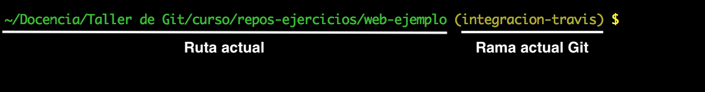

<br/><br/><p style="font-size:90%"><strong>@2018 Domingo Gallardo<br/>Depto. de Ciencia de la Computación e I.A.</strong></p>

<!-- Tres líneas en blanco para la siguiente transparencia -->


## Día 1: Git para el desarrollo en solitario ##

- Sesión 1
   - Introducción
   - Configuración de Git
   - Configuración de GitHub: creación y configuración de cuenta
   - Trabajo básico: add, commit, diff, checkout

- **Sesión 2**
   - Trabajo con el repositorio remoto
   - Cómo cambiar la historia
   - Ramas

<!-- Tres líneas en blanco para la siguiente transparencia -->


## Comandos git a aprender en esta sesión ##

```txt
$ git clone
$ git pull
$ git fetch
$ git amend
$ git reset
$ git revert
$ git branch
$ git checkout -b
$ git merge
$ git rebase
$ git cherry-pick
```

<!-- Tres líneas en blanco para la siguiente transparencia -->


## Repositorios remotos ##

<!-- .slide: class="image-right" -->


- La naturaleza distribuida de Git hace posible tener tantos
  repositorios remotos como queramos.
- Git permite darles un nombre lógico a cada uno de ellos. El nombre
  por defecto del primero de ellos es `origin`.
- Por ejemplo, supongamos que queremos publicar un proyecto open
  source. Podemos tener un repositorio remoto privado (sólo
  accesible por nosotros) en el que trabajamos hasta tener una nueva
  versión y un repositorio público al que subiremos los cambios cuando
  los hayamos comprobado bien en el repo privado.


<!-- Tres líneas en blanco para la siguiente transparencia -->


## Repositorios remotos en proyectos open source ##


- Normalmente el equipo de desarrollo tiene un único repositorio
  remoto sobre el que se trabaja, pero son posibles otras
  configuraciones.
- Cuando queremos aportar una **modificación a un proyecto open source**
  es habitual trabajar con dos repositorios remotos:
  - el del proyecto original (se suele llamar `upstream`) sobre el que
  no realizamos cambios directos.
  - nuestra copia particular obtenida con un _fork_, que es en la
    que realizamos las modificaciones (`origin`).
- Varios compañeros podemos trabajar añadiendo commits a nuestro
  repositorio.
- Cuando se ha terminado se solicita un _pull request_ al repositorio
  del proyecto original para incorporar nuestras aportaciones.
- Trabajaremos más adelante con los pull requests.

<!-- Tres líneas en blanco para la siguiente transparencia -->


## Comando "git clone" ##
<!-- .slide: data-background="#cbe0fc"-->
<!-- .slide: class="image-right" -->


- Vamos a practicar con los comandos de git para trabajar con repositorios
  remotos.
- Trabajaremos como indica la figura, con un repositorio remoto (el
  que ya tenemos) conectado a dos repositorios locales (uno de ellos
  ya lo tenemos también).
- Vamos a crear el otro. Nos movemos al directorio padre del
  directorio `web-ejemplo` y clonamos allí el repositorio remoto dándole
  otro nombre al directorio de descarga:

```txt
$ cd ..
$ git clone https://github.com/domingogallardo/curso-git-repo1.git web-ejemplo2
Cloning into 'web-ejemplo2'...
remote: Counting objects: 33, done.
remote: Compressing objects: 100% (19/19), done.
remote: Total 33 (delta 7), reused 31 (delta 5), pack-reused 0
Unpacking objects: 100% (33/33), done.
```

- Ahora tenemos dos directorios con repositorios locales conectados al
  mismo repositorio remoto:
  
```txt
$ ls -a
total 0
drwxr-xr-x   4 domingo  staff  128  8 dic 09:45 .
drwxr-xr-x  10 domingo  staff  320  8 dic 09:44 ..
drwxr-xr-x   7 domingo  staff  224  7 dic 18:06 web-ejemplo
drwxr-xr-x   7 domingo  staff  224  8 dic 09:45 web-ejemplo2
```

<!-- Tres líneas en blanco para la siguiente transparencia -->


## Trabajamos en el nuevo repositorio descargado ##
<!-- .slide: data-background="#cbe0fc"-->

- Si nos movemos al nuevo directorio podemos comprobar que se han
  descargado todos los commits y etiquetas:
  
```txt
$ cd web-ejemplo2
$ git log --oneline
```

- Cargamos el directorio `web-ejemplo2` en una nueva ventana de Visual
  Studio Code.
- Hacemos un nuevo commit en este nuevo repositorio y lo subimos al
  repositorio remoto.
  
```txt
# Modificamos el fichero index.html
$ git status
$ git commit -am "Cambiado el título de la web"
$ git push
```

- Comprobamos en GitHub que se ha subido el nuevo commit.

<!-- Tres líneas en blanco para la siguiente transparencia -->


## Nos movemos al repo local original ##
<!-- .slide: data-background="#cbe0fc"-->

- Cambios al repositorio `web-ejemplo` y comprobamos el estado del
  repositorio remoto con el comando `git remote show origin`:
  
```txt
$ cd ..
$ cd web-ejemplo
$ git remote show origin
```


- El comando `git status` nos informa también de que estamos atrás con
  respecto al repo remoto.

```txt
$ git status
```


<!-- Tres líneas en blanco para la siguiente transparencia -->


## Comando "git pull" ##
<!-- .slide: data-background="#cbe0fc"-->

- Descargamos los cambios del repositorio remoto con el comando `git pull`:

```txt
$ git pull
```


<!-- Tres líneas en blanco para la siguiente transparencia -->


## Añadimos un nuevo repositorio remoto ##
<!-- .slide: data-background="#cbe0fc"-->


- Podemos conectar el repo local con un nuevo repositorio remoto con `git remote add
  <nombre> <url>`.
  
- Para comprobarlo, creamos un nuevo repositorio en GitHub, con el nombre de
  `curso-git-repo2`, lo conectamos como repositorio remoto y subimos
  también allí el repositorio local:
  
```txt
$ git remote add remoto2 https://github.com/domingogallardo/curso-git-repo2.git
$ git push remoto2 master
Counting objects: 35, done.
Delta compression using up to 4 threads.
Compressing objects: 100% (26/26), done.
Writing objects: 100% (35/35), 50.07 KiB | 6.26 MiB/s, done.
Total 35 (delta 9), reused 0 (delta 0)
remote: Resolving deltas: 100% (9/9), done.
To https://github.com/domingogallardo/curso-git-repo2.git
 * [new branch]      master -> master
```

- Comprobamos en GitHub que se ha subido el repositorio.

- El comando `git remote -v` nos da información sobre los nombres y
  las urls de los repositorios remotos:

```txt
$ git remote -v
origin	https://github.com/domingogallardo/curso-git-repo1.git (fetch)
origin	https://github.com/domingogallardo/curso-git-repo1.git (push)
remoto2	https://github.com/domingogallardo/curso-git-repo2.git (fetch)
remoto2	https://github.com/domingogallardo/curso-git-repo2.git (push)
```

<!-- Tres líneas en blanco para la siguiente transparencia -->


## Dejamos de hablar de remotos y vamos con una pregunta muy frecuente ##

> **"Me he equivocado al hacer el último commit.**<br/>
> **¿Es posible cambiarlo?"**


<!-- Tres líneas en blanco para la siguiente transparencia -->


## Cambios en el último commit ##

- Si todavía no hemos subido el commit al repositorio remoto tenemos
  varias opciones para cambiar el último commit.
- Si queremos cambiar **sólo el mensaje** del commit: 

   ```txt
   $ git commit --amend -m "<nuevo mensaje>"
   ```

- Si queremos **deshacer el commit**, pero no los cambios introducidos en
  él:
  
  ```txt
  $ git reset HEAD^
  ```
  
  - El espacio de trabajo no cambia, pero el commit se ha desecho.
  - `HEAD^` significa "el commit anterior a HEAD". Es equivalente a
    poner el número de commit anterior al actual:
    
  ```txt
  $ git reset <commit-anterior>
  ```
  
- Si queremos **eliminar los cambios** del último commit del espacio
  de trabajo y empezar de nuevo:
  
  ```txt
  $ git reset --hard HEAD^
  ```
  
<!-- Tres líneas en blanco para la siguiente transparencia -->


## Deshacer el último commit cuando se ha publicado ##

- Si ya hemos publicado el commit en el repositorio remoto otras
  personas pueden habérselo descargado, con lo que el commit ya no es
  solo nuestro, sino que es parte de la historia pública del proyecto.
  
- Es posible **revertir los cambios** del commit que queremos eliminar
  con el comando `git revert <commit>`.
  
- El comando introduce un commit con exactamente los cambios
  contrarios al commit indicado.

- Por ejemplo, el siguiente comando crea un commit que revierte el último commit

```txt
$ git revert HEAD
```

- Para revertir los cambios realizados hace 3 commits:

```txt
$ git revert HEAD~3
```

- Para revertir sin commitear los cambios realizados por el quinto
  último commit en master (incluido) hasta el tercer último commit en
  master (incluido), usando la opción `-n`:
  
```txt
$ git revert -n master~5..master~2
```

<!-- Tres líneas en blanco para la siguiente transparencia -->


## Probamos "git commit --amend" ##
<!-- .slide: data-background="#cbe0fc"-->

- Seguimos en `web-ejemplo`. 
- Volvemos a modificar el fichero `index.html` y creamos un commit
  nuevo (sin subirlo al repositorio remoto):

```txt
# Modificamos index.html
$ git commit -am "Commit a eliminar"
$ git log --oneline
36cb05d (HEAD -> master) Commit a eliminar
d02dbfb (remoto2/master, origin/master) Nuevo título de la web
e498cdc (tag: v0.1) Últimos ajustes
...
```

- Ahora podemos cambiar el mensaje del commit:

```txt
$ git commit --amend -m "Nuevo mensaje a eliminar"
[master 0358a98] Nuevo mensaje a eliminar
 Date: Fri Dec 8 19:05:50 2017 +0100
 1 file changed, 1 insertion(+), 1 deletion(-)
$ git log --oneline
0358a98 (HEAD -> master) Nuevo mensaje a eliminar
d02dbfb (remoto2/master, origin/master) Nuevo título de la web
e498cdc (tag: v0.1) Últimos ajustes
...
```

<!-- Tres líneas en blanco para la siguiente transparencia -->


## Probamos "git reset" ##
<!-- .slide: data-background="#cbe0fc"-->

- Vamos a deshacer el último commit, pero manteniendo los cambios
  realizados:

```txt
$ git reset HEAD^
Unstaged changes after reset:
M	index.html
$ git status
```


```txt
$ git log --oneline
d02dbfb (HEAD -> master, remoto2/master, origin/master) Nuevo título de la web
e498cdc (tag: v0.1) Últimos ajustes
...
```

<!-- Tres líneas en blanco para la siguiente transparencia -->


## Probamos "git reset --hard" ##
<!-- .slide: data-background="#cbe0fc"-->

- Volvemos a hacer el commit con los cambios que hay en el espacio de
  trabajo:
  
```txt
$ git commit -am "Este commit sí que lo eliminamos"
[master 81a5217] Este commit sí que lo eliminamos
 1 file changed, 1 insertion(+), 1 deletion(-)
$ git log --oneline
81a5217 (HEAD -> master) Este commit sí que lo eliminamos
d02dbfb (remoto2/master, origin/master) Nuevo título de la web
e498cdc (tag: v0.1) Últimos ajustes
...
```

- Y ahora eliminamos definitivamente el último commit y sus cambios:

```txt
$ git reset --hard HEAD^
HEAD is now at d02dbfb Nuevo título de la web
$ git log --oneline
d02dbfb (HEAD -> master, remoto2/master, origin/master) Nuevo título de la web
e498cdc (tag: v0.1) Últimos ajustes
...
```

<!-- Tres líneas en blanco para la siguiente transparencia -->


## Probamos "git revert" ##
<!-- .slide: data-background="#cbe0fc"-->

- Cambiamos otra vez el fichero `index.html` y hacemos un commit.

```txt
# Modificamos index.html
$ git commit -am "Cambiada la cabecera del artículo"
[master 303dcc0] Cambiada la cabecera del artículo
 1 file changed, 1 insertion(+), 5 deletions(-)
```

- Comprobamos el cambio realizado:

```txt
$ git diff HEAD^
```

```diff
<article>
   <h2>Cabecera de artículo</h2>
 
-  <p>Lorem ipsum dolor sit amet, consectetur adipisicing elit. Donec a diam
-     lectus. Set sit amet ipsum mauris. Maecenas congue ligula as quam viverra
-     nec consectetur ant hendrerit. Donec et mollis dolor. Praesent et diam eget
-     libero egestas mattis sit amet vitae augue. Nam tincidunt congue enim, ut
-     porta lorem lacinia consectetur.</p>
+  <p>Esta es la cabecera del artículo.</p>
 
   <h3>Subsección</h3>
``` 

<!-- Tres líneas en blanco para la siguiente transparencia -->


## Probamos "git revert" ##
<!-- .slide: data-background="#cbe0fc"-->

- Realizamos el comando `git revert` para revertir este último commit:

```txt
$ git revert HEAD
[master e86c6e9] Revert "Cambiada la cabecera del artículo"
 1 file changed, 5 insertions(+), 1 deletion(-)
```

- Comprobamos que los cambios se han revertido:

```txt
$ git diff HEAD^
```

```diff
   <h2>Cabecera de artículo</h2>
 
-  <p>Esta es la cabecera del artículo.</p>
+  <p>Lorem ipsum dolor sit amet, consectetur adipisicing elit. Donec a diam
+     lectus. Set sit amet ipsum mauris. Maecenas congue ligula as quam viverra
+     nec consectetur ant hendrerit. Donec et mollis dolor. Praesent et diam eget
+     libero egestas mattis sit amet vitae augue. Nam tincidunt congue enim, ut
+     porta lorem lacinia consectetur.</p>
 
   <h3>Subsección</h3>
```

- Comprobamos que no hay cambios en los últimos dos commits:

```txt
$ git diff HEAD~2
```

<!-- Tres líneas en blanco para la siguiente transparencia -->


## Limpiamos los últimos dos commits ##
<!-- .slide: data-background="#cbe0fc"-->

- Por último, como todavía no lo hemos subido al repositorio remoto,
  podemos limpiar los últimos dos commits.
  
- Comprobamos la historia:
  
```txt
$ git log --oneline
e86c6e9 (HEAD -> master) Revert "Cambiada la cabecera del artículo"
303dcc0 Cambiada la cabecera del artículo
d02dbfb (remoto2/master, origin/master) Nuevo título de la web
```

- Y movemos la rama a actual al commit `HEAD~2` eliminando también los
  cambios del espacio de trabajo:

```txt
$ git reset --hard HEAD~2
$ git log --oneline
d02dbfb (HEAD -> master, remoto2/master, origin/master) Nuevo título de la web
```

<!-- Tres líneas en blanco para la siguiente transparencia -->


## Nuevos comandos ##

|Comando | Explicación |
|-------|--------------|
| `git clone <URL repositorio>` | Se descarga el repositorio remoto |
| `git remote show <remoto>` | Se conecta con el repositorio remoto y comprueba su estado |
| `git pull` | Actualiza el repo local con los últimos cambios del repo remoto  |
| `git remote add <remoto> <URL>` | Añade un repositorio remoto al repo local |
| `git remote -v` | Describe nombres y URLs de los repos remotos conectados al repo local |
| `git commit --amend -m "<mensaje>"` | Actualiza el mensaje del último commit |
| `git reset HEAD^` | Elimina el último commit de la historia local, manteniendo los cambios en el espacio de trabajo |
| `git reset --hard HEAD^`| Elimina el último commit y los cambios introducidos |
| `git reset <commit-anterior>` | Elimina todos los commits hasta el commit indicado, manteniendo los cambios en el espacio de trabajo |
| `git reset --hard <commit-anterior>` | Elimina todos los commits hasta el commit indicado y los cambios introducidos |
| `git revert <commit-inicial> <commit-final>` | Crea un commit que revierte los cambios en los commits indicados |


<!-- Tres líneas en blanco para la siguiente transparencia -->


## Empezamos con las ramas ##


<!-- Tres líneas en blanco para la siguiente transparencia -->


## Ramas ##

- El modelo de ramas de Git es una de sus características más
  importantes y que más lo diferencia del resto de VCSs.
- Git permite realizar ramas de forma **increíblemente ligera**, haciendo
  las operaciones relacionadas con ellas y permitiendo movernos de una
  rama a otra de forma casi instantánea.
- A diferencia de otros VCSs (como subversion), Git hace fácil y
  promueve el uso flujos de trabajo en los que se **abren ramas y se
  mezclan a menudo**, incluso múltiples veces a lo largo del día.
- Si entiendes y dominas el uso de esta característica tendrás una
  potente herramienta que cambiará para siempre la forma en la que tú
  y tu equipo desarrolla.


<!-- Tres líneas en blanco para la siguiente transparencia -->


## Desarrollo usando ramas  ##

- Una rama nos permite probar cambios en el proyecto **sin
  afectar** el proyecto principal.
- Podemos **abrir una rama** para experimentar introduciendo cambios,
  publicarlos en el repositorio remoto para que otros compañeros
  trabajen con ellos.
- El desarrollo principal puede también continuar avanzando sin
  necesidad de esperar a terminar la rama.
- Si el desarrollo termina gustándonos, **mezclaremos la rama** con
  el proyecto principal.
- Podemos usar esta estrategia distintas veces al mismo tiempo y tener
  múltiples ramas abiertas con **desarrollo simultáneo de múltiples
  características** que terminan integrándose en el proyecto de forma asíncrona.


<!-- Tres líneas en blanco para la siguiente transparencia -->


## Primera aproximación al trabajo con ramas ##
<!-- .slide: class="image-right" -->
<!-- .slide: data-background="#cbe0fc"-->


- Nos vamos al directorio `web-ejemplo`. Y hacemos

 ```txt
 $ git log --oneline
 ```

- En el directorio de trabajo (HEAD) tenemos el último commit de la
  rama `master`.
- La rama `master` es la única rama con la que hemos trabajado hasta
  ahora. Es la rama que se crea por defecto cuando se inicializa el
  repositorio de Git.

<!-- Tres líneas en blanco para la siguiente transparencia -->


##  Comando "git branch" ##
<!-- .slide: data-background="#cbe0fc"-->
<!-- .slide: class="image-right" -->


- Creamos una nueva rama con el comando `git branch <nombre-rama>` y
  la llamamos `prueba`:

 ```txt
 $ git branch prueba
 ```

- ¿Cómo sabe Git en qué rama nos encontramos? Para eso utiliza el
  puntero especial llamado `HEAD`. En el caso actual HEAD sigue
  apuntando a `master` ya que el comando `git branch` simplemente crea
  la nueva rama, pero no nos mueve a ella.

```txt
$ git log --oneline
d02dbfb (HEAD -> master, prueba) Nuevo título de la web
e498cdc (tag: v0.1) Últimos ajustes
77a127a Añadida tipografía y colores
0bf82cd Layout principal y margen
...
```


<!-- Tres líneas en blanco para la siguiente transparencia -->


## Nos cambiamos de rama ##
<!-- .slide: data-background="#cbe0fc"-->

- Para cambiarnos de rama debemos usar el comando `git checkout
  <rama>`:
  
```txt
$ git checkout prueba
```


- ¿Qué significa esto? Vamos a comprobarlo haciendo un nuevo commit en
  la nueva rama.
  
<!-- Tres líneas en blanco para la siguiente transparencia -->


## Hacemos cambios en la nueva rama ##
<!-- .slide: data-background="#cbe0fc"-->

- Por ejemplo, hacemos los siguientes cambios para que el pie de
  página sea más pequeño.
  
- Fichero `index.html`:

```diff
  </main>

+  <footer>
   <p>©Copyright 2050 by nobody. All rights reversed.</p>
+  </footer>
  </body>
```

- En el fichero `layout.css` añadimos:

```css
footer p {
  font-size: 10px;
}
```

<!-- Tres líneas en blanco para la siguiente transparencia -->


## Y hacemos un commit ##
<!-- .slide: data-background="#cbe0fc"-->

- Hacemos un commit:

```txt
$ git commit -m "Pie de página pequeño"
[master 251b64a] Pie de página pequeño
 2 files changed, 6 insertions(+)
```


- La rama `prueba` se ha movido hacia adelante, junto con el nuevo
  commit, pero la rama `master` todavía apunta al commit en el que
  estábamos cuando hicimos `git checkout` para cambiar de rama.

- Comprobamos cargando la página en el navegador que el pie de página
  ha cambiado de tamaño.

<!-- Tres líneas en blanco para la siguiente transparencia -->


## Volvemos a master ##
<!-- .slide: data-background="#cbe0fc"-->

- Volvemos a `master` con otro `git checkout`:

```txt
$ git checkout master
```


- El puntero `HEAD` vuelve a apuntar a `master` y todos los ficheros
  del espacio de trabajo han cambiado al contenido de ese commit.
- Si comprobamos en el navegador veremos que el pie de página ha
  vuelto a tener el tamaño original.

<!-- Tres líneas en blanco para la siguiente transparencia -->


## Cambio de rama en Git ##

> Cuando en Git cambiamos de rama, cambian los ficheros del directorio
> de trabajo de forma instantánea.

- Si cambias a una rama antigua, los ficheros de tu directorio de
trabajo se cambiarán a cómo eran en la última vez que comiteaste en
esa rama.

- Si en tu espacio de trabajo hay cambios no comiteados, cuando
  cambias de rama los cambios se mantendrán en el espacio de trabajo
  (si no quieres que pase eso, puedes comitear los cambios antes de
  cambiar de rama o hacer _stash_; lo veremos más adelante).
  
- Si Git no puede cambiar limpiamente los ficheros del espacio de
  trabajo por los de la rama, no te dejará cambiar de rama.

<!-- Tres líneas en blanco para la siguiente transparencia -->


## Hacemos otro commit en master ##
<!-- .slide: data-background="#cbe0fc"-->
<!-- .slide: class="image-right" -->


- Ahora, estando en `master`, cambiamos otra vez el título de la
  página web:

```diff
   </head>
   <body>
 
-   <h1>Mi página web</h1>
+   <h1>Mi nueva página web</h1>
 
    <nav>
```

- Y hacemos un commit (estando en la rama `master`):

```txt
$ git commit -am "Cambiado el título"
[master 41c360f] Cambiado el título
 1 file changed, 1 insertion(+), 1 deletion(-)
```

<!-- Tres líneas en blanco para la siguiente transparencia -->


## Vemos la historia del repositorio ##
<!-- .slide: data-background="#cbe0fc"-->

- Podemos ver la historia del repositorio usando `git log` con el
  parámetro `--graph` y `--all`:
  
```txt
$ git log --oneline --graph --all
* 41c360f (HEAD -> master) Cambiado el título
| * ec7e05b (prueba) Pie de página pequeño
|/  
* d02dbfb Nuevo título de la web
* e498cdc (tag: v0.1) Últimos ajustes
* 77a127a Añadida tipografía y colores
* 0bf82cd Layout principal y margen
* 3fd14f1 Añadimos cabecera de navegación
* 59e0464 Añadidos márgenes al documento
...
```

- La historia se lee de abajo a arriba. 
- Vemos que `HEAD` apunta a `master` (el espacio de trabajo está en
  `master`) y que es una historia que diverge en el commit `d02dbfb`.
- Cuando mezclemos ambas ramas, Git buscará ese commit inicial y
  comprobará si los cambios entre las dos ramas pueden realizarse sin
  que unos entren en conflicto con otros.

<!-- Tres líneas en blanco para la siguiente transparencia -->


## Mezclamos la rama prueba ##
<!-- .slide: data-background="#cbe0fc"-->
<!-- .slide: class="image-right" -->


- Estando en la rama `master` mezclamos la rama `prueba`:

```txt
$ git merge prueba -m "Mezclamos la rama prueba"
Auto-merging index.html
Merge made by the 'recursive' strategy.
 css/layout.css | 4 ++++
 index.html     | 2 ++
 2 files changed, 6 insertions(+)
```

- Se crea un nuevo commit de merge, con el mensaje que hemos
  indicado. Es un commit especial que tiene dos padres y que realiza
  la mezcla de los cambios de las dos ramas.


- Podemos comprobar la historia de commits igual que antes:

```txt
$ git log --oneline --graph --all
```

- Comprobamos que la página web contiene ahora los cambios de las dos
ramas: nuevo título y nuevo pie de página.

<!-- Tres líneas en blanco para la siguiente transparencia -->


## Representación gráfica ##
<!-- .slide: data-background="#cbe0fc"-->


<!-- Tres líneas en blanco para la siguiente transparencia -->


## Borramos la rama prueba ##
<!-- .slide: data-background="#cbe0fc"-->

- Como ya está integrada en `master` podemos borrar la rama `prueba`:

```txt
$ git branch -d prueba
Deleted branch prueba (was ec7e05b).
```

- El efecto del borrado consiste simplemente en que se elimina el
  puntero de la rama:
  


- Por último subimos el resultado al repositorio remoto:

```txt
$ git push
Counting objects: 11, done.
...
To https://github.com/domingogallardo/curso-git-repo1.git
   d02dbfb..fb8f62b  master -> master
```

<!-- Tres líneas en blanco para la siguiente transparencia -->


## Git Tip: Añadir la rama actual al prompt##



- [Enlace](https://coderwall.com/p/fasnya/add-git-branch-name-to-bash-prompt)
  original con el consejo, aplicable a bash y a sistemas Linux/Mac.
- El estilo del prompt se define con la variable PS1, que se puede
  definir en el fichero `~/.bash_profile`.
- El prompt anterior se consigue con el siguiente código en el
  `.bash_profile`:
  
```txt
parse_git_branch() {
    git branch 2> /dev/null | sed -e '/^[^*]/d' -e 's/* \(.*\)/ (\1)/'
}
export PS1="\[\033[32m\]\w\[\033[33m\]\$(parse_git_branch)\[\033[00m\] $ "
```

- [Más ejemplos de
  PS1](https://www.thegeekstuff.com/2008/09/bash-shell-ps1-10-examples-to-make-your-linux-prompt-like-angelina-jolie/).
- Información para [cambiar el prompt en PowerShell](https://coderwall.com/p/myssfq/customize-powershell-prompt-message-to-show-current-git-branch-name).

<!-- Tres líneas en blanco para la siguiente transparencia -->


## ¡Fin de la tarde! ##


