<!--
   - Volver a explicar lo de Detached HEAD y crear una rama ahí
-->


<br/><br/><p style="font-size:90%"><strong>@2018 Depto. de Ciencia de la Computación e I.A.</strong></p>

<!-- Tres líneas en blanco para la siguiente transparencia -->


## Día 2: Git para el trabajo en equipo ##

- Sesión 3
   - Solución de conflictos en los merge
   - ¿Qué hacer cuando he metido la pata?
   - Empezamos a trabajar en equipo: ciclo de trabajo sobre master
   - Trabajo con ramas de features, pruebas antes de integrar en master
   
- Sesión 4
   - Pull requests en GitHub
   - Ramas short-lived y long-lived
   - Gestión de versiones con ramas
   - Gestión de bug-fixes y cherry-pick

<!-- Tres líneas en blanco para la siguiente transparencia -->


## Conflictos en los merge  ##
<!-- .slide: class="image-right" -->

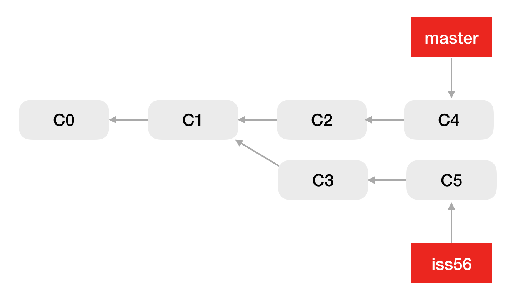

- Cuando Git va a realizar una mezcla entre dos ramas comprueba los
  cambios introducidos en ambas y nos avisa si existe algún conflicto.
- En la figura anterior, Git comprueba si hay conflicto entre los
  cambios introducidos en los commits `C2` y `C4` con respecto a los
  introducidos por los commits `C3` y `C5`.
- ¿Qué es un conflicto?
   - Cambios contrapuestos en **las mismas líneas** de un fichero.
   - Ficheros borrados en una rama y modificados en otras.
- No es un conflicto:
   - Cambios en distintas líneas de un mismo fichero.

<!-- Tres líneas en blanco para la siguiente transparencia -->


## Solución de los conflictos ##
<!-- .slide: class="image-right" -->

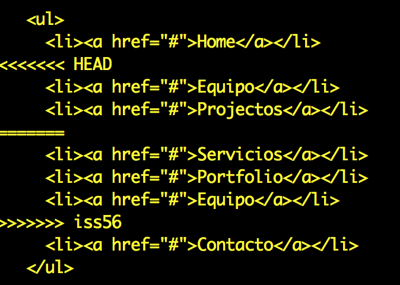

- Los conflictos en los merge son algo habitual, hay que perderles el
  miedo y aprender a resolverlos cuando sucedan.
- Pero **no debería haber demasiados**. En un proyecto bien diseñado y
  poco acoplado debería ser posible trabajar de forma independiente en
  distintos _issues_ sin que existieran conflictos.
- Cuando sucede un conflicto en un `merge` (o en un `rebase`) Git
  realiza lo siguiente:
  - Detiene el merge (o rebase).
  - Registra todos los ficheros en los que existe un conflicto.
  - Introduce en cada fichero las líneas en conflicto, indicando qué
    líneas vienen de qué rama. Nosotros debemos examinar el fichero y
    dejarlo tal y como queremos que se resuelva.
  - Nos indica en el `git status` qué debemos hacer para marcar el
    conflicto como resuelto.
- Los editores de código suelen detectar estos patrones introducidos
  por Git y proporcionar algún tipo de interfaz para simplificar el
  arreglo del conflicto.


<!-- Tres líneas en blanco para la siguiente transparencia -->


## Introducimos cambios que entran en conflicto ##
<!-- .slide: data-background="#cbe0fc"-->

- Creamos una rama `iss56` en la que vamos a trabajar en la cabecera
  de la web. Realizamos un commit con el cambio:

```txt
$ git checkout -b iss56
# Cambiamos la cabecera de la web para 
# que aparezcan las opciones:
# Home | Servicios | Porfolio | Equipo | Contacto
$ git commit -am "Cambiada la cabecera"
[iss56 dec2148] Cambiada la cabecera
 1 file changed, 3 insertions(+), 2 deletions(-)
```

- Cambiamos a la rama `master` y allí realizamos un par de
  correcciones, una de ellas en la cabecera (será la que entre en
  conflicto con la rama):
  
```txt
$ git checkout master
```

```diff
    <ul>
      <li><a href="#">Home</a></li>
-     <li><a href="#">Nuestro equipo</a></li>
+     <li><a href="#">Equipo</a></li>
      <li><a href="#">Projectos</a></li>
      <li><a href="#">Contacto</a></li>
    </ul>
...
   <h3>Otra subsección</h3>
 
-  <p>Donec viverra mi quis quam pulvinar at malesuada arcu rhoncus. Cum soclis</p>
+  <p>Primer párrafo de la subsección.</p>
```

<!-- Tres líneas en blanco para la siguiente transparencia -->


## Commiteamos y mezclamos  ##
<!-- .slide: data-background="#cbe0fc"-->
<!-- .slide: class="image-right" -->

- Hacemos commit en `master`:

```txt
$ git commit -am "Pequeñas correcciones"
[master 3001dfd] Pequeñas correcciones
 1 file changed, 2 insertions(+), 5 deletions(-)
```

- Y mezclamos (aparecerán los conflictos):

```txt
$ git merge iss56
Auto-merging index.html
CONFLICT (content): Merge conflict in index.html
Automatic merge failed; fix conflicts and then commit the result.
```

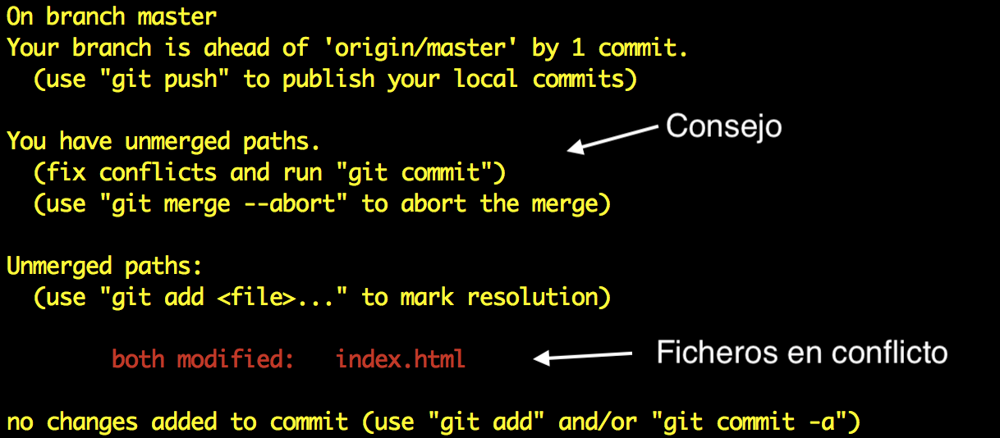

- Si hacemos `git status` Git nos indica lo que tenemos que hacer:

<!-- Tres líneas en blanco para la siguiente transparencia -->


## Arreglamos el conflicto ##
<!-- .slide: data-background="#cbe0fc"-->
<!-- .slide: class="image-right" -->

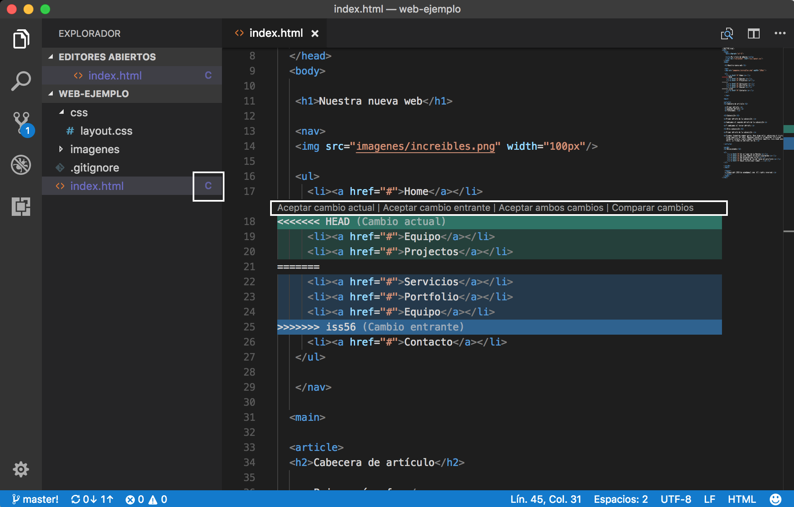

- Cuando abrimos el fichero en Visual Studio Code aparece resaltado el
  conflicto.
- El otro cambio que se ha hecho en `master` en el fichero aparece
  integrado sin problema, porque no entra en conflicto con ningún
  cambio en la rama que estamos mezclando.
- Examinamos las opciones que nos ofrece la interfaz y seleccionamos
  "Aceptar cambio entrante". Habrá veces en que tengamos que mezclar
  los cambios de ambas ramas (seleccionaríamos "Aceptar ambos cambios"
  y editaríamos el contenido).
- En el fichero queda la versión de la rama. 

<!-- Tres líneas en blanco para la siguiente transparencia -->


## Resolvemos el merge ##
<!-- .slide: data-background="#cbe0fc"-->
<!-- .slide: class="image-right" -->

- Para resolver el merge lo primero es confirmar a Git que hemos
  arreglado los conflictos. Una vez resueltos todos los cambios en
  todos los ficheros en conflicto añadimos los cambios al _stage_:
  
```txt
$ git add .
$ git status
On branch master
All conflicts fixed but you are still merging.
  (use "git commit" to conclude merge)

Changes to be committed:

	modified:   index.html

```

- Hacemos un commit para concluir el merge:

```txt
$ git commit -m "Merge branch 'iss56' y resueltos conflictos"
[master 2046b52] Merge branch 'iss56' y resueltos conflictos
```

- El commit que ha grabado es un commit de merge que integra ambas ramas:

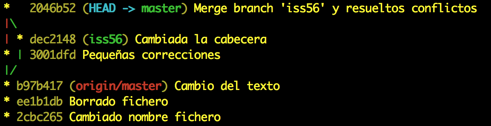

```txt
$ git log --oneline --graph
```

<!-- Tres líneas en blanco para la siguiente transparencia -->


## Analizamos la historia en Git Kraken ##
<!-- .slide: data-background="#cbe0fc"-->

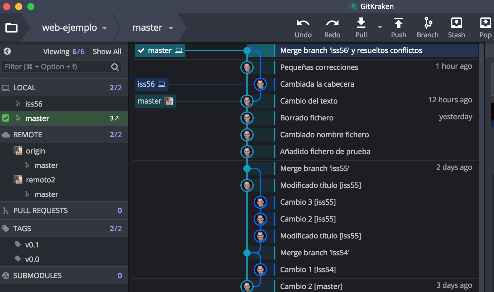

<!-- Tres líneas en blanco para la siguiente transparencia -->


## Ahora tú ##
<!-- .slide: data-background="#cbe0fc"-->
<!-- .slide: class="image-right" -->


- Ahora es **tu turno**:
   -  Crea otra rama `prueba` y añade un commit en la rama y otro en
      `master` que tengas conflictos.
   - Realiza un `merge` y resuelve los conflictos.
- Y lo mismo con un **rebase**:
   - Crea otra rama `prueba2`, añade un par de commits en ella y algún
     otro conflictivo en `master`. 
   - Realiza un `rebase` resolviendo los conflictos. Sigue las
     indicaciones que aparecen en el `git status`.


<!-- Tres líneas en blanco para la siguiente transparencia -->


## 3 errores comunes después de mezclar una rama (y cómo arreglarlos) ##
<!-- .slide: class="image-right" -->

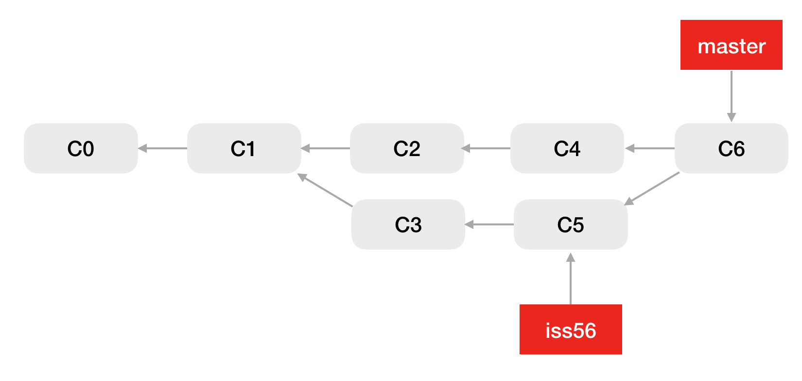

- Ya hemos visto el ciclo de trabajo de desarrollo en una rama:
  1. Abrir una rama a partir de master.
  2. Realizar commits en la rama.
  3. Mezclar la rama en master y volver a 1.

- Una vez mezclada la rama con el _issue_ 56 queremos desarrollar
  un nuevo _issue_ (`iss57`). **Algunas cosas pueden ir mal**:
  1. Se nos olvida crear la rama nueva, y añadimos los commits del
     _issue_ 57 en `master`.
  2. Se nos olvida crear la rama nueva, y añadimos los commits del
     _issue_ 57 en la rama `iss56`
  3. Creamos la nueva rama, pero lo hacemos en la rama `iss56` en
     lugar de en `master`, y añadimos los commits en la nueva rama.


- Veamos cómo resolver cada caso.

<!-- Tres líneas en blanco para la siguiente transparencia -->


## Error 1: Añadimos commits del nuevo issue en master ##

- Después de hacer el merge en `master`, se nos olvida crear la nueva
  rama `iss57` y añadimos los nuevos commits en `master`

```txt
$ git checkout master
$ git merge iss56
# MAL: Ahora hacemos commits del issue 57 en master sin crear la rama nueva
```

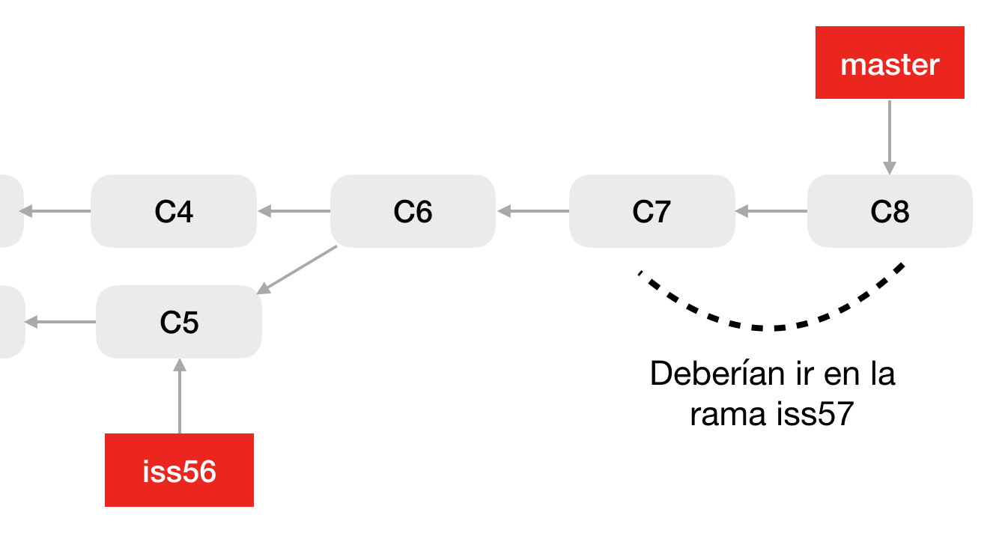

- ¿Solución?

<!-- Tres líneas en blanco para la siguiente transparencia -->


## Solución error 1 ##

- La solución es sencilla: creamos la rama `iss57` en el commit actual y
  hacemos retroceder `master` al commit `C6`:
  
```txt
$ git branch iss57 # Creamos la rama iss57
$ git branch # Comprobamos que estamos en master
* master
iss56
iss57
$ git reset --hard HEAD~2 # También correcto el id del commit C6
$ git checkout iss57 # Nos movemos a iss57 para seguir haciendo allí los nuevos commits
```


 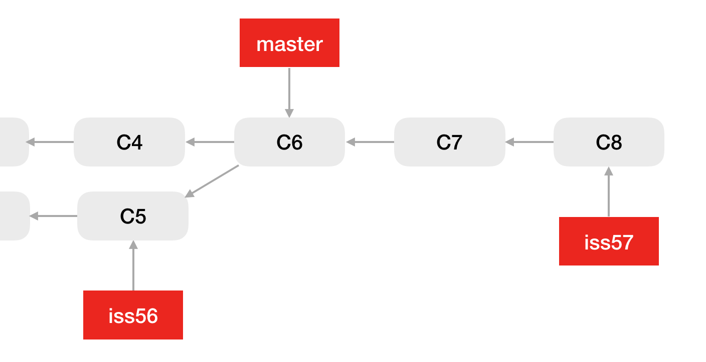

<!-- Tres líneas en blanco para la siguiente transparencia -->


## Error 2: Añadimos commits del nuevo issue en la rama antigua ##

- Después de hacer el merge en `master`, en lugar de crear una rama
  nueva volvemos a la rama mergeada y mezclamos allí los commits del
  _issue 57_ sin haber creado la nueva rama:

```txt
$ git checkout master
$ git merge iss56
$ git checkout iss56 # MAL: deberíamos borrar la rama y crear una nueva
# añadimos commits en iss56
```

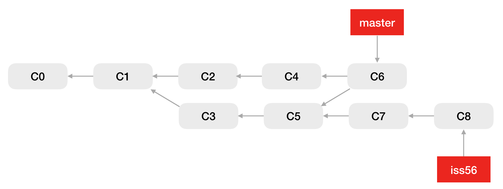

- ¿Solución?

<!-- Tres líneas en blanco para la siguiente transparencia -->


## Solución error 2 ##

- Podemos combinar `reset` y `stash` para mover atrás `iss56` y
  llevar los commits a la otra rama:
  
```txt
$ git branch # Nos aseguramos de que estamos en iss56
* iss56
master
$ git reset HEAD~2
$ git status # Confirmamos que los cambios de C7 y C8 están en el espacio de trabajo
$ git stash
$ git checkout master
$ git checkout -b iss57
$ git statsh pop
# Hacemos 'add' y 'commit' para confirmar los cambios que nos interesen (C7' y C8')
```

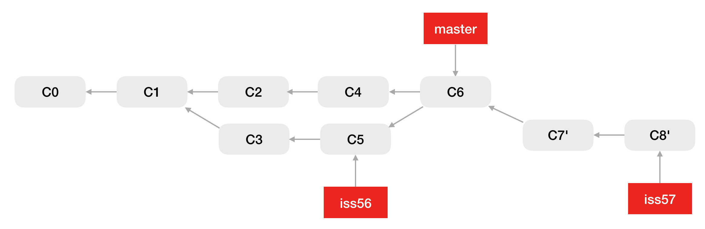

<!-- Tres líneas en blanco para la siguiente transparencia -->


## Error 3: Creamos la rama nueva en la antigua ##

- Después de hacer el merge en `master`, nos movemos por error a la
  rama recién mergeada y creamos allí la rama nueva `iss57`:

```txt
$ git checkout master
$ git merge iss56
$ git checkout iss56 
$ git checkout -b iss57 # MAL: hemos creado la rama en iss56, en lugar de en master
# añadimos commits en iss57
```

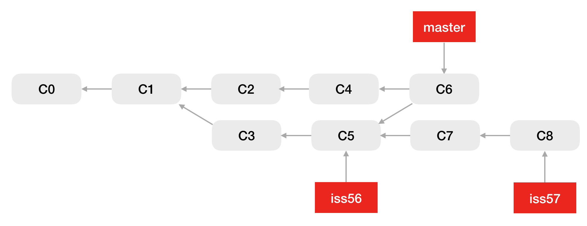

- ¿Solución?

<!-- Tres líneas en blanco para la siguiente transparencia -->


## Solución error 3 ##

- Podemos hacer una solución similar a la solución 2 haciendo un `rebase`:
  
```txt
$ git branch # Nos aseguramos de que estamos en iss57
* iss57
iss56
master
$ git rebase master
First, rewinding head to replay your work on top of it...
Applying: Primer cambio [iss57]
Applying: Segundo cambio [iss57]
```


<!-- Tres líneas en blanco para la siguiente transparencia -->


## Ejercicio ##
<!-- .slide: data-background="#cbe0fc"-->

- Escoge uno de los 3 errores, reprodúcelo y soluciónalo siguiendo las indicaciones.
- Comprueba que todo ha funcionado correctamente.

<!-- Tres líneas en blanco para la siguiente transparencia -->


## Último ejercicio con ramas: detached HEAD y rama desde el pasado ##
<!-- .slide: data-background="#cbe0fc"-->
<!-- .slide: class="image-right" -->

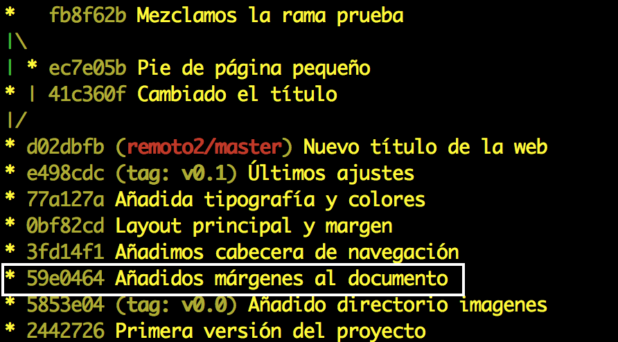

- Supongamos que queremos solucionar un bug introducido en un commit
  en el pasado. Sería interesante poder irnos a ese momento del
  desarrollo (para aislarnos de los cambios introducidos después),
  examinar el proyecto en ese momento y abrir allí una rama con un fix
  que lo corrige.
- Vamos a probarlo.
- Supongamos que nos hemos dado cuenta de que el margen de la web es
  demasiado grande y que queremos hacerlo más pequeño. Queremos probarlo y
  arreglarlo en el commit `59e0464`, que es cuando introducimos el
  cambio. Realizamos un `git checkout` para mover el HEAD a ese commit:

```txt
$ git checkout 59e0464
Note: checking out '59e0464'.

You are in 'detached HEAD' state. You can look around, make experimental
changes and commit them, and you can discard any commits you make in this
state without impacting any branches by performing another checkout.

If you want to create a new branch to retain commits you create, you may
do so (now or later) by using -b with the checkout command again. Example:

  git checkout -b <new-branch-name>

HEAD is now at 59e0464... Añadidos márgenes al documento
```


<!-- Tres líneas en blanco para la siguiente transparencia -->


## Detached HEAD ##
<!-- .slide: data-background="#cbe0fc"-->
<!-- .slide: class="image-right" -->

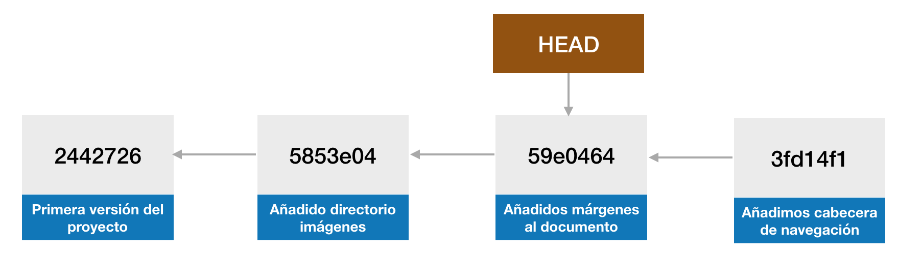

- El puntero HEAD indica dónde está el espacio de trabajo. Si ahora
  abrimos el fichero `index.html` en el navegador veremos que nos
  encontramos tal y como estaba el proyecto en ese momento del
  desarrollo. Lo podemos comprobar también en los ficheros cargados en
  el Visual Studio Code, que se habrán actualizado a ese commit.
- El HEAD está "desconectado" porque no está apuntando a ninguna rama
  (que es su estado natural para que funcione correctamente el añadido de commits).
- Creamos una rama y nos movemos a ella para que HEAD apunte a ella:

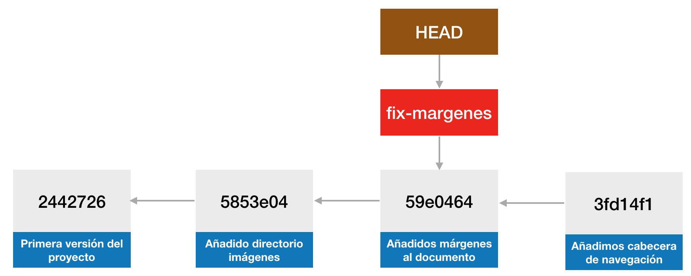


```txt
$ git checkout -b fix-margenes
```


<!-- Tres líneas en blanco para la siguiente transparencia -->


## Añadimos commits y mezclamos la rama ##
<!-- .slide: data-background="#cbe0fc"-->
<!-- .slide: class="image-right" -->

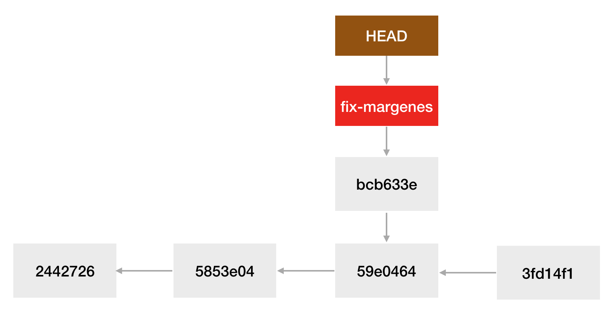

- Una vez en la nueva rama arreglamos lo que nos interesa y hacemos un
  commit:
  
```txt
# Modificamos el fichero css/layout.css para 
# reducir el margen
$ git commit -am "Reducido el margen"
[fix-margenes bcb633e] Reducido el margen
 1 file changed, 1 insertion(+), 1 deletion(-)
```

- Comprobamos que todo está bien y mezclamos la rama en `master`:

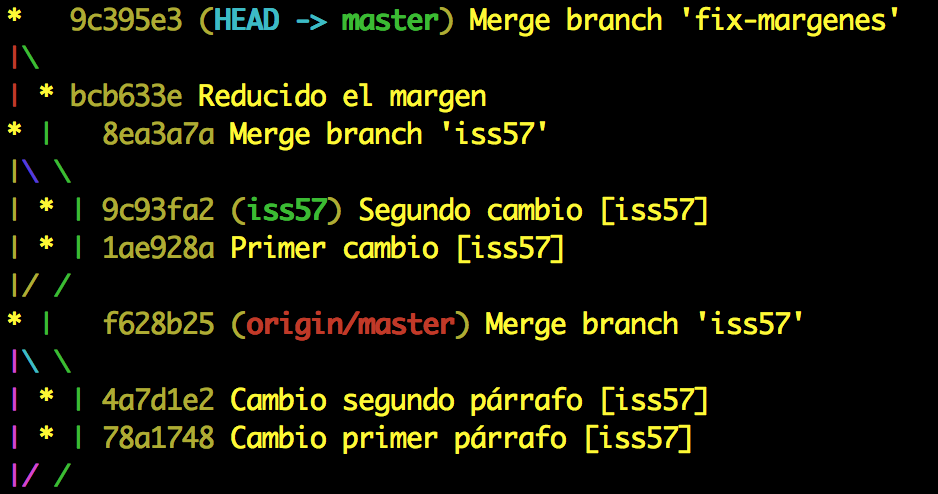

```txt
$ git checkout master
$ git merge fix-margenes
Auto-merging css/layout.css
Merge made by the 'recursive' strategy.
 css/layout.css | 2 +-
 1 file changed, 1 insertion(+), 1 deletion(-)
$ git branch -d fix-margenes
```

- Por último subimos los últimos cambios a GitHub y comprobamos allí
  que todo se ha subido correctamente.

```txt
$ git push
```

<!-- Tres líneas en blanco para la siguiente transparencia -->


## ¡Es hora de trabajar en equipo! ##


<!-- Tres líneas en blanco para la siguiente transparencia -->


## Trabajo de dos personas sobre master ##
<!-- .slide: class="image-right" -->

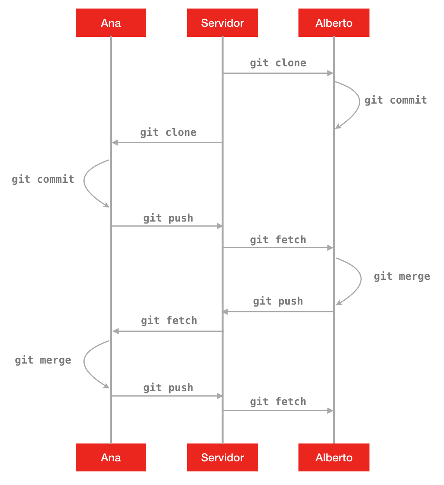

- Vamos a empezar por lo más sencillo: suponemos dos personas con
  permiso de lectura y escritura en el repositorio remoto trabajando
  simultáneamente sobre `master`.

- El modo de trabajo es muy similar al del trabajo sobre un
  repositorio centralizado:

   1. Alberto y Ana trabajan sobre la rama `master` en local haciendo
      commits.
   2. Ana termina su trabajo, piensa que los cambios están listos
      para publicarlos y hace un `git push`.
   3. Si ahora Alberto intenta publicar en el repo remoto, Git le da
      un mensaje de error indicando que primero debe descargarse los
      cambios que se han introducido.
   4. Alberto se baja los cambios (con `git fetch`) y los integra en
      su rama en local (`git merge`), solucionando los posibles conflictos.
   5. Una vez integrado los cambios en local, Alberto los sube al repo
      remoto con un `git push`.
   6. Ana integra los cambios de Alberto haciendo lo mismo que él ha
      hecho: `git fetch` y `git merge` y después `git push`.


<!-- Tres líneas en blanco para la siguiente transparencia -->


## Rama remota: "git clone" ##

- El comando `git clone` se descarga el repositorio en nuestra máquina
  y crea una referencia local (`origin/master`) a la rama remota
  `master` (aunque no es totalmente correcto, llamamos a
  `origin/master` una rama remota).

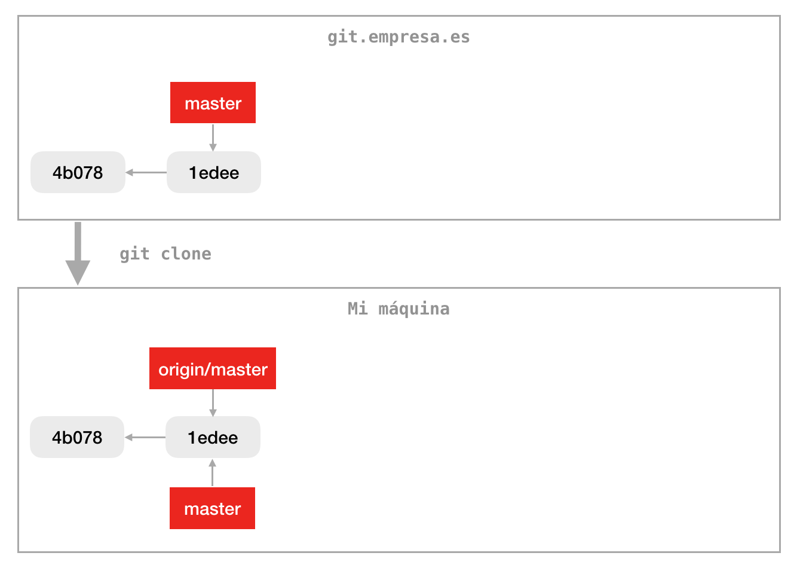


<!-- Tres líneas en blanco para la siguiente transparencia -->


## Rama remota: "git fetch" ##

- El comando `git fetch` descarga los commits nuevos de `master` en la máquina remota a la
  rama remota de nuestra máquina `origin/master`.

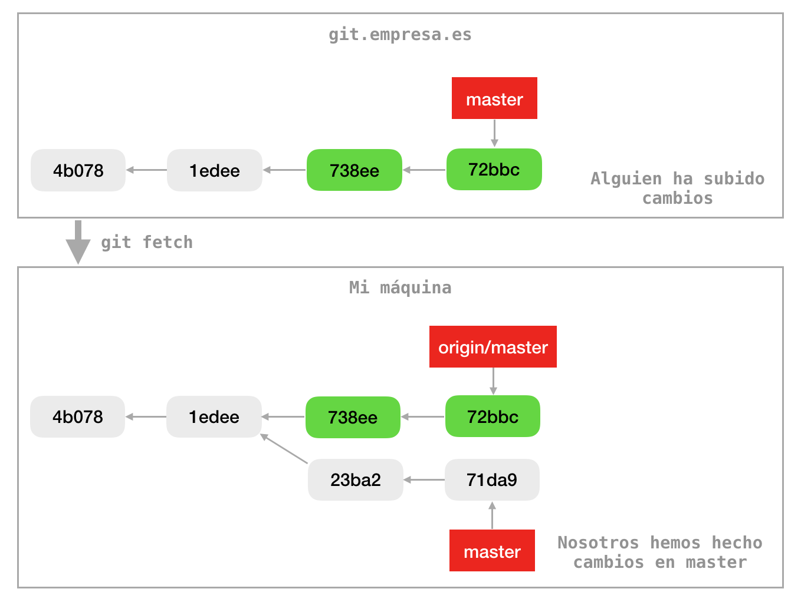

<!-- Tres líneas en blanco para la siguiente transparencia -->


## Rama remota: "git merge" ##

- La rama `origin/master` es una rama local como otra
  cualquiera. Mezclamos los cambios descargados en `master` local
  haciendo un `merge`.

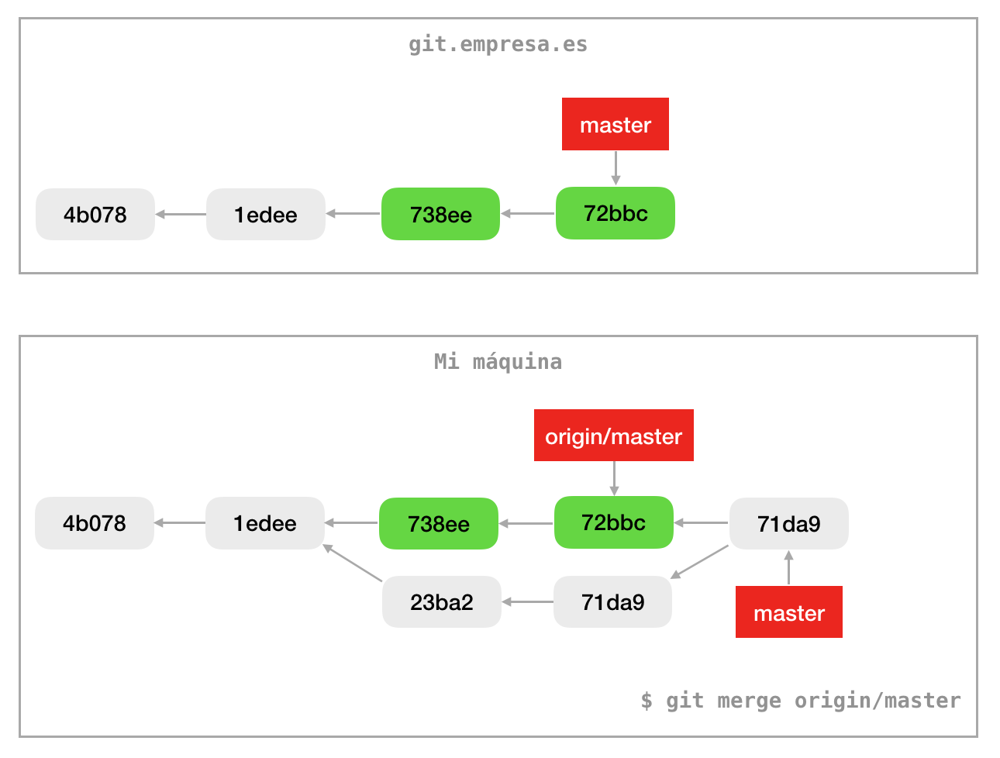

<!-- Tres líneas en blanco para la siguiente transparencia -->


## Rama remota: "git push" ##

- El comando `git push` sube los cambios a la máquina remota y
  adelanta la rama remota `origin/master`.

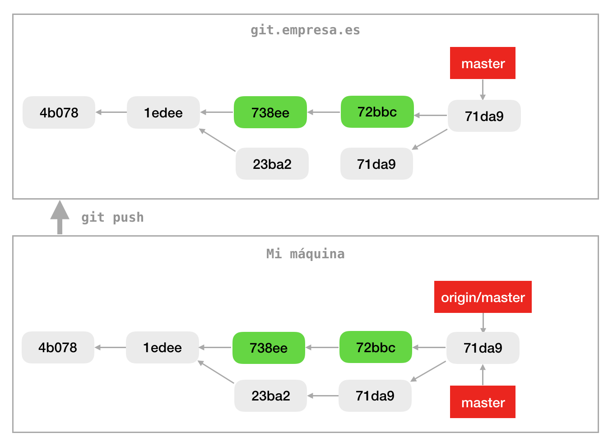

<!-- Tres líneas en blanco para la siguiente transparencia -->


## Formamos equipos de tres personas y compartimos repositorio ##
<!-- .slide: data-background="#cbe0fc"-->

- Vamos a practicar este flujo de trabajo. En el proceso explicaremos
  cómo funcionan los comandos `git fetch` y `git pull` y la gestión de
  Git de ramas remotas.

- Creamos equipos de tres personas. Vamos a llamarlas Ana, Carlos y Alberto.
- Uno de los tres repositorios va a hacer el papel de repositorio
  central. Por ejemplo el de Ana.
- Alberto y Carlos se descargan el repositorio de Ana:

```txt
# En las máquinas de Alberto y Carlos
$ cd ..
$ git clone URL-REPO repo-compartido
$ cd repo-compartido
```

- Ana gestiona los permisos del repositorio en GitHub para que sus dos
  compañeros también puedan escribir y publicar cambios, con la opción
  _Settings > Collaborators_. Los compañeros recibirán un correo
  electrónico con un enlace en el que aceptar la invitación.

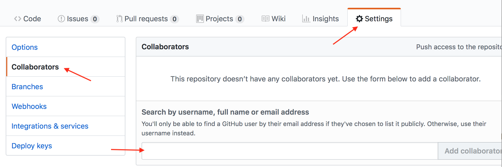

<!-- Tres líneas en blanco para la siguiente transparencia -->


## Trabajo secuencial ##
<!-- .slide: data-background="#cbe0fc"-->

- Los dos compañeros comprueban que pueden publicar cambios (esta
  primera vez lo hacemos de forma secuencial, uno detrás de otro):

```txt
# En la máquina de Alberto
# Alberto modifica el fichero 'index.html'
$ git commit -am "Modificación de Alberto"
$ git push
```

```txt
# En la máquina de Carlos
# Carlos se descarga los cambios, añade cambios y los publica
$ git pull
# Modifica el fichero 'index.html'
$ git commit -am "Modificación de Carlos"
$ git push
```

- Comprobamos en GitHub que se han subido los cambios. Y Ana se descarga los cambios:

```txt
# En la máquina de Ana
$ git pull
```

<!-- Tres líneas en blanco para la siguiente transparencia -->


## Comando "git fetch" ##
<!-- .slide: class="image-right" -->

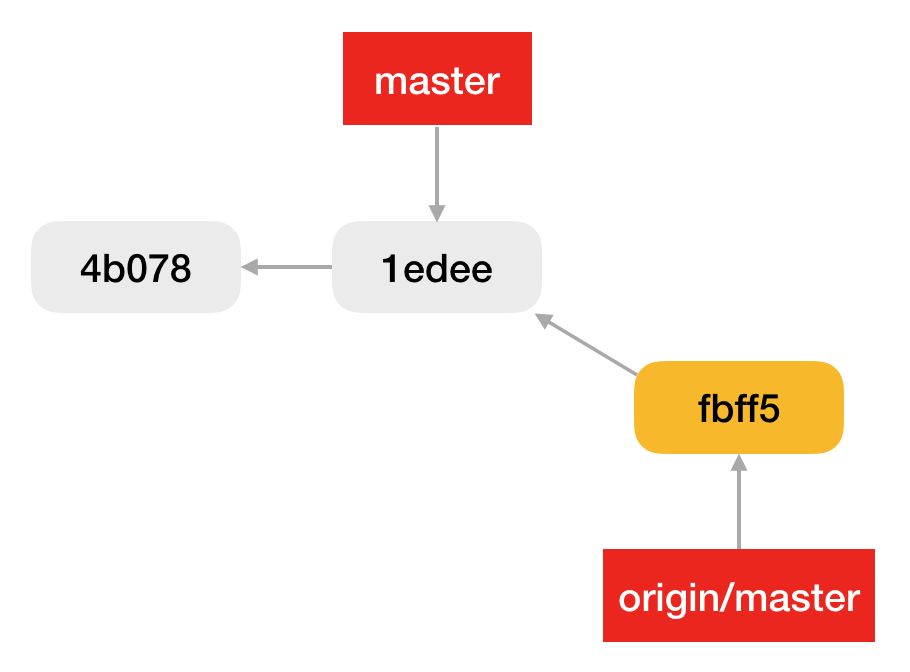

- El comando `git fetch` se conecta con el repositorio remoto
  (`origin` si no lo especificamos) y se descarga los últimos commits
  que se han subido y que no tenemos.
- Git gestiona las ramas remotas usando **ramas locales que hacen de
  caché de los cambios**. La rama `origin/master` cachea la rama remota `master` en el
  repositorio `origin` y es en esa rama en la que se descargan los
  cambios.

- Podemos consultar las ramas locales y las cachés con el comando

```txt
$ git branch -vva
```

- El commit `fbff5` es el que se ha añadido en el repositorio remoto.

- Podemos trabajar con la rama `origin/master` como si fuera una rama
  normal. Por ejemplo, podemos consultar los cambios del último
  commit haciendo `git diff`:
  
```txt
$ git diff HEAD origin/master
```

- Para incorporar los cambios a `master` hacemos lo habitual,
  mezclamos la rama con los cambios (`origin/master`) en
  `master`. Suponiendo que estemos en `master`:

```txt
$ git merge origin/master
```


<!-- Tres líneas en blanco para la siguiente transparencia -->


## Comando "git pull" ##

- El comando `git pull` es una forma abreviada de hacer un `fetch`
  seguido de un `merge`
  
```txt
$ git pull
# git fetch
# git merge origin/master
```

- Veremos que podemos tener otras ramas remotas aparte de
  `master`. También se usarán los comandos `git fetch`, `git push` y
  `git pull` para actualizarlas.


<!-- Tres líneas en blanco para la siguiente transparencia -->


## Probamos el trabajo concurrente y "git fetch" ##
<!-- .slide: data-background="#cbe0fc"-->

- Dos miembros del equipo realiza un commit distinto:

```txt
# En la máquina de Ana
$ git commit -am "Cambios simultáneos de Ana"
```

```txt
# En la máquina de Carlos
$ git commit -am "Cambios simultáneos de Carlos"
```

- Ana publica los cambios:

```txt
# En la máquina de Ana
$ git push
```

- Carlos intenta publicar los cambios, pero obtiene un
  error porque la rama remota ha avanzado y sus ramas se han quedado
  atrás (tiene que integrar los cambios remotos):
  
```txt
# En la máquina de Carlos
$ git push
To https://github.com/domingogallardo/curso-git-repo1.git
 ! [rejected]        master -> master (non-fast-forward)
error: failed to push some refs to 'https://github.com/domingogallardo/curso-git-repo1.git'
hint: Updates were rejected because the tip of your current branch is behind
hint: its remote counterpart. Integrate the remote changes (e.g.
hint: 'git pull ...') before pushing again.
```

<!-- Tres líneas en blanco para la siguiente transparencia -->


## Carlos integra los cambios de Ana ##
<!-- .slide: data-background="#cbe0fc"-->
<!-- .slide: class="image-right" -->

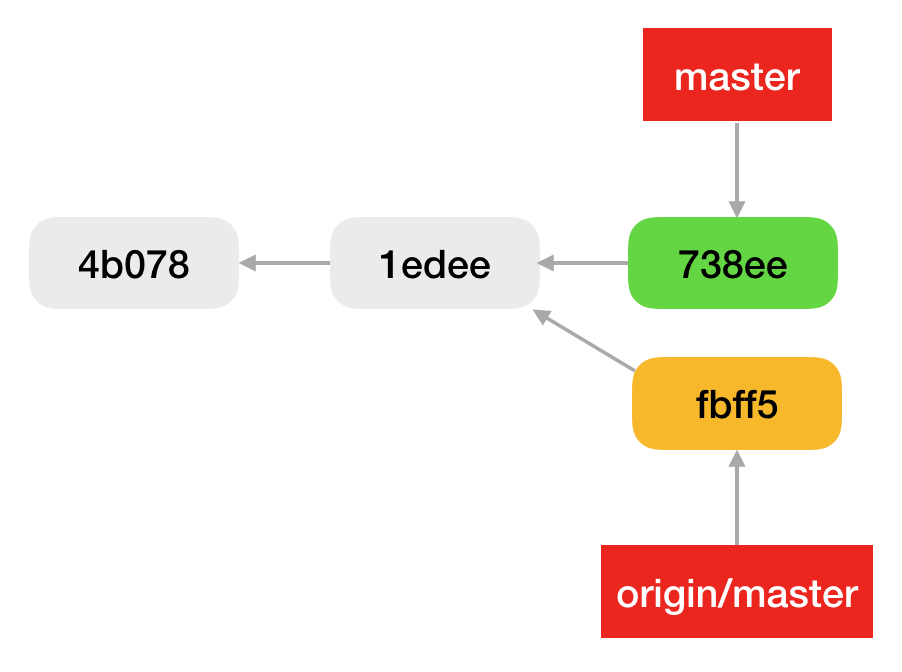 

- Carlos hace un `git fetch` para descargar los cambios de Ana a su repositorio local:


```txt
# En la máquina de Carlos
$ git fetch
$ git branch -vva
* master                 738ee82 [origin/master: ahead 1, behind 1] Cambio simultáneo de Domingo
  remotes/origin/master  fbff52a Cambios simultáneos de Ana
```

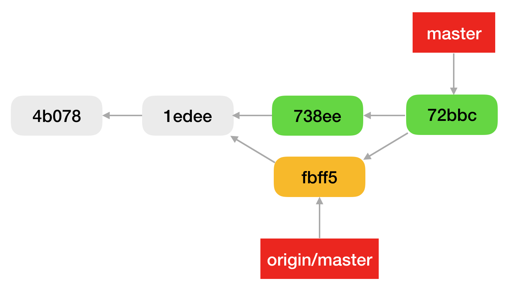 

- Y mezcla los cambios

```txt
$ git merge origin/master
Merge made by the 'recursive' strategy.
 index.html | 4 ++--
 1 file changed, 2 insertions(+), 2 deletions(-)
```

- Por último, sube la rama master

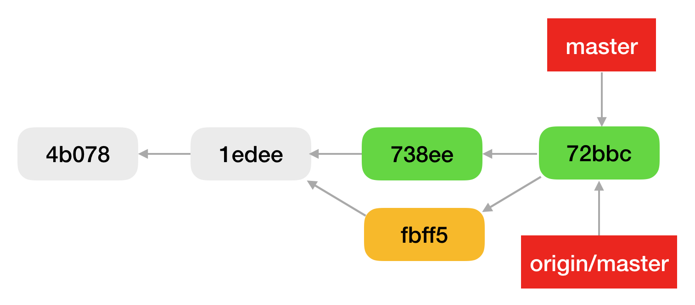

```txt
$ git push
To https://github.com/domingogallardo/curso-git-repo1.git
   fbff5..72bbc master -> master
```

<!-- Tres líneas en blanco para la siguiente transparencia -->


## Ana trabaja en una rama ##
<!-- .slide: data-background="#cbe0fc"-->

- Mientras tanto, Ana ha seguido trabajando en su repositorio, creando
  una rama llamada `iss58`:
  
```txt
# En la máquina de Ana
$ git checkout -b iss58
# Añade algunos commits
```

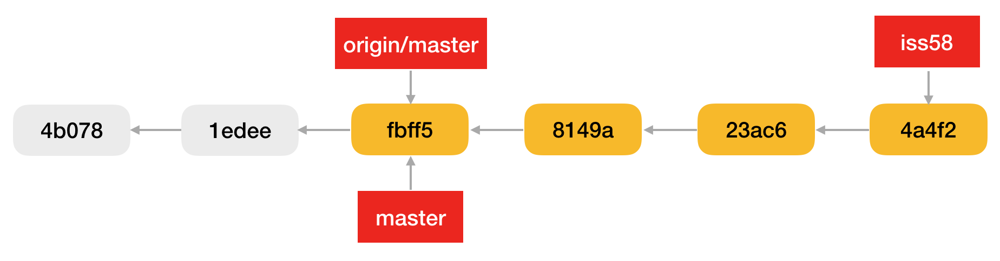 

- Ana descarga los cambios de Carlos, pero todavía no los mezcla:

```txt
$ git fetch
```

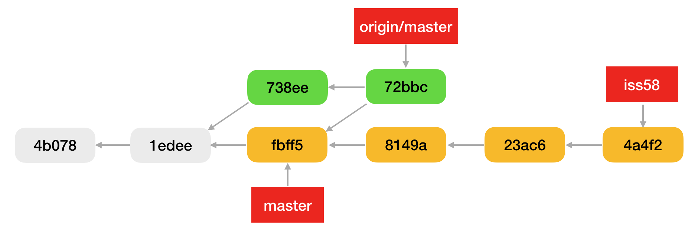 


<!-- Tres líneas en blanco para la siguiente transparencia -->


## Ana termina su rama ##
<!-- .slide: data-background="#cbe0fc"-->
<!-- .slide: class="image-right" -->

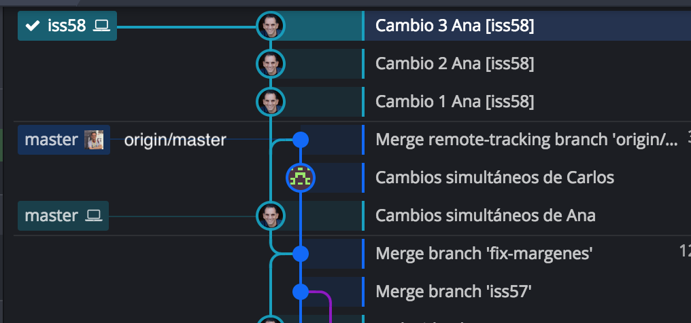 

- Ana ya ha terminado sus cambios en la rama y tiene que integrarlos en
  `master`. También tiene que integrar los cambios remotos. Y después
  comprobar que todo funciona bien y subirlo al repositorio remoto.

- Podemos examinar el estado del repositorio en GitKraken. Puedes
  abrir Git Kraken y comprobar la historia. 

- Para integrar los cambios en `master` empezamos cambiando a esa rama:

```txt
$ git checkout master
Switched to branch 'master'
Your branch is behind 'origin/master' by 2 commits, and can be fast-forwarded.
  (use "git pull" to update your local branch)
```

<!-- Tres líneas en blanco para la siguiente transparencia -->


## Y los mezcla con master ##
<!-- .slide: data-background="#cbe0fc"-->

- Ana puede mezclar en `master` o bien `origin/master` o bien `iss58`,
  el orden no importa de cara al resultado final. Sólo cambiara la
  historia.

- Empezamos mezclando la rama `iss54`. Lo podemos hacer como siempre,
  por línea de comando:

```txt
$ git merge iss58
Updating 19b5a30..982b609
Fast-forward
 index.html | 4 ++--
 1 file changed, 2 insertions(+), 2 deletions(-)
```

- O usando la interfaz de GitKraken, arrastrando la rama `iss58` sobre
  la rama `master` y seleccionando la opción `Fast-forward`.

<!-- Tres líneas en blanco para la siguiente transparencia -->


## Se mezcla el commit remoto ##
<!-- .slide: data-background="#cbe0fc"-->

- Una vez incorporada la rama `iss54` a `master`, Ana completa la
  integración añadiendo los cambios de Carlos, que estaban pendientes
  en la rama `origin/master`:
  
```txt
$ git merge origin/master
Auto-merging index.html
Merge made by the 'recursive' strategy.
 index.html | 2 +-
 1 file changed, 1 insertion(+), 1 deletion(-)
```

- Ahora la historia del repositorio de Ana aparece de la siguiente
  forma:

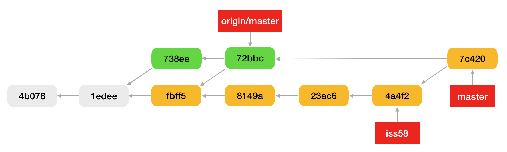


<!-- Tres líneas en blanco para la siguiente transparencia -->


## Y sube el resultado al repositorio remoto ##
<!-- .slide: data-background="#cbe0fc"-->

```txt
$ git push
```

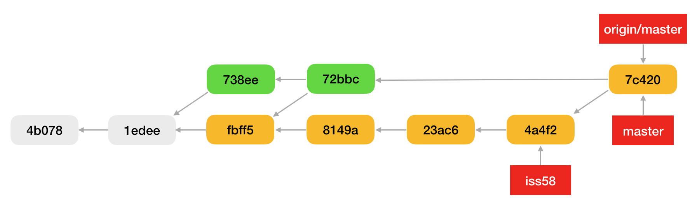


<!-- Tres líneas en blanco para la siguiente transparencia -->


## Ramas compartidas ##

- Resumen del flujo de trabajo que acabamos de ver:
  - La única rama remota compartida es `master`.
  - Los compañeros desarrollan cambios (en un commit o en una rama)
    que mezclan en local sobre `master`.
  - Por último se suben los cambios a la rama `master` remota.

- La naturaleza distribuida de Git permite muchos otros flujos de
  trabajo; veremos varios.

- Antes necesitamos subir y compartir nuevas ramas en el repositorio
  remoto.

<!-- Tres líneas en blanco para la siguiente transparencia -->


## Subir ramas al repositorio remoto ##

- Supongamos que hemos creado la rama `iss59` y en el repositorio
 local y que queremos subirla al repositorio remoto.

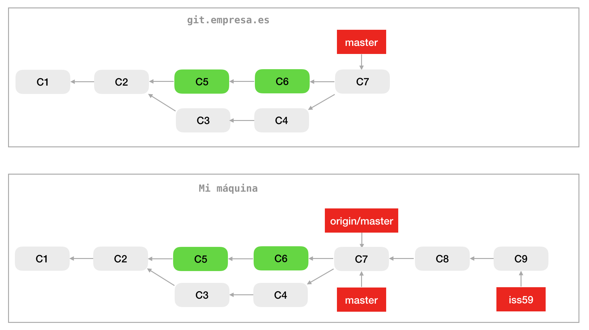


<!-- Tres líneas en blanco para la siguiente transparencia -->


## Comando "git push" para subir ramas ##

- El comando `git push` sube la rama al repositorio remoto:

```txt
$ git push -u origin iss59
```

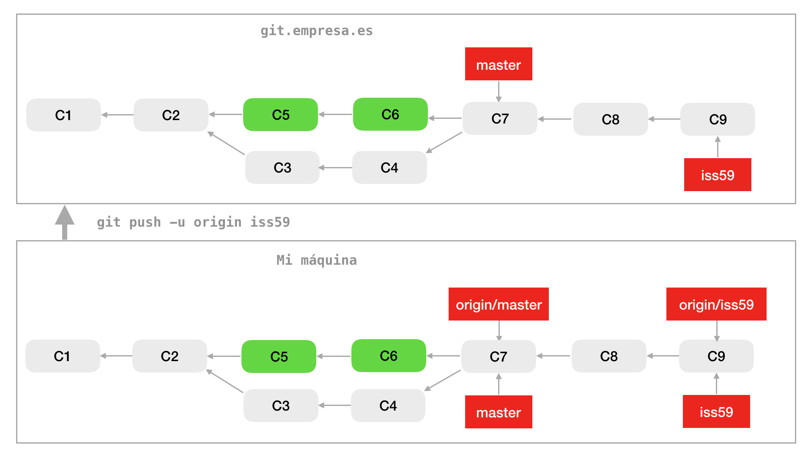

<!-- Tres líneas en blanco para la siguiente transparencia -->


## Comando "git fetch" para bajar las ramas ##

- El comando `git fetch` baja las ramas nuevas subidas al repositorio
  y las almacena como ramas remotas (el comando no crea las ramas locales):

```txt
# En otra máquina
$ git fetch
```

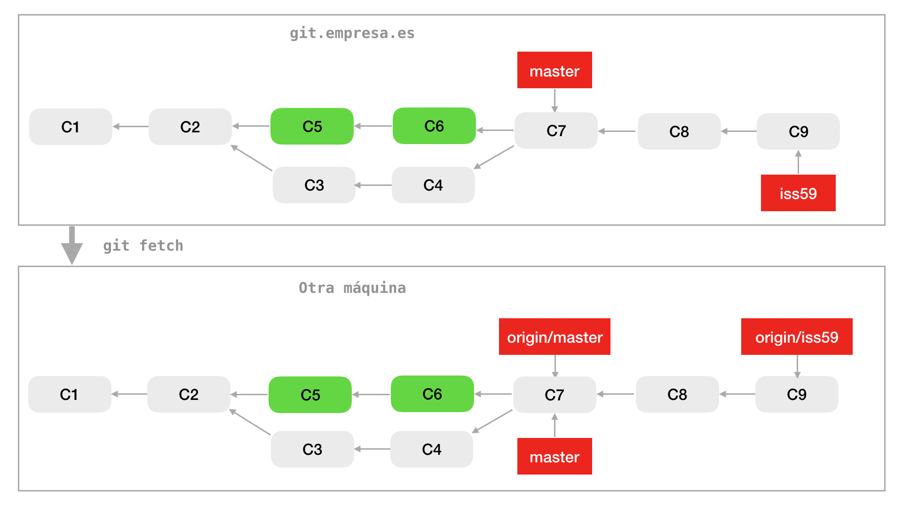

<!-- Tres líneas en blanco para la siguiente transparencia -->


## Las ramas locales se crean con "git checkout" ##

- Una vez bajadas las ramas remotas se pueden crear ramas locales
  conectadas a ellas con `git checkout`:

```txt
$ git checkout -b iss59 origin/iss59
# Comando equivalente: $ git checkout iss59
```

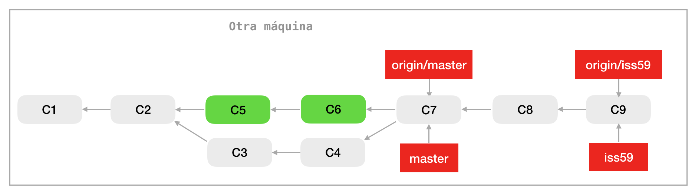

<!-- Tres líneas en blanco para la siguiente transparencia -->


## Ana comienza el desarrollo de una nueva rama ##
<!-- .slide: data-background="#cbe0fc"-->

- Vamos a crear una nueva rama y subirla al repositorio remoto.
- Ana crea una nueva rama `iss59` y un par de commits en ella:

```txt
# En la máquina de Ana
$ git checkout -b iss59
$ git commit -am "Primer cambio [iss59]"
[iss59 747459f] Primer cambio [iss59]
 1 file changed, 1 insertion(+), 3 deletions(-)
$ git commit -am "Segundo cambio [iss59]"
[iss59 2090ea1] Segundo cambio [iss59]
 1 file changed, 1 insertion(+), 2 deletions(-)
```

- Comprueba las ramas locales y remotas:

```txt
$ git branch -vva
* iss59                 2090ea1 Segundo cambio [iss59]
  master                7c4205e [origin/master] Merge remote-tracking branch 'origin/master'
  remotes/origin/HEAD   -> origin/master
  remotes/origin/master 7c4205e Merge remote-tracking branch 'origin/master'
```

- La rama `master` está trackeando `origin/master` (cuando estemos en
  `master` y hagamos push o pull se baja la rama remota `master`).

<!-- Tres líneas en blanco para la siguiente transparencia -->


## Ana sube la nueva rama ##
<!-- .slide: data-background="#cbe0fc"-->

- Ahora subimos la nueva rama `iss59` usando el comando `git push`. La
  opción `-u` permite publicar los nuevos cambios haciendo sólo `git push` a
  partir de ahora:

```txt
$ git push -u origin iss59
...
To https://github.com/domingogallardo/curso-git-repo1.git
 * [new branch]      iss59 -> iss59
Branch iss59 set up to track remote branch iss59 from origin.
```

- Comprobamos el estado local de las ramas:

```txt
$ git branch -vva
* iss59                 2090ea1 [origin/iss59] Segundo cambio [iss59]
  master                7c4205e [origin/master] Merge remote-tracking branch 'origin/master'
  remotes/origin/HEAD   -> origin/master
  remotes/origin/iss59  2090ea1 Segundo cambio [iss59]
  remotes/origin/master 7c4205e Merge remote-tracking branch 'origin/master'
```

- Vemos que se ha creado una rama remota `origin/iss59` y que la rama
  local `iss59` está trackeando esa rama remota.
- Comprobamos también que la rama **se ha subido a GitHub**.

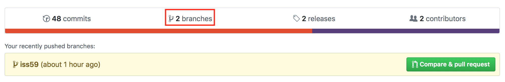

<!-- Tres líneas en blanco para la siguiente transparencia -->


## Carlos se baja la nueva rama ##
<!-- .slide: data-background="#cbe0fc"-->

- Carlos se baja la nueva rama 

```txt
$ git fetch
...
From https://github.com/domingogallardo/curso-git-repo1
   a4fe1f4..7c4205e  master     -> origin/master
 * [new branch]      iss59      -> origin/iss59
```

- Comprueba que se ha descargado la rama `iss59`:

```txt
$ git branch -vva
* master                a4fe1f4 [origin/master: behind 4] Merge remote-tracking branch 'origin/master'
  remotes/origin/HEAD   -> origin/master
  remotes/origin/iss59  2090ea1 Segundo cambio [iss59]
  remotes/origin/master 7c4205e Merge remote-tracking branch  'origin/master'
```

- Y accede a la rama local correspondiente con `git checkout`:

```txt
$ git checkout iss59
Branch iss59 set up to track remote branch iss59 from origin.
Switched to a new branch 'iss59'
```

<!-- Tres líneas en blanco para la siguiente transparencia -->


## Carlos y Ana trabajan en la rama ##
<!-- .slide: data-background="#cbe0fc"-->

- Carlos y Ana trabajan en la rama desarrollando el _issue 59_, de la
  misma forma que antes lo han hecho en la rama `master`:

```txt
# En la máquina de Ana, en la rama iss59
$ git commit # se añaden cambios
$ git push 
```

- Simultáneamente:

```txt
# En la máquina de Carlos, en la rama iss59
$ git commit # se añaden otros cambios
$ git pull # se bajan los cambios de Ana y se integran
$ git push # se suben los cambios
```

<!-- Tres líneas en blanco para la siguiente transparencia -->


## Ana termina la rama e integra con master ##
<!-- .slide: data-background="#cbe0fc"-->

- Ana se descarga los cambios de Carlos y termina el desarrollo de la
  rama:
  
```txt
# En la máquina de Ana, en la rama iss59
$ git fetch
$ git merge origin/iss59 # Mezcla los cambios de Carlos
$ git commit # Se añade algún commit más para terminar el issue
$ git push # Sube los cambios
```

- Actualiza `master` (puede haber avanzado porque se haya integrado
  algún commit o rama) e integra la rama para comprobar que el _issue_
  funciona bien en `master`:

```txt
$ git checkout master
$ git pull # actualiza master y se descarga C5 añadido por algún compañero
$ git merge iss59
```

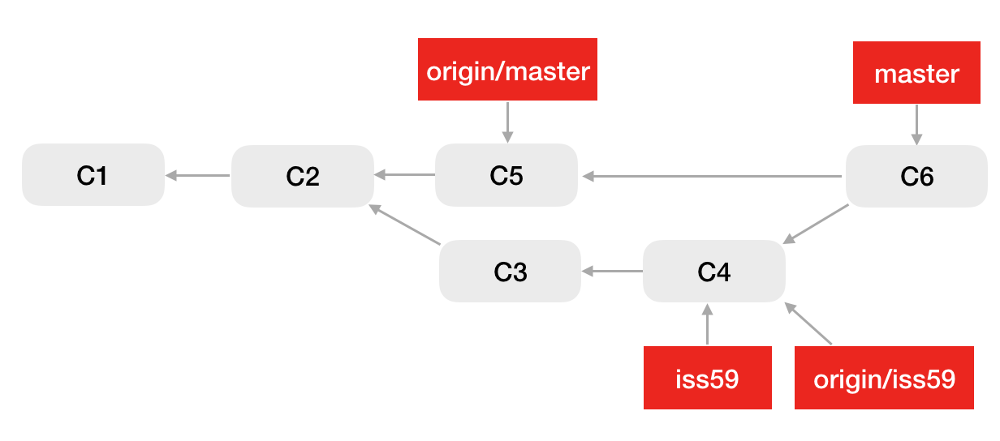

<!-- Tres líneas en blanco para la siguiente transparencia -->


## Ana realiza pruebas de integración ##
<!-- .slide: data-background="#cbe0fc"-->

- Ana revisa la integración, lanza todos los tests, realiza algunas
  pruebas funcionales, y si todo está bien se lo comunica a Alberto,
  responsable de integración del equipo.

- Si hay algún fallo o algo que mejorar, vuelve a la rama, añade algún
  commit, vuelve a mezclar para comprobar y vuelve a subir la rama:
  
```txt
$ git checkout iss59
$ git commit # añadimos algún commit para mejorar la rama
$ git checkout master
$ git merge iss59 
# Ana prueba que todo está bien y publica los nuevos cambios:
$ git checkout iss59
$ git push 
```

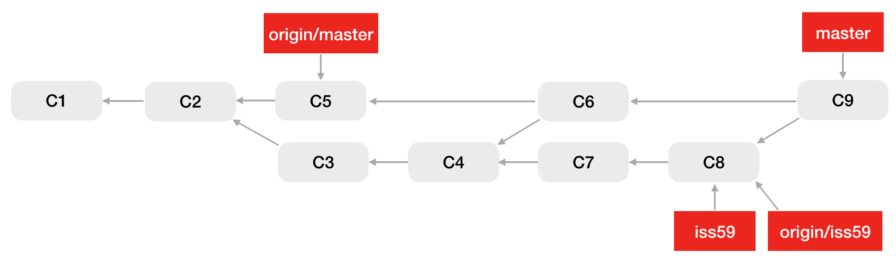

<!-- Tres líneas en blanco para la siguiente transparencia -->


## Alberto integra la rama en master ##
<!-- .slide: data-background="#cbe0fc"-->

- Suponemos que Alberto tiene el papel de responsable de integración
  de issues en `master`. Recibe la comunicación de Ana, se descarga su
  rama y comprueba los cambios:
  
```txt
# En la máquina de Alberto
# Se descarga la última versión de la rama
$ git fetch
$ git checkout iss59
# Comprueba los cambios
$ git diff master..iss59
```

- Realiza la integración de la rama y comprueba que todo está correcto:

```txt
$ git checkout master
$ git merge iss59
```

- Y sube `master` al repositorio remoto:

```txt
$ git push
```

<!-- Tres líneas en blanco para la siguiente transparencia -->


## Borrado de la rama y actualizado master ##
<!-- .slide: data-background="#cbe0fc"-->

- Ana y Carlos borran la rama local y remota:

```txt
$ git branch -d iss59
$ git push origin -d iss59
$ git remote prune origin # Borra las referencias locales a ramasremotas

```

- Carlos actualiza la rama master:

```txt
# En la máquina de Carlos
$ git checkout master
$ git pull
```

- Y Ana limpia su rama master, quitando las mezclas que hizo con su
  rama `iss59`:
  
```txt
# En la máquina de Ana
$ git checkout master
$ git reset --hard origin/master
$ git pull
```

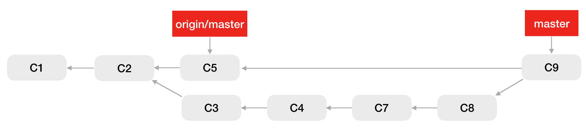

<!-- Tres líneas en blanco para la siguiente transparencia -->


## Resumen del flujo de trabajo: ramas de _issues_ ##

1. El desarrollador que se hace cargo de un _issue_ abre una rama y
   la publica en el servidor remoto.
2. Desarrolla la rama en local y sube los commits regularmente al
   servidor remoto.
3. Un compañero puede ayudar al desarrollo del _issue_ descargándose
   la rama y añadiendo commits.
4. Cuando la rama está terminada, se comprueba la integración en
   `master`, se integra y se publica en el repositorio remoto.
5. Se borra la rama y se descarga `master`.

<!-- Tres líneas en blanco para la siguiente transparencia -->


## Comandos para comprobar ramas remotas ##

- El comando `git status` no se conecta con las ramas remotas. Podemos
  usar el comando `git remote -v update` para que Git se conecte al
  repositorio y actualice las referencias:

```txt
$ git remote -v update
From https://github.com/domingogallardo/curso-git-repo1
   2090ea1..35438c4  master     -> origin/master
 = [up to date]      iss60      -> origin/iss60
 ```

- El comando `git remote show origin` se conecta con el repositorio
  `origin` y muestra la información completa de ramas remotas y locales:

```txt
$ git remote show origin
* remote origin
  Fetch URL: https://github.com/domingogallardo/curso-git-repo1.git
  Push  URL: https://github.com/domingogallardo/curso-git-repo1.git
  HEAD branch: master
  Remote branches:
    iss60  tracked
    master tracked
  Local branches configured for 'git pull':
    iss60  merges with remote iss60
    master merges with remote master
  Local refs configured for 'git push':
    iss60  pushes to iss60  (up to date)
    master pushes to master (local out of date)
```

<!-- Tres líneas en blanco para la siguiente transparencia -->


## Nuevos comandos ##

|Comando | Explicación |
|-------|--------------|
| `git clone <URL repositorio>` | Se descarga el repositorio remoto |
| `git fetch` | Descarga los nuevos commits en las ramas `<remoto>/<rama>` |
| `git checkout <rama>` | Crea la rama local que trackea `<origin>/<rama>` |
| `git merge origin/<rama>` | Mezcla la rama remota en la rama local actual |
| `git push -u origin <rama>` | Sube la rama al repositorio remoto |
| `git pull` | Se descargan los cambios de la rama actual y se integran |
| `git branch -vva` | Muestra la información de las ramas locales y remotas |
| `git remote -v update` | Actualiza las referencias locales de ramas remotas | 
| `git remote show origin` | Muestra la información competa de ramas remotas y locales |

<!-- Tres líneas en blanco para la siguiente transparencia -->


## Probamos el flujo de trabajo  ##
<!-- .slide: data-background="#cbe0fc"-->
<!-- .slide: class="image-right" -->

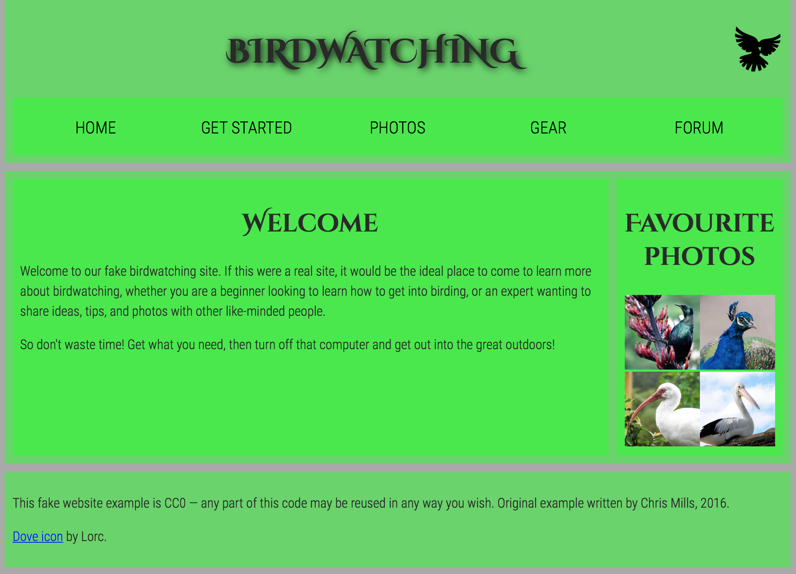 

- Descarga el `ejemplo2.zip`, cárgalo en el navegador y en Visual Studio
  Code y analiza el código.

- Vamos a desarrollar dos nuevas _issues_ adaptando el código anterior
  a nuestra web:
   - `iss60` en la que sustituimos los enlaces de la derecha por las imágenes de los pájaros.
   - `iss61` en la que movemos el logo de los increibles a la derecha
     y cambiamos algo la tipografía.

- En cada `issue` participarán 2 personas.
- Una vez terminado cada `issue` el responsable de integración lo integra en `master`.

