<br/><br/><p style="font-size:90%"><strong>@2018 Domingo Gallardo<br/>Depto. de Ciencia de la Computación e I.A.</strong></p>

<!-- Tres líneas en blanco para la siguiente transparencia -->


## Día 2: Git para el trabajo en equipo ##

- **Sesión 3**
   - Trabajo con ramas

- Sesión 4
   - Solución de conflictos en los merge
   - ¿Qué hacer cuando he metido la pata?
   - Empezamos a trabajar en equipo: ciclo de trabajo sobre master
   - Trabajo con ramas de features, pruebas antes de integrar en master

<!-- Tres líneas en blanco para la siguiente transparencia -->


## Creamos y mezclamos _issues_   ##
<!-- .slide: data-background="#cbe0fc"-->

- Vamos a probar un ejemplo común de flujo de trabajo con ramas y
  merge, que se usa continuamente en el mundo real.


1. Creamos una rama en para un _issue_ (característica a implementar)
   que queremos realizar en la web.
2. Trabajamos en la rama para desarrollar el _issue_.
3. Nos llega una incidencia de un arreglo crítico que hay que hacer en
   la web y tenemos que realizar un _hotfix_:
   1. Cambiamos a la rama de producción (`master`)
   2. Creamos una rama para realizar el _hotfix_.
   3. Después de que están probados los cambios, mezclamos el _hotfix_ y
      lo _pusheamos_ a producción.
4. Volvemos a nuestra historia original y seguimos trabajando hasta
   que probamos y mezclamos el _issue_.

<!-- Tres líneas en blanco para la siguiente transparencia -->


## Creamos la rama con el _issue_ ##
<!-- .slide: data-background="#cbe0fc"-->
<!-- .slide: class="image-right" -->

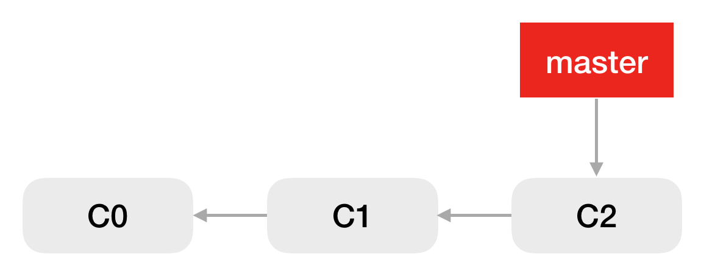

- Representamos el estado inicial del proyecto con la figura
  anterior. 
  
- Hemos decidido trabajar en el _issue_ número 53, que escogemos del
  sistema de tracking de _issues_ que nuestra empresa esté usando.

- Creamos una rama nueva en la que trabajar con el comando `git
  checkout` con el parámetro `-b`:

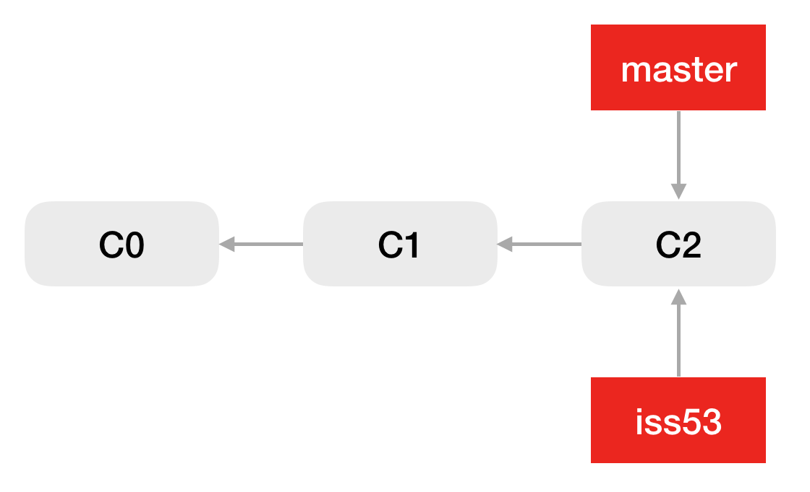

```txt
$ git checkout -b iss53
Switched to a new branch 'iss53'
```

- Esto es un modo abreviado de:

```txt
$ git branch iss53
$ git checkout iss53
```

<!-- Tres líneas en blanco para la siguiente transparencia -->


## Trabajamos en el _issue_ ##
<!-- .slide: data-background="#cbe0fc"-->

- Para desarrollar el _issue_ 53 hacemos algunos cambios en el texto
  del artículo y hacemos commit:
  
```txt
# Modificamos el artículo del index.html
$ git commit -am "Completando el artículo [issue 53]"
[iss53 191f0db] Completando el artículo [issue 53]
 1 file changed, 1 insertion(+), 5 deletions(-)
```

- Al hacer esto el puntero de la rama en la que estamos se mueve
  también hacia adelante:
  
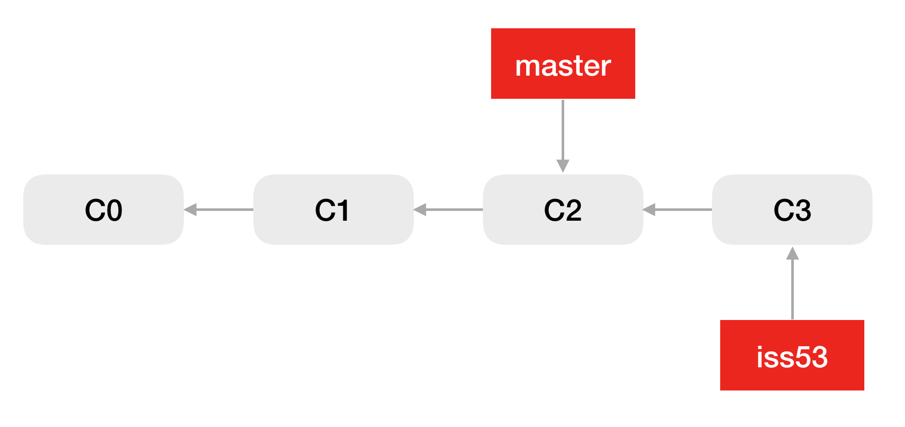


<!-- Tres líneas en blanco para la siguiente transparencia -->


## Cambios sin comitear ##
<!-- .slide: data-background="#cbe0fc"-->

- Ahora llega la petición de realizar un arreglo rápido en la rama de
  producción: tenemos que añadir una dirección de correo en la página
  principal. No hay ningún problema en conservar el trabajo realizado en el
  _issue_, todo lo que tenemos que hacer es cambiarnos a la rama
  `master`.

- Si en el espacio de trabajo o en el área de stage tenemos cambios
  sin comitear que entran en conflicto con la rama a la que nos
  movemos, Git no nos dejará cambiar. Vamos a probarlo.

- Estando en la rama `issue53` hacemos más cambios en el artículo, sin
  hacer commit:
  
```txt
# Hacemos más cambios en el artículo index.html,
# pero no hacemos commit
$ git status
On branch iss53
Changes not staged for commit:
  (use "git add <file>..." to update what will be committed)
  (use "git checkout -- <file>..." to discard changes in working directory)

	modified:   index.html

no changes added to commit (use "git add" and/or "git commit -a")
```

- Si ahora intentamos cambiar a `master`:

```txt
$ git checkout master
error: Your local changes to the following files would be overwritten by checkout:
	index.html
Please commit your changes or stash them before you switch branches.
Aborting
```

<!-- Tres líneas en blanco para la siguiente transparencia -->


## Usamos "git stash" ##
<!-- .slide: data-background="#cbe0fc"-->

- Con `git stash` podemos eliminar los cambios actuales del espacio de
  trabajo y apilarlos en una pila (_stash_) de la que después podremos
  desapilarlos:
  
```txt
$ git stash
Saved working directory and index state WIP on iss53: 191f0db Completando el artículo [issue 53]
$ git status
On branch iss53
nothing to commit, working tree clean
```

- Podemos examinar el contenido de la pila:

```txt
$ git stash list
stash@{0}: WIP on iss53: 191f0db Completando el artículo [issue 53]
```

- El comando `git stash pop` desapila los cambios en el espacio de
  trabajo actual.
  
```txt
$ git stash pop
On branch iss53
Changes not staged for commit:
  (use "git add <file>..." to update what will be committed)
  (use "git checkout -- <file>..." to discard changes in working directory)

	modified:   index.html

no changes added to commit (use "git add" and/or "git commit -a")
Dropped refs/stash@{0} (178d16c6647adc28985253d08ed95de639e6d070)
```

<!-- Tres líneas en blanco para la siguiente transparencia -->


## Cambiamos de rama y abrimos el hotfix ## 
<!-- .slide: data-background="#cbe0fc"-->
<!-- .slide: class="image-right" -->

- Volvemos a hacer `git stash` para apilar los cambios y cambiamos a
  `master` para realizar allí el hotfix:

```txt
$ git stash
Saved working directory and index state WIP on iss53: 191f0db Completando el artículo [issue 53]
$ git checkout master
Switched to branch 'master'
Your branch is up-to-date with 'origin/master'.
```

- Realizamos el hotfix, creando una rama en la que lo completamos:

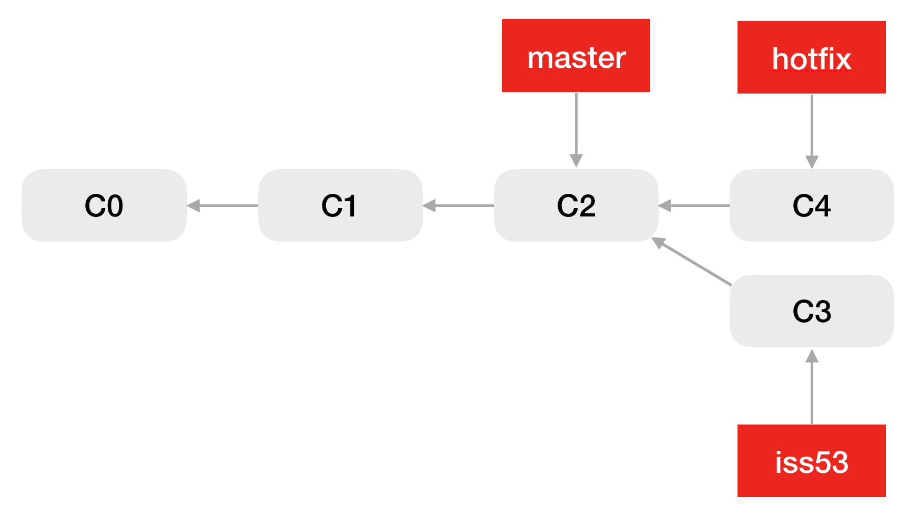


```txt
$ git checkout -b hotfix
Switched to a new branch 'hotfix'
# Añadimos el correo electronico acme@gmail.com 
# en el pie de página
$ git commit -am "Añadida la dirección de email"
[hotfix 330b7f8] Añadida la dirección de email
 1 file changed, 1 insertion(+), 1 deletion(-)
```


<!-- Tres líneas en blanco para la siguiente transparencia -->


## Mezclamos el hotfix con master ##
<!-- .slide: data-background="#cbe0fc"-->

- Podemos realizar los tests y asegurarnos de que el hotfix es el que
  queremos (en nuestro caso, bastaría con cargar la página en el
  navegador) y finalmente mezclamos en la rama `master` que es la que
  se despliega en producción:

```txt
$ git checkout master
$ git merge hotfix
Updating fb8f62b..330b7f8
Fast-forward
 index.html | 2 +-
 1 file changed, 1 insertion(+), 1 deletion(-)
```

- El término "fast-forward" se refiere a que no se ha tenido que crear
  un commit de merge que combine las dos ramas, dado que no hay
  ninguna historia divergente entre `hotfix` y `master`. Git
  simplemente avanza el puntero de la rama `master`:

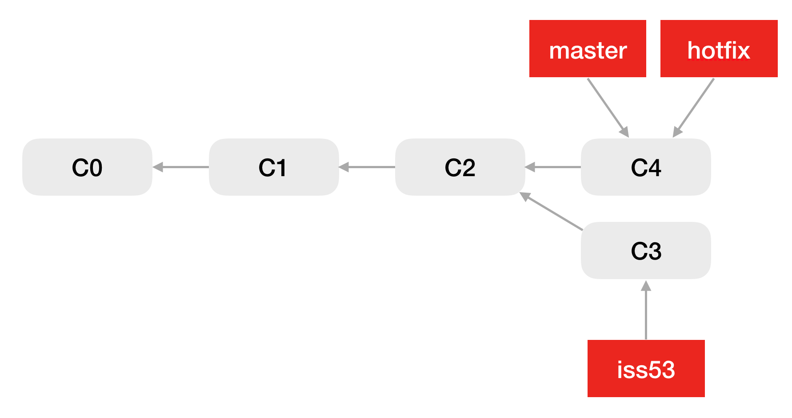

<!-- Tres líneas en blanco para la siguiente transparencia -->


## Seguimos trabajando el issue 53 ##
<!-- .slide: data-background="#cbe0fc"-->

- Después de haber integrado el hotfix en `master` ya podemos seguir
  trabajando el _issue_ 53.
- Sin embargo, primero borramos la rama `hotfix` porque ya no la
  necesitamos:
  
```txt
$ git branch -d hotfix
Deleted branch hotfix (was 330b7f8).
```

- Comprobamos las ramas que quedan:
  
```txt
$ git branch
  iss53
* master
```

- El asterisco nos indica la rama en la que nos encontramos. 

- Nos movemos a la rama `iss53`, desapilamos el trabajo en proceso y
  terminamos el desarrollo:
  
```txt
$ git checkout iss53
$ git stash pop
# Terminamos el artículo y hacemos commit
$ git commit -am "Terminado el artículo [issue 53]"
[iss53 a5e2c39] Terminado el artículo [issue 53]
 1 file changed, 2 insertions(+)
```


<!-- Tres líneas en blanco para la siguiente transparencia -->


## Actualizamos la rama hotfix ##
<!-- .slide: data-background="#cbe0fc"-->

- Hay que resaltar que el trabajo que hemos realizado en el hotfix no
  está ahora incluido en la rama `iss53`. Si cargas la página en el
  navegador verás que en el pie de página no está la dirección de
  correo.
  
- Puede ser necesario integrar el desarrollo en `master` para probar que
  todo funciona correctamento. Basta con mezclar la rama `master` en
  la rama actual:

```txt
$ git branch
* iss53
  master
$ git merge master
```

- Se abrirá el editor, pidiéndonos que escribamos el mensaje del
  commit de merge. Podemos salvar y dejar el mensaje por defecto.

- Una vez realizado el merge, podemos comprobar que todo funciona
  bien. En nuestro caso, la página contendrá el nuevo artículo y la
  dirección de email en el pié de página.
  
- Si comprobamos que algo no funciona bien, podemos deshacer
  fácilmente el último `merge`:
  
```txt
$ git reset --merge ORIG_HEAD
```

<!-- Tres líneas en blanco para la siguiente transparencia -->


## Estado del repositorio ##
<!-- .slide: data-background="#cbe0fc"-->

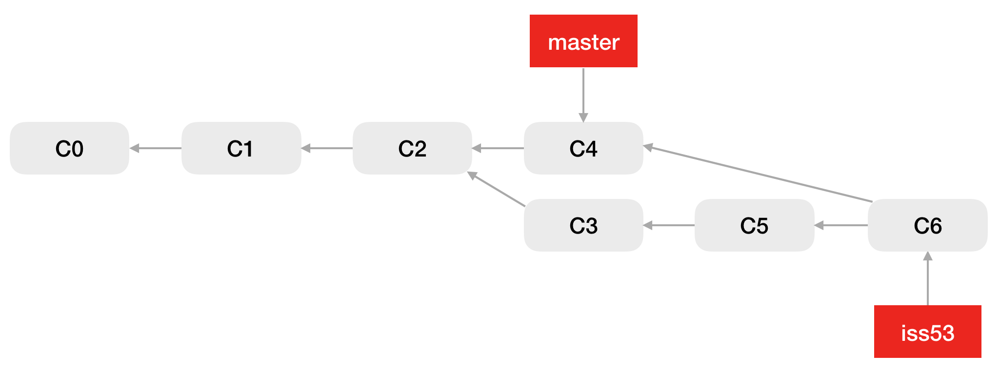

<!-- Tres líneas en blanco para la siguiente transparencia -->


## Mezclamos el issue en master ##
<!-- .slide: data-background="#cbe0fc"-->

- Como todo está correcto, mezclamos el issue en la rama master:

```txt
$ git checkout master
$ git merge iss53
Updating 330b7f8..48d7900
Fast-forward
 index.html | 8 +++-----
 1 file changed, 3 insertions(+), 5 deletions(-)
```

- La imagen de la historia de Git resultante:

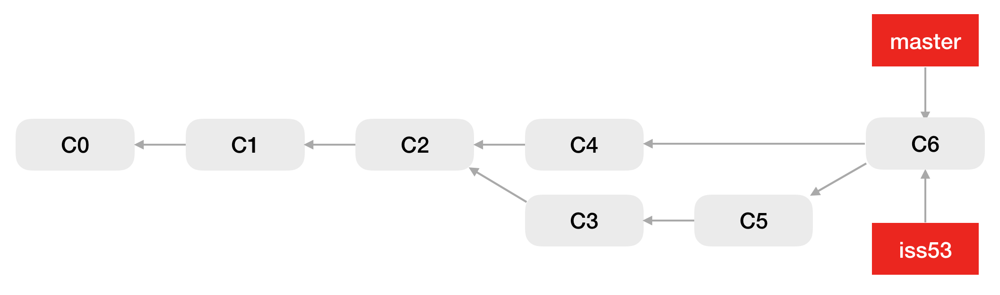

<!-- Tres líneas en blanco para la siguiente transparencia -->


## Y subimos los cambios al repositorio remoto ##
<!-- .slide: data-background="#cbe0fc"-->
<!-- .slide: class="image-right" -->

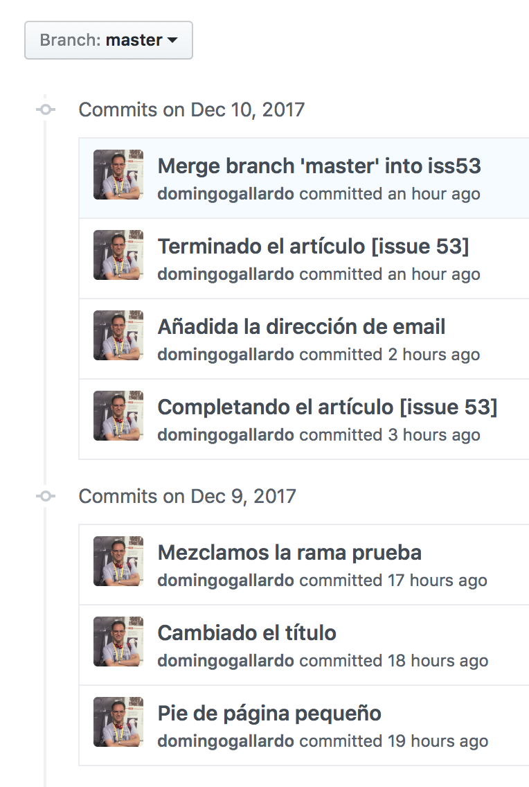

- Subimos `master` al repositorio remoto y borramos la rama `iss53`:
  
```txt
$ git push
$ git branch -d iss53
```

- Todo ha funcionado muy bien: 
    - Hemos realizado un desarrollo independiente de la línea
      principal.
    - Hemos podido introducir en la línea principal un cambio rápido y
      después continuar el desarrollo independiente.
    - Al final hemos mezclado todo y no ha habido ningún problema.

<!-- Tres líneas en blanco para la siguiente transparencia -->


## Resumen de comandos vistos ##

|Comando | Explicación |
|-------|--------------|
| `git branch <rama>` | Crea una rama |
| `git checkout <rama>` | Nos movemos a una rama |
| `git checkout -b <rama>` | Crea una rama y nos movemos a ella |
| `git log --oneline --graph --all ` | Muestra la historia de commits de forma gráfica, incluyendo todas las ramas |
| `git branch` | Muestra todas las ramas | 
| `git branch -d <rama>` | Elimina una rama |
| `git merge <otra-rama> -m "<mensaje>"` | Mezcla la rama `otra-rama` en la rama actual y crea el commit de mezcla con el mensaje indicado|
| `git stash` | Añade los cambios en el espacio de trabajo a la pila stash |
| `git stash list` | Muestras los cambios apilados en la pila stash |
| `git stash pop` | Desapila los cambios del stash y los añade al espacio de trabajo |
| `git reset --merge ORIG_HEAD` | Deshace el último merge realizado |

<!-- Tres líneas en blanco para la siguiente transparencia -->


## Examinamos la historia de cambios. <br/> ¿Hay algo mejorable? ##


<!-- Los commits aparecen ordenados sólo por fecha, no hay ninguna -->
<!-- información de la "evolución lógica" del proyecto: cuál ha sido -->
<!-- el hotfix, cuál ha sido el issue, etc.-->

<!-- Tres líneas en blanco para la siguiente transparencia -->


## Volvemos al estado inicial para empezar de nuevo ##
<!-- .slide: data-background="#cbe0fc"-->

- Vamos a probar otras otros comandos de mezcla, que también se
  utilizan muy a menudo en flujos de trabajo reales: `git merge
  --no-ff` y `git rebase`.
  
- Empezamos volviendo al **commit anterior al ejercicio anterior**, el que
  tiene como descripción `Mezclamos la rama prueba`:

```txt
$ git reset --hard fb8f62b
HEAD is now at fb8f62b Mezclamos la rama prueba
```

- Hacemos un `git push --force` para sobreescribir la historia que hay en
  el repositorio remoto (si intentamos hacer un `push` sin `--force`
  Git no lo dejará, porque el repositorio local tiene el `HEAD` en un
  commit pasado):

```txt
$ git push
To https://github.com/domingogallardo/curso-git-repo1.git
 ! [rejected]        master -> master (non-fast-forward)
error: failed to push some refs to 'https://github.com/domingogallardo/curso-git-repo1.git'
hint: Updates were rejected because the tip of your current branch is behind
hint: its remote counterpart. Integrate the remote changes (e.g.
hint: 'git pull ...') before pushing again.
```

```txt
$ git push --force
Total 0 (delta 0), reused 0 (delta 0)
To https://github.com/domingogallardo/curso-git-repo1.git
 + 48d7900...fb8f62b master -> master (forced update)
 ```

<!-- Tres líneas en blanco para la siguiente transparencia -->


## Creamos las mismas ramas que antes  ##
<!-- .slide: data-background="#cbe0fc"-->

- Creamos las mismas ramas y commits que antes con el objetivo de llegar a la
  situación mostrada en la siguiente imagen:
  
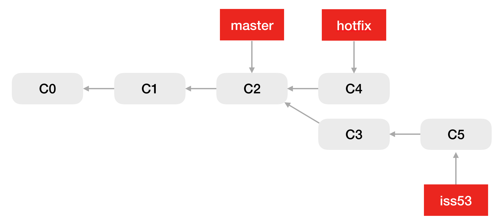


<!-- Tres líneas en blanco para la siguiente transparencia -->


## El comando "git merge --no-ff" ##

- Si se hace un _fast forward_ es imposible saber qué commits son los
  que corresponden a la rama y cuáles a la historia previa.
- El comando `git merge --no-ff` previene la realización de un _fast
  forward_ creando un commit de merge artificial.
- Esto permite preservar la historia lógica de una rama, ya que los
  commits de la rama quedan separados de la rama principal y es
  posible examinar los cambios completos que han introducido esos
  commits.

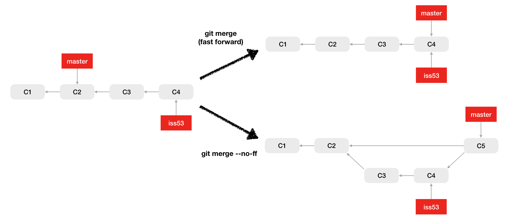

<!-- Tres líneas en blanco para la siguiente transparencia -->


## Integramos el hotfix con "merge --no-ff" ##
<!-- .slide: data-background="#cbe0fc"-->

- Mezclamos el hotfix (que tiene un único commit) en master, usando un
  `merge --no-ff`:

```txt
$ git checkout master
$ git merge --no-ff hotfix
# Se abrirá el editor: deja el mensaje de commit por defecto
Merge made by the 'recursive' strategy.
 index.html | 2 +-
 1 file changed, 1 insertion(+), 1 deletion(-)
```

- El resultado es el siguiente. A la izquierda lo que muestra el
  comando `git log --oneline --graph --all` y a la derecha la
  representación gráfica. Podemos comprobar que queda claro en la historia el
  commit que hemos realizado en el hotfix:

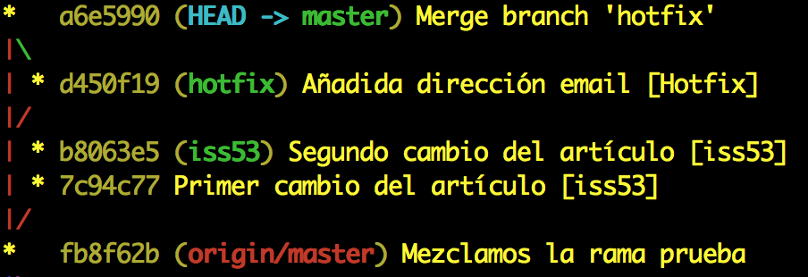 
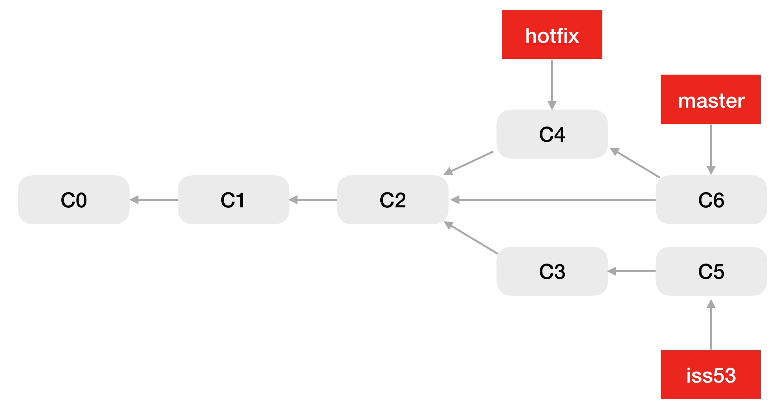

<!-- Tres líneas en blanco para la siguiente transparencia -->


## Incorporamos la rama iss53 ##
<!-- .slide: data-background="#cbe0fc"-->

- Una vez mezclada, eliminamos la rama `hotfix`:

```txt
$ git branch -d hotfix
```

- Y ahora vamos a mezclar la rama `iss53` con `master` ¿Cómo quedaría
  el grafo de commits si hiciéramos un `merge` de `iss53` en `master`? La historia quedaría
  también clara:

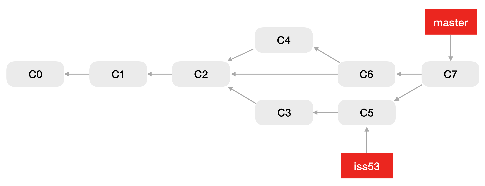

- Pero hay un comando muy útil de Git que deja una historia todavía
  más clara, a costa de cambiar la historia verdadera del proyecto
  introduciendo commits nuevos. Se trata del comando `git rebase`.


<!-- Tres líneas en blanco para la siguiente transparencia -->


## Comando "git rebase" ##

- El comando git rebase realiza un "cambio de base" de una rama,
  haciéndola avanzar al top de la rama sobre la que hacemos el rebase.

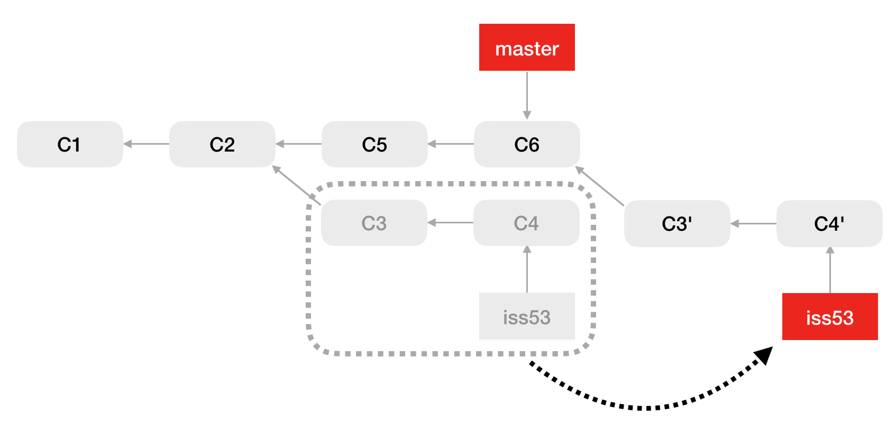

- La imagen anterior es el resultado de los siguientes comandos:

```txt
$ git checkout iss53
$ git rebase master
```

- Para realizar el rebase Git reproduce los commits `C3` y `C4` en la
  cabeza de la rama `master`, creando los commits `C3'` y
  `C4'`. Después mueve el puntero de la rama `iss53` al último commit añadido.

- El resultado es que la rama `iss53` resultante ha cambiado su commit
  base y se ha colocado a la cabeza de `master`. El contenido de los
  cambios de la rama es el mismo.
  

<!-- Tres líneas en blanco para la siguiente transparencia -->


## Aplicamos "git rebase" al proyecto ##
<!-- .slide: data-background="#cbe0fc"-->
<!-- .slide: class="image-right" -->

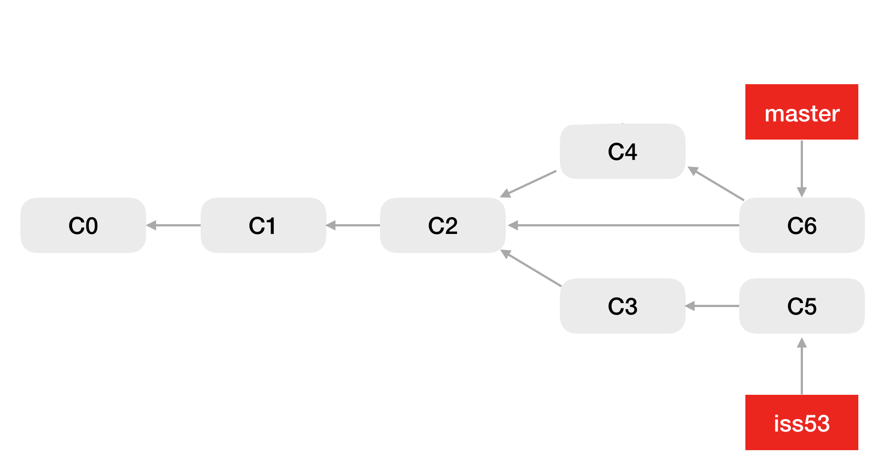

- Recordemos el estado actual del proyecto. Tenemos la rama `master`
  en la que se ha integrado el hotfix y la rama con el _issue_ 53 que
  hemos terminado de desarrollar y queremos integrar también:

- Hacemos un rebase de `iss53` sobre `master`:

```txt
$ git checkout iss53
$ git rebase master
First, rewinding head to replay your work ...
Applying: Primer cambio del artículo [iss53]
Applying: Segundo cambio del artículo [iss53]
```

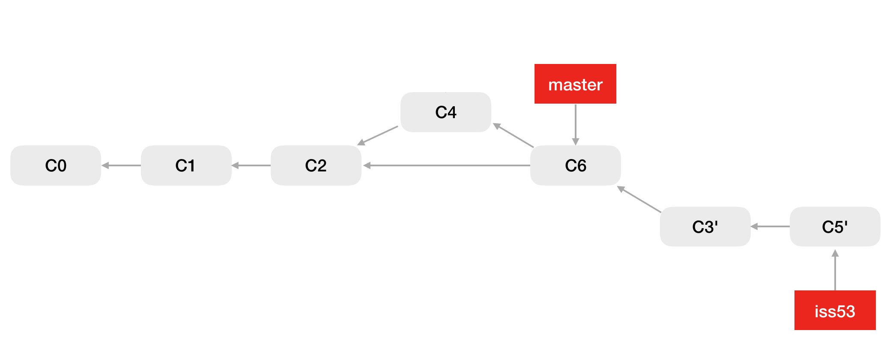

- El resultado es el siguiente:


<!-- Tres líneas en blanco para la siguiente transparencia -->


## Mezclamos la rama iss53 ##
<!-- .slide: data-background="#cbe0fc"-->

- Y ahora hacemos un `merge --no-ff` para mezclar la rama resultante
  (después del rebase) de `iss53` en `master`, sin hacer _fast
  forward_. Una vez realizada la mezcla, borramos la rama.

```txt
$ git checkout master
$ git merge --no-ff iss53
Merge made by the 'recursive' strategy.
 index.html | 9 ++++-----
 1 file changed, 4 insertions(+), 5 deletions(-)
$ git branch -d iss53
Deleted branch iss53 (was 8b07fdd).
```

- ¿Cuál sería la representación de la historia de los commits? Si
  hacemos un `git log --oneline --graph --all` veremos la
  representación de la derecha:

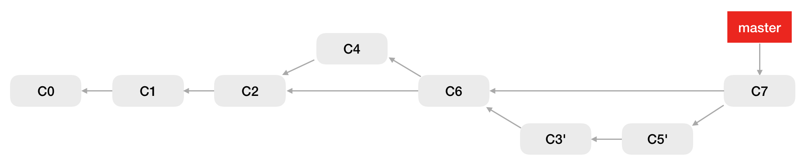 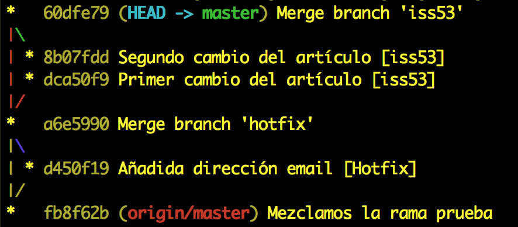

<!-- Tres líneas en blanco para la siguiente transparencia -->


## Subimos los commits ##
<!-- .slide: data-background="#cbe0fc"-->
<!-- .slide: class="image-right" -->

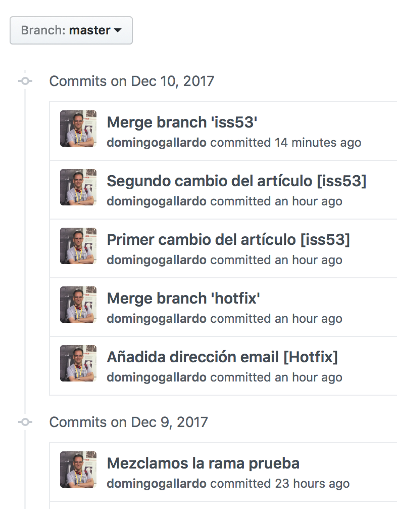

```txt
$ git push
```

- Subimos los commits al repositorio remoto.

- Examinamos los commits en el repositorio GitHub. Podemos comprobar
  que ahora sí que hay información lógica sobre la evolución histórica
  del desarrollo del proyecto: los commits de merge de ramas contienen
  acumulados todos los cambios de todos los commits que se han
  realizado en esa rama.
  
- Para mantener una historia lógica del repositorio es muy útil usar
  los comandos `git merge --no-ff` y `git rebase`.

- En la siguiente clase veremos que esto es también se puede conseguir
  usando _pull requests_.

<!-- Tres líneas en blanco para la siguiente transparencia -->


## Problemas del rebase ##
<!-- .slide: class="image-right" -->


- Cuando se realiza un rebase se crean commits nuevos (con distintos
  números _hash_, pero el mismo contenido). Los commits nuevos tienen
  la hora y fecha de la realización del rebase. Esto **cambia la
  historia** del proyecto.

- La regla básica se puede resumir en una única frase: 

> **No rebases commits que existan fuera de tu repositorio.**

- Si sigues este consejo, todo irá bien. Si no, serás el culpable de
  muchos males y la gente te odiará.

- Si ya habías subido los commits antiguos y la gente se los ha
  descargado y ha seguido trabajando a partir de ellos, cuando subas
  la nueva historia los compañeros tendrán que re-mezclar sus commits
  y cuando hagas un pull las cosas se pondrán muy complicadas.

- Puedes encontrar en [este
  apartado](https://git-scm.com/book/en/v2/Git-Branching-Rebasing#_pre_merge_rebase_work)
  del libro Pro Git una explicación de qué hacer en este caso.

<!-- Tres líneas en blanco para la siguiente transparencia -->


## Comando "git rebase -i" ##
<!-- .slide: class="image-right" -->

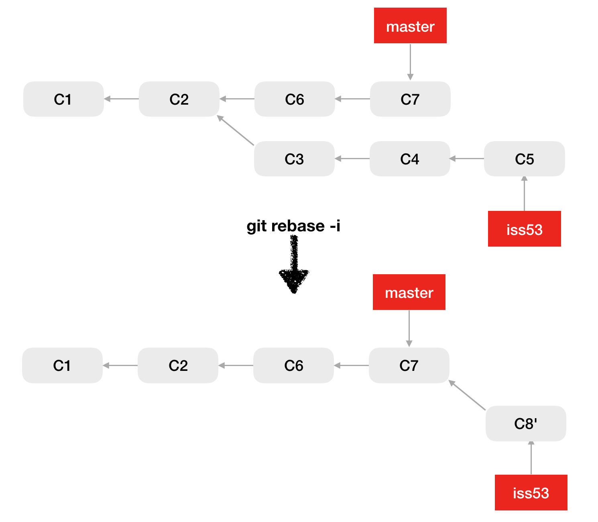


- Además de ser útil para clarificar la historia del proyecto, el
  rebase también se puede usar para limpiar los commits de una rama
  antes de subirlos al servidor remoto.

- El comando `git rebase -i` (rebase interactivo) permite modificar
  los mensajes de los commits, mezclar varios commits y/o eliminar
  commits.

- En la figura de la derecha, el rebase interactivo compacta los tres
  commits de la rama `iss53` (`C3`, `C4` y `C5`) en un único commit
  (`C8'`) que incluye todos los cambios.

<!-- Tres líneas en blanco para la siguiente transparencia -->


## Probamos el rebase interactivo ##
<!-- .slide: data-background="#cbe0fc"-->
<!-- .slide: class="image-right" -->

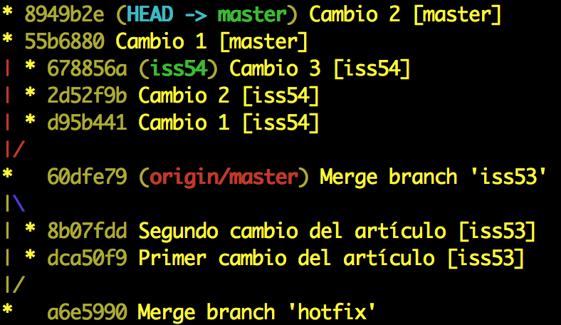

- Crea una rama nueva llamada `iss54` y añade 3 commits en
  ella. Cambia a la rama `master` y añade 2 commits. El resultado
  debería ser el que se ve en la figura:
  
- Vamos ahora a hacer un rebase interactivo en el que nos quedaremos
  con un único commit en el que se incluyan todos los cambios:

```txt
$ git rebase -i master
```


<!-- Tres líneas en blanco para la siguiente transparencia -->


## Edición de las acciones del rebase interactivo ##
<!-- .slide: data-background="#cbe0fc"-->
<!-- .slide: class="image-right" -->

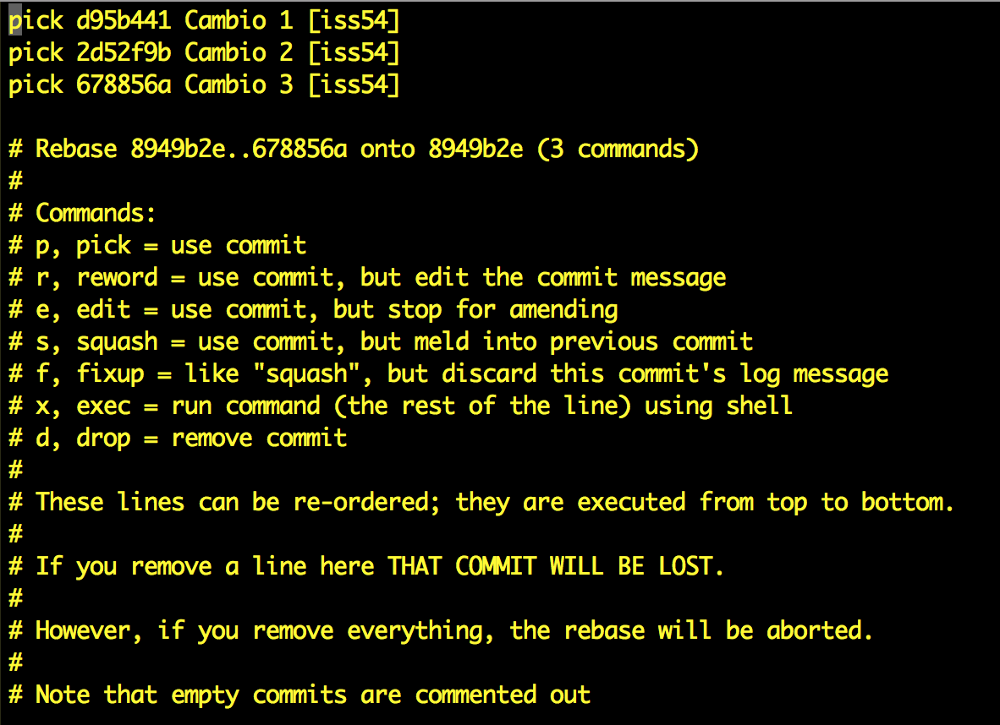

- Se abrirá un editor en el que deberemos escribir las instrucciones a
  realizar por el rebase. Las instrucciones **se ejecutarán de arriba a
  abajo**. Por defecto aparecen las instrucciones que generarán un 
  rebase normal:
     - aplicar el commit 1
     - aplicar el commit 2
     - aplicar el commit 3


<!-- Tres líneas en blanco para la siguiente transparencia -->


## Opciones del rebase interactivo ##
<!-- .slide: data-background="#cbe0fc"-->
<!-- .slide: class="image-right" -->


- Sin embargo, podemos cambiar ese comportamiento por defecto,
  modificando esas instrucciones usando los propios comandos que nos
  muestra la página que estamos editando.

- Las opciones que podemos hacer con los commits que rebaseamos
  pueden:
  - **pick**: usar commit tal cual
  - **reword**: modificar el mensaje del commit por el nuevo que
    escribimos a continuación
  - **edit**: usar el commit, pero parar para modificar el mensaje
  - **squash**: mezcla el commit con el previo
  - **fixup**: como "squash", pero descarta el mensaje del commit
  - **drop**: elimina el commit

<!-- Tres líneas en blanco para la siguiente transparencia -->


## Escribimos las acciones del rebase interactivo ##
<!-- .slide: data-background="#cbe0fc"-->
<!-- .slide: class="image-right" -->

- Escribimos lo siguiente en el editor (queremos cambiar de nombre el primer
  commit y mezclamos en él los commits 2 y 3):

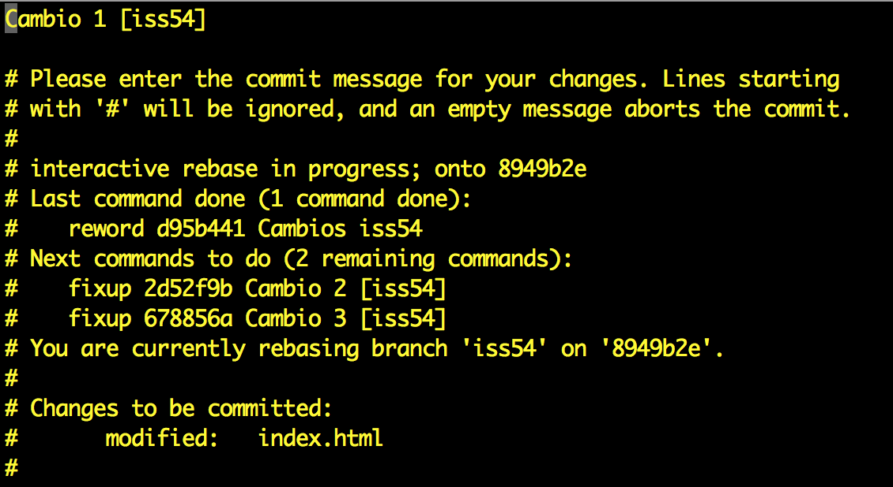

```txt
reword d95b441 Cambios iss54
fixup 2d52f9b Cambio 2 [iss54]
fixup 678856a Cambio 3 [iss54]
```

- Salvamos el fichero de acciones y se ejecutarán una a una.
- Al ejecutar el `reword` del primer commit se abrirá otra vez el
  editor con la información que muestra la imagen de la derecha.
  
- Salvamos sin cambiar nada y automáticamente se realizan los otros
  dos comandos y se termina el rebase.

```txt
[detached HEAD c9b490a] Cambio 1 [iss54]
 1 file changed, 3 insertions(+)
Successfully rebased and updated refs/heads/iss54.
```

<!-- Tres líneas en blanco para la siguiente transparencia -->


## Comprobamos cómo ha quedado el grafo ##
<!-- .slide: data-background="#cbe0fc"-->
<!-- .slide: class="image-right" -->

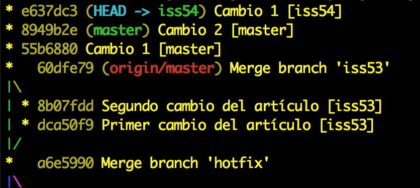

- Mostramos la historia para comprobar cómo ha quedado el grafo de
  commits:
  
```txt
$ git log --oneline --graph --all
```

- Y mergeamos sobre `master` con un `--no-ff`, aceptando el mensaje
  por defecto que nos muestra el editor:

```txt
$ git checkout master
$ git merge --no-ff iss54
```

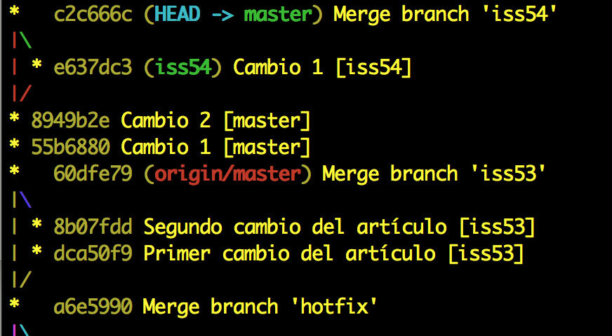

- El grafo debe quedar como muestra la imagen de la derecha.

- Terminamos borrando la rama `iss54` y subiendo todo a GitHub:

```txt
$ git branch -d iss54
$ git push
```

<!-- Tres líneas en blanco para la siguiente transparencia -->


## Comando "git cherry-pick" ##

<!-- Tres líneas en blanco para la siguiente transparencia -->

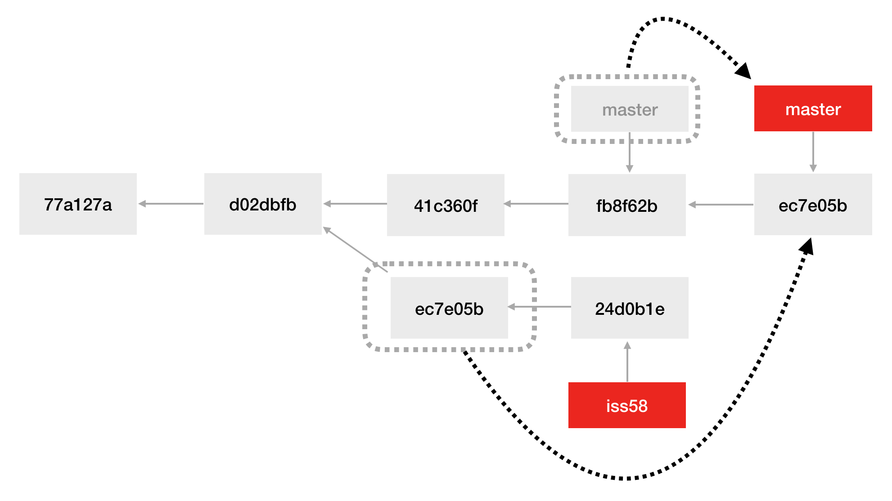

- El comando `git cherry-pick` permite duplicar un commit de su rama
  original en la rama actual. La figura anterior muestra el resultado
  de:
  
```txt
$ git checkout master
$ git cherry-pick ec7e05b
```

- Supongamos que en una rama de desarrollo de un _issue_ nos damos
  cuenta de un error importante y lo solucionamos en un commit. Con el
  comando `git cherry-pick` es posible aplicar ese mismo commit a
  `master` para resolver también allí el bug.
- Al igual que el merge y el rebase Git comprueba si es posible
  aplicar el commit en la nueva rama y genera un conflicto en el caso
  en que no lo sea.
  
<!-- Tres líneas en blanco para la siguiente transparencia -->


## Ejemplo de "git cherry-pick" ##
<!-- .slide: data-background="#cbe0fc"-->
<!-- .slide: class="image-right" -->

- Vamos a probar el comando `git cherry-pick`.

- Haz una rama nueva `iss55` y crea un commit cambiando el título
  `<h1>` de la página (ese será el commit que copiaremos en `master`).
- Añade dos o tres commits a la rama.

```txt
$ git checkout -b iss55
# Modificamos el título <h1> de la página
$ git commit -am "Modificado título [iss55]"
# Hacemos varios cambios más y añadimos dos nuevos commits
```

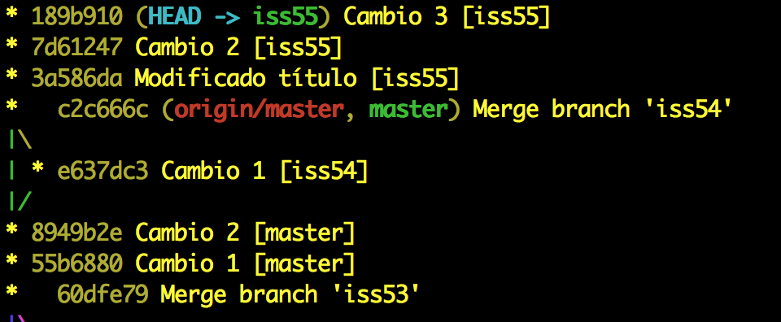

- Vemos el grafo de commits antes de hacer el cherry-pick:

- Cambiamos a `master` y hacemos el cherry-pick, seleccionando el commit en el que hemos
  cambiado el título:

```txt
$ git checkout master
Switched to branch 'master'
$ git cherry-pick 3a586da
[master c5f32a0] Modificado título [iss55]
 Date: Thu Dec 14 12:36:34 2017 +0100
 1 file changed, 1 insertion(+), 1 deletion(-)
```

<!-- Tres líneas en blanco para la siguiente transparencia -->


## Resumen de los últimos commandos ##

|Comando | Explicación |
|-------|--------------|
| `git push --force` | Sube los commits al repositorio remoto sobreescribiendo la historia de commits  |
| `git merge --no-ff <rama>` |  Mezcla la rama sobre la rama actual creando un commit de mezcla para prevenir el fast forward |
| `git rebase <rama>` | Mueve la rama actual sobre la rama indicada creando nuevos commits  |
| `git rebase <rama> -i` | Realiza un rebase interactivo |
| `git cherry-pick <commit>` | Re-aplica el commit sobre la rama actual  |

<!-- Tres líneas en blanco para la siguiente transparencia -->


## Primer contacto con Git Kraken ##
<!-- .slide: data-background="#cbe0fc"-->
<!-- .slide: class="image-right" -->

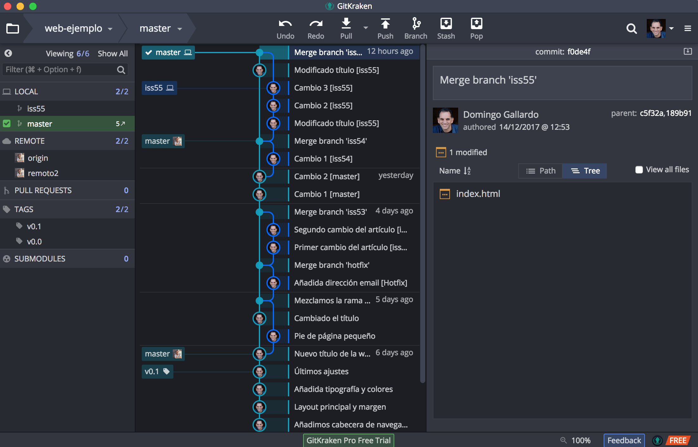

- Abre Git Kraken y regístrate usando tu cuenta de GitHub
- Abre el repositorio de trabajo
- Realizamos un primer contacto con la aplicación:
   - Examinamos los cambios en un commit
   - Examinamos los cambios en un merge
   - Examinamos el commit del que hemos hecho cherry-pick
   - Eliminamos la rama `iss55`

<!-- Tres líneas en blanco para la siguiente transparencia -->


## ¡Fin de la sesión! ##


