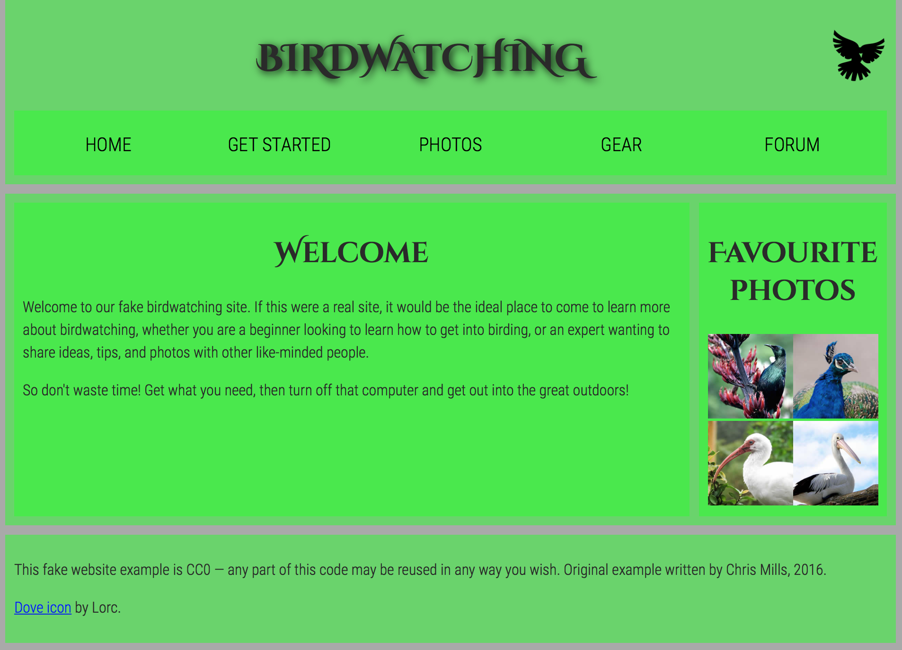

<br/><br/><p style="font-size:90%"><strong>@2018 Domingo Gallardo<br/>Depto. de Ciencia de la Computación e I.A.</strong></p>

<!-- Tres líneas en blanco para la siguiente transparencia -->


## Día 2: Git para el trabajo en equipo ##

- Sesión 3
   - Solución de conflictos en los merge
   - ¿Qué hacer cuando he metido la pata?
   - Empezamos a trabajar en equipo: ciclo de trabajo sobre master
   - Trabajo con ramas de features, pruebas antes de integrar en master
   
- **Sesión 4**
   - Pull requests en GitHub
   - Ramas short-lived y long-lived
   - Gestión de versiones con ramas
   - Gestión de bug-fixes y cherry-pick

<!-- Tres líneas en blanco para la siguiente transparencia -->


## Origen del pull request ##
<!-- .slide: class="image-right" -->


- El término _pull request_ tiene su origen en el flujo de trabajo
  típico del desarrollo open source (flujo de trabajo basado
  en forks)
   - Un repositorio oficial contiene la versión canónica del proyecto.
   - Los colaboradores no tienen permiso de escritura en este repositorio,
     pero quieren realizar desarrollos que solucionan bugs o
     añaden _features_.
   - Se copia el repositorio canónico (normalmente con un _fork_) a un
     repositorio particular en el que se crea una rama con la
     aportación.
   - Se solicita al administrador del repositorio oficial la mezcla de
     la rama de nuestro repositorio en la rama `master` del
     repositorio oficial.
- La solicitud de mezcla es el origen del término **pull request**:
  petición de que el administrador haga un pull en el repositorio
  oficial que integre nuestra rama.


<!-- Tres líneas en blanco para la siguiente transparencia -->


## Pull request en GitHub ##
<!-- .slide: class="image-right" -->


- Tanto la solicitud del pull request como su aprobación en
  integración en el repositorio oficial eran operaciones manuales
  hasta que servicios de hosting de Git como GitHub o Bitbucket
  incorporaron utilidades para gestionarlos.
- En GitHub solicitar un pull request es tan sencillo como seleccionar
  la rama que se quiere integrar y pulsar un botón.


- La aprobación del pull request es igual de sencillo: con un botón se
  acepta y GitHub se encarga de realizar la mezcla de la rama con
  master.


<!-- Tres líneas en blanco para la siguiente transparencia -->


## Creación de un pull request en GitHub ##


<!-- Tres líneas en blanco para la siguiente transparencia -->


## Pestaña de pull requests ##
<!-- .slide: class="image-right" -->


- GitHub mantiene la lista de pull requests abiertos y cerrados.
- Es una de las páginas más importantes y que más va a visitar el equipo.


<!-- Tres líneas en blanco para la siguiente transparencia -->


## Página de pull request ##
<!-- .slide: class="image-right" -->


- Página importante en la que el administrador, el proponente (y el
  equipo) pueden consultar los cambios que propone el pull request y
  realizar comentarios.
- GitHub comprueba si hay conflictos en el merge.
- Si se **suben nuevos commits** a la rama del pull request, GitHub
  actualiza la página con la información de los nuevos commits.
- Es posible incluso hacer un `push --force` y sustituir todos los
  commits por otros nuevos (por ejemplo, cuando se ha hecho un **rebase
  de la rama local**).

<!-- Tres líneas en blanco para la siguiente transparencia -->


## Página de aceptación del pull request ##
<!-- .slide: class="image-right" -->


- La página del pull request vista desde el punto de visto del
  administrador.
- Con solo pulsar un botón se acepta el pull request.
- GitHub realiza el merge de las ramas.

<!-- Tres líneas en blanco para la siguiente transparencia -->


## Rama master después de integrar el pull request ##
<!-- .slide: class="image-right" -->


- La rama se integra en la rama `master` del repositorio.

- Actualizamos el repositorio local 

```txt
$ git checkout master
$ git pull
```

- Podemos ver que se ha mezclado la rama con un `merge --no-ff`. La
imagen de la derecha muestra cómo se ven en GitKraken.


<!-- Tres líneas en blanco para la siguiente transparencia -->


## Ejercicio: fork y pull request ##
<!-- .slide: data-background="#cbe0fc"-->
<!-- .slide: class="image-right" -->


- Haz un fork del repositorio
  [domingogallardo/asistentes-curso-git](https://github.com/domingogallardo/asistentes-curso-git). 
- Clona tu repositorio en local.
- Crea una rama con el nombre `nuevo-asistente`. Añade tu nombre
  precedido de un guión en el fichero `README.md`
  
```txt
# Asistentes curso Git

- Domingo Gallardo
```

- Sube la rama a GitHub y realiza desde allí un pull request al
  repositorio original.
- El administrador del repositorio original acepta los pull requests.

<!-- Tres líneas en blanco para la siguiente transparencia -->


## Actualizamos master en nuestro repositorio ##
<!-- .slide: data-background="#cbe0fc"-->
<!-- .slide: class="image-right" -->


- Para actualizar `master` en nuestro repositorio privado lo más sencillo es
  crear otro remoto en el repo local. Lo llamamos `upstream`:
  
```txt
$ git remote add upstream https://github.com/domingogallardo/asistentes-curso-git.git
$ git remote -v
origin	https://github.com/domingogallardo2/asistentes-curso-git.git (fetch)
origin	https://github.com/domingogallardo2/asistentes-curso-git.git (push)
upstream	https://github.com/domingogallardo/asistentes-curso-git.git (fetch)
upstream	https://github.com/domingogallardo/asistentes-curso-git.git (push)
```


- Y actualizamos `master` bajándolo de `upstream`:

```txt
$ git fetch upstream
From https://github.com/domingogallardo/asistentes-curso-git
 * [new branch]      master     -> upstream/master
$ git checkout master
$ git merge upstream/master
```

- Por último subimos `master` a nuestro repositorio remoto privado
  para mantenerlo actualizado con el repositorio original:
  
```txt
$ git push origin master # bastaría con `git push`
```

<!-- Tres líneas en blanco para la siguiente transparencia -->


## ¡Prueba superada! ##


<!-- Tres líneas en blanco para la siguiente transparencia -->


## Pull request ##

- El funcionamiento del pull request en los proyectos open source tuvo
  tanto éxito que GitHub y el resto de servicios lo adaptaron al
  trabajo en un único repositorio.
- Es posible hacer un pull request en GitHub de cualquier rama subida
  al repositorio sobre cualquier otra rama (lo normal es hacerlo sobre
  `master`).
- Desde la pestaña `branch` que muestra las ramas subidas al repositorio,
  se puede crear un pull request con cualquiera de ellas.


<!-- Tres líneas en blanco para la siguiente transparencia -->


## Flujo de trabajo de ramas de features ##

- Los pull requests son un complemento perfecto para el flujo de
  trabajo de ramas de features:


<!-- Tres líneas en blanco para la siguiente transparencia -->


## Ejemplo: CartoDB  ##
<!-- .slide: class="image-right" -->


- CartoDB es un producto open source español de cartografía y
  visualización que utiliza Git y GitHub de forma intensiva en su desarrollo.
- El repositorio abierto en GitHub de
  [CartoDB](https://github.com/CartoDB/cartodb) es un ejemplo de
  producto que utiliza el desarrollo basado en ramas de features.
- Por ejemplo, en un momento dado tienen abiertos 32 pull requests en
  espera de aprobación.
- Se han cerrado 5.630 e integrado pull requests a lo largo de toda su
  vida.

<!-- Tres líneas en blanco para la siguiente transparencia -->


## Comentarios y revisión del pull request ##
<!-- .slide: class="image-right" -->


- En el pull request el equipo pueden realizar comentarios sobre la
  nueva feature que se está desarrollando, incluyendo propuestas de
  código que habría que cambiar o añadir.
- Se puede realizar comentarios en líneas concretas del código.
- Cuando creamos el pull request podemos asignar un revisor que puede
  solicitar cambios concretos y que puede aprobarlo.
- A la derecha podemos ver un ejemplo concreto de revisión de un pull
  request en CartoDB y abajo de revisión de código.


<!-- Tres líneas en blanco para la siguiente transparencia -->


## Ejercicio: pull request ##
<!-- .slide: data-background="#cbe0fc"-->

- En el proyecto en el que está trabajando el equipo uno de los
  miembros crea una rama `cambio-pie-pagina`
  
```txt
$ git checkout -b cambio-pie-pagina
$ git push -u origin cambio-pie-pagina
```

- En la rama cambiamos el pie de página incluyendo el nombre de todos
  los miembros del equipo.

```diff
   <footer>
     <p>©Copyright 2050 by acme@gmail.com. All rights reversed.</p>
+    <ul>
+      <li>Juan González</li>
+      <li>Rosa Sánchez</li>
+      <li>Rodrigo Zamora</li>
+    </ul>
   </footer>
```

- Y publicamos los cambios:

```txt
$ git commit -am "Añadido equipo en pie de página"
$ git push
```

<!-- Tres líneas en blanco para la siguiente transparencia -->


## Creamos pull request y lo revisamos ##
<!-- .slide: data-background="#cbe0fc"-->


- En GitHub creamos el pull request. 
- Añadimos como revisor a un miembro del equipo.
- El revisor integra la rama con master en local y carga la página en
  un navegador para comprobar que todo está bien.
  
```txt
# En la máquina del revisor
$ git fetch
$ git checkout master
$ git diff master origin/cambio-pie-pagina
$ git merge origin/cambio-pie-pagina
```

- El revisor comprueba que el tamaño de la fuente no es correcto.
  
  
<!-- Tres líneas en blanco para la siguiente transparencia -->


## Revisión del pull request ##
<!-- .slide: data-background="#cbe0fc"-->
<!-- .slide: class="image-right" -->


- El revisor solicita un cambio en el pull request.
- Probamos distintas formas de realizar revisiones y de contestar.

<!-- Tres líneas en blanco para la siguiente transparencia -->


## Se suben los cambios solicitados al pull request ##
<!-- .slide: data-background="#cbe0fc"-->
<!-- .slide: class="image-right" -->


- El autor de la rama realiza los cambios en el fichero CSS:
  
```diff
footer p {
  font-size: 10px;
}

+ footer li {
+   font-size: 10px;
+ }
```


- y los sube:

```txt
$ git commit -m "Añadido fuente pequeño para elemento 
`li` en pie de página"
On branch cambio-pie-pagina
Your branch is ahead of 'origin/cambio-pie-pagina' 
by 1 commit.
  (use "git push" to publish your local commits)
$ git push
To https://github.com/domingogallardo/curso-git-repo1.git
   c5cb6c5..09349b9  cambio-pie-pagina -> cambio-pie-pagina
```

<!-- Tres líneas en blanco para la siguiente transparencia -->


## Nueva revisión ##
<!-- .slide: data-background="#cbe0fc"-->

- El revisor vuelve a descargarse la rama y a mezclarla en local con
  `master`:
  
```txt
# En la máquina del revisor
$ git checkout master # nos aseguramos de que estamos en master
$ git reset --hard origin/master # descartamos el merge anterior
$ git pull # nos descargamos posibles cambios de master y los nuevos
           # commits de la rama
$ git merge origin/cambio-pie-pagina
Updating 9ee94de..09349b9
Fast-forward
 css/layout.css | 4 ++++
 index.html     | 5 +++++
 2 files changed, 9 insertions(+)
```

- Y comprueba en el navegador que ahora el tamaño de los nombres en el
  pie de página sí que es el correcto.

<!-- Tres líneas en blanco para la siguiente transparencia -->


## Aprobación del pull request y actualización de master ##
<!-- .slide: data-background="#cbe0fc"-->
<!-- .slide: class="image-right" -->

 

- Podemos mezclar de el pull request tres formas:
   - Haciendo un `--no-ff` (opción por defecto)
   - Comprimiendo todos los commits en un único commit que se añade a
     `master`
   - Haciendo un `rebase`
- Dejamos la primera opción seleccionada, el revisor acepta el pull
  request y pulsa la opción de borrar la rama remota.

 

- GitHub actualiza `master` y podemos borrar la rama remota.

- Todo el equipo actualiza la rama `master` para bajarse la nueva
  versión:
  
```txt
$ git checkout master

# En la máquina del revisior
$ git reset --hard origin/master # para borrar el merge local

# En las máquinas de todos
$ git pull

# En las máquinas de los que han trabajado en la rama
$ git branch -d cambio-pie-pagina
$ git remote prune origin
Pruning origin
URL: https://github.com/domingogallardo/curso-git-repo1.git
 * [pruned] origin/cambio-pie-pagina
```

<!-- Tres líneas en blanco para la siguiente transparencia -->


## ¡¡¡Bravo!!! ##


<!-- Tres líneas en blanco para la siguiente transparencia -->


## Conflictos en el pull request ##
<!-- .slide: data-background="#cbe0fc"-->
<!-- .slide: class="image-right" -->

- ¿Qué pasa si GitHub no puede mezclar el pull request porque hay
  conflictos con `master`? Vamos a probarlo y a ver la solución.
  
- Abrimos una rama desde `master`:

```txt
$ git checkout -b completamos-nombres master
```

- Modificamos en esa rama los autores en el fichero `index.html`,
  añadiendo el segundo apellido a todos.


 

```txt
# Modificamos index.html
$ git commit -am "Añadido segundo apellido"
```

- Subimos la rama a GitHub y abrimos un pull request:

```txt
$ git push -u origin completamos-nombres
```

- Nos vamos a `master`, eliminamos uno de los autores y subimos el cambio:

```txt
$ git checkout master
# Eliminamos uno de los autores
$ git commit -am "Eliminado Juan González"
$ git push
```

- Veremos que el pull request se actualiza porque GitHub detecta los
  conflictos.
  
<!-- Tres líneas en blanco para la siguiente transparencia -->


## Solución de los conflictos ##
<!-- .slide: data-background="#cbe0fc"-->

- Podemos solucionar los conflictos en el editor on-line que
  proporciona GitHub, o hacerlo en local. Vamos a escoger la segunda
  opción.
- Una forma de hacerlo es actualizar `master`, mezclarlo con la rama,
  solucionar los conflictos en esa mezcla y actualizar el pull
  request:
  
```txt
$ git checkout master
$ git pull
$ git checkout completamos-nombres
# Arreglamos el conflicto: por ejemplo, eliminamos Juan González 
# y nos quedamos con los otros dos nombres completos
$ git commit -am "Solucionados conflictos"
$ git push
```

- Vemos cómo en GitHub ya no aparece el error y que podemos aceptar el
  pull request allí.

<!-- Tres líneas en blanco para la siguiente transparencia -->


## Ejercicio: integración de pull requests ##
<!-- .slide: data-background="#cbe0fc"-->
<!-- .slide: class="image-right" -->

 

- Vamos a desarrollar una nueva issue (`cambio-apariencia`) usando el flujo de
  trabajo de ramas de features con pull request.
- Usad el ejemplo de la web de pájaros de la sesión anterior. Tenéis
  que cambiar la apariencia (color, fuente, etc.) de la web que
  estamos desarrollando para que se parezca a esa.

- Flujo de trabajo:

 1. Una persona del equipo creará la rama `cambio-apariencia` y la publicará en remoto.
 2. En el desarrollo de la rama deben participar 2 personas del equipo.
 3. Habrá un responsable de integración que se encargue de revisar el
   `pull request` y solicitar algún cambio.
 4. La persona que revisa el pull request deberá probar en su máquina que
   funciona bien la integración con master antes de aceptarlo.
 5. Una vez aceptado el pull request e integrado en la rama `master`
   remota todos los miembros del equipo actualizarán su rama master local.

<!-- Tres líneas en blanco para la siguiente transparencia -->


## ¡Estoy emocionado! ##


<!-- Tres líneas en blanco para la siguiente transparencia -->


## Protección de master ##
<!-- .slide: class="image-right" -->


- Es posible proteger `master` para obligar a que todos los cambios en
  la rama se realicen a través de pull requests y que hayan sido
  aprobados por al menos un revisor.
- Se puede obligar a que GitHub compruebe que el servicio de
  integración continua ha marcado con un cierto estado la rama (lo
  veremos más adelante).

<!-- Tres líneas en blanco para la siguiente transparencia -->


## Avance de master ##
<!-- .slide: class="image-right" -->


- Cuando se utiliza el flujo de ramas de features, `master` va
  avanzando por las integraciones de pull requests.
- ¿Qué pasa con las ramas en desarrollo si avanza `master`?
- En principio no hay problema, pero cuanto más se separe `master` más
  probabilidades hay de que hayan problemas en la integración.
- Si hay una separación muy grande entre `master` y la rama que
  estamos desarrollando, es conveniente que se integren los cambios de
  master en la rama, para comprobar que se está desarrollando de forma
  correcta o para incluir dependencias que necesitamos.
- Dos posibles formas de avanzar la rama:
   1. Haciendo un rebase de la rama sobre `master`.
   2. Creando una nueva rama y añadiendo en ella los cambios de la rama
     original usando `git merge --squash`.

<!-- Tres líneas en blanco para la siguiente transparencia -->


## Avance de rama con "rebase" ##

- Ya hemos visto cómo funciona `git rebase`:

```txt
$ git checkout featureA
$ git rebase master
```


- Para actualizar el pull request abierto en GitHub hay que hacer:

```txt
$ git push --force
```

- Inconveniente: los commits se vuelven a aplicar uno a uno sobre
  `master` y si hay conflictos se deben resolver también en cada uno
  de los commits.

<!-- Tres líneas en blanco para la siguiente transparencia -->


## Avance de rama con "merge --squash" ##
<!-- .slide: class="image-right" -->


- El comando `git merge --squash` recoge todos los cambios de los
  commits de una rama y los añade al _stage_ en la rama actual:

```txt
$ git checkout master
$ git checkout -b featureBv2
$ git merge --squash featureB
$ git commit -m "Primeros cambios featureB"
```


<!-- Tres líneas en blanco para la siguiente transparencia -->


## Actualización del pull request ##
<!-- .slide: class="image-right" -->


- Publicamos la nueva rama:

```txt
$ git push -u origin featureBv2
```

- Y en GitHub cerramos sin mezclar el de la rama antigua y abrimos un nuevo pull request.

- También es posible **cambiar el contenido completo del pull request
  anterior** sin cerrarlo, publicando el contenido de la nueva rama
  local en la antigua rama remota:

```txt
$ git push -u origin featureBv2:featureB --force
```

- En ambos casos borramos la rama antigua (tendremos que forzar el
  borrado con `-D` porque no la hemos mezclado):
  
```txt
$ git branch -D featureB
```

<!-- Tres líneas en blanco para la siguiente transparencia -->


## Ejercicio: avance de ramas ##
<!-- .slide: data-background="#cbe0fc"-->

- Debéis crear dos ramas, abrir dos pull request, avanzar master con
  algún commit y probar las dos estrategias anteriores para avanzar
  las ramas.

 

<!-- Tres líneas en blanco para la siguiente transparencia -->


## Ramas sobre ramas ##


- La flexibilidad de Git con las ramas nos permite hacer cosas como
  la que se muestra en la figura anterior, en la que se prueban simultáneamente
  dos versiones de una misma feature.
- Podríamos abrir dos pull requests y probarlos por separado.
- Si integramos la versión 2 en `master` se incorporarían los commits
  `C3`, `C4`, `C9` y `C10`.

<!-- Tres líneas en blanco para la siguiente transparencia -->


## Ramas de largo recorrido ##

- Todas las ramas que hemos visto hasta ahora son ramas de corto
  recorrido (_short-lived_ en inglés).
- Con Git podemos tener otro tipo de ramas: ramas que están siempre
  abiertas, que usamos para distintas fases de nuestro ciclo de
  desarrollo y que podemos mezclar regularmente. Las llamamos ramas de
  largo recorrido (_long-lived_ o _long-running_ en inglés).
- Por ejemplo, podemos dejar la rama `master` para el código que es
  totalmente estable y que está (o estará en breve) en producción, en
  algún release.
- Podríamos tener una rama llamada `develop` o `next` que usemos para
  testear la estabilidad. El código que incluimos en esta rama pasa
  por una serie de tests de integración y tests funcionales que lo
  dejan listo para integrar en la rama `master`.
- Las ramas de features salen y se integran en `develop`.
- Veremos una versión más elaborada de este flujo de trabajo cuando
  hablemos del flujo de trabajo **git-flow**.


<!-- Tres líneas en blanco para la siguiente transparencia -->


## Ramas de versiones ##
<!-- .slide: class="image-right" -->


- Otro uso de las ramas de largo recorrido es almacenar versiones
  del producto que queremos mantener vivas, añadiendo _bug-fixes_ o
  funcionalidades específicas de la versión.
- Aquí el desarrollo se hace en la rama `master`; allí abrimos ramas
  de features y mantenemos la siguiente versión no lanzada.
- Cuando lanzamos una nueva versión (mayor o menor, siguiendo la
  terminología del [versionado semántico](https://semver.org)) creamos
  una rama nueva y cambiamos la versión de la rama `master` a la
  próxima. Por ejemplo, las versiones 3.1 y 3.2 irían en ramas distintas.


- Las versiones _patch_ que solucionan bugs (3.1.1 o 3.1.2) se
  identifican con _tags_ en la rama de la versión menor.
- Muchos productos open source que mantienen distintas versiones públicas
  utilizan esta estrategia.
- [Swift](https://github.com/apple/swift) mantiene ramas
  independientes para las versiones 4.0 y 4.1.
- [Play Framework](https://github.com/playframework/playframework)
  tiene la misma estrategia, una rama para cada versión. En las ramas `2.5.x` y
  `2.6.x` publica las versiones 2.5.1, 2.5.2, ... y 2.6.1,
  2.6.2, ...

<!-- Tres líneas en blanco para la siguiente transparencia -->


## Proceso de lanzar una rama de versión  ##


- Antes de abrir una rama de versión se puede crear una rama de
  limpieza (_polishing branch_) en la que estabilizar el código,
  revisarlo con más detalle y hacer unos últimos arreglos de bugs.
- Los cambios se integran después también en `master` y se abre a
  partir de ahí la rama con el número de la versión. La rama de
  limpieza se puede borrar.
- Los fixes en la rama de versión se integran también en `master`
  mezclando la rama de versión en `master` o haciendo un `cherry-pick`.

<!-- Tres líneas en blanco para la siguiente transparencia -->


## ¡Vamos con el último ejercicio! ##


<!-- Tres líneas en blanco para la siguiente transparencia -->


## Preparación de una rama de versión ##
<!-- .slide: data-background="#cbe0fc"-->
<!-- .slide: class="image-right" -->


- Empezamos bloqueando la rama de master, para obligar a que los
  pull requests sean revisados antes de integrarlos.
- Creamos la rama `1.1.x-polish` y la subimos a GitHub

```txt
$ git checkout -b 1.1.x-polish master
$ git push -u origin 1.1.x-polish
```


- Hacemos un par de commits, simulando que arreglamos algunos bugs:

```txt
# Modificamos algo en index.html
$ git commit -am "Arreglado bug"
# Otras modificacione
$ git commit -am "Arreglado otro bug"
$ git push
```

- Creamos y aceptamos un pull request para integrar los
  cambios de la preparación de la versión `1.1.x` en
  `master`. 
  
- Y actualizamos `master` en local:

```txt
$ git checkout master
$ git pull
```


<!-- Tres líneas en blanco para la siguiente transparencia -->


## Creación de la rama de versión ##
<!-- .slide: data-background="#cbe0fc"-->
<!-- .slide: class="image-right" -->

- Creamos la rama de versión `1.1.x`, a partir de la rama `1.1.x-polish`, la
  subimos a GitHub y borramos la rama `1.1.x-polish`:

```txt
$ git checkout -b 1.1.x 1.1.x-polish
$ git push -u origin 1.1.x
$ git branch -d 1.1.x-polish
$ git remote prune origin
```


- Bloqueamos también la rama `1.1.x` para obligar a aprobar los pull requests.

<!-- Tres líneas en blanco para la siguiente transparencia -->


## Creación de la versión 1.1.0 ##
<!-- .slide: data-background="#cbe0fc"-->
<!-- .slide: class="image-right" -->

- Estando en la rama `1.1.x` añadimos el número de versión `1.1.0` en
  el pie de página de `index.html`:

```diff
<footer>
<p>©Copyright 2050 by acme@gmail.com. All rights reversed.</p>
+ <p>Version 1.1.0</p>
   <ul>
     <li>Rosa Sánchez Murillo</li>
```

- Y creamos el commit con el cambio de versión:

```txt
$ git commit -am "Cambiado número de versión a 1.1.0"
```

- Creamos la etiqueta `1.1.0` en el commit y lo subimos todo a GitHub:


```txt
$ git tag 1.1.0
$ git push
$ git push origin 1.1.0
```

- Al subir la etiqueta, GitHub crea automáticamente un _release_ que
  puede descargarse.

- Este commit no queremos integrarlo en `master`, porque allí vamos a
  cambiar el número de versión para indicar que en esa rama se va a
  se está desarrollando la versión `1.2.0`.

<!-- Tres líneas en blanco para la siguiente transparencia -->


## Número de versión en master ##
<!-- .slide: data-background="#cbe0fc"-->

- En `master` hacemos un único commit en el que actualizamos el número
  de versión a `1.2.0-SNAPSHOT`. La palabra `SNAPSHOT` indica que la
  versión está en desarrollo y que todavía no ha sido lanzada.

```txt
$ git checkout master
# Añadimos en 'index.html' el número de versión
```

```diff
<footer>
<p>©Copyright 2050 by acme@gmail.com. All rights reversed.</p>
+ <p>Version 1.2.0-SNAPSHOT</p>
   <ul>
     <li>Rosa Sánchez Murillo</li>
```

- Hacemos el commit y lo subimos a GitHub (no hace falta hacer un pull request):

```txt
$ git commit -am "Cambiado número de versión a 1.2.0-SNAPSHOT"
$ git push
```

- El grafo de commits debería ser el siguiente:


<!-- Tres líneas en blanco para la siguiente transparencia -->


## Avance de la rama de versión ##
<!-- .slide: data-background="#cbe0fc"-->
<!-- .slide: class="image-right" -->


- Abrimos una rama de feature en la rama `1.1.x` para solucionar una
  incidencia:

```txt
$ git checkout -b arreglo-subseccion 1.1.x
$ git push -u origin arreglo-subseccion
```

- Hacemos dos cambios:

```txt
$ git commit -am "Arreglado un párrafo"
$ git commit -am "Arreglado otro párrafo"
$ git push
```

- Creamos el pull request. Pero **¡cuidado!, debemos crearlo en la rama
  `1.1.x`**.
  

<!-- Tres líneas en blanco para la siguiente transparencia -->


## Integración del pull request##
<!-- .slide: data-background="#cbe0fc"-->
<!-- .slide: class="image-right" -->


- Aprobamos el pull request y lo mezclamos en la rama `1.1.x` **usando la estrategia
  'squash-and-merge' que comprime todos los cambios en un único commit**.

- Podemos editar el título y la descripción del único commit. Dejamos
  el número del pull request entre paréntesis, porque GitHub lo va a
  identificar como un enlace al pull request en el listado de commits.

- Comprobamos en el listado de commits de la rama que todos los
cambios se han comprimido en un único commit.


- Terminamos actualizando la rama `1.1.x` y borrando la rama de
  feature:

  
```txt
$ git checkout 1.1.x
$ git pull
$ git branch -d arreglo-subseccion
$ git remote prune origin
```


<!-- Tres líneas en blanco para la siguiente transparencia -->


## Backport a master ##
<!-- .slide: data-background="#cbe0fc"-->
<!-- .slide: class="image-right" -->

- Por último realizamos un _backport_ del commit de la rama `1.1.x` a
  la rama `master`. Se denomina _backport_ a la aplicación de un
  commit de una rama de versión a otra versión anterior. Lo haremos
  con el comando `git cherry-pick`.


- Comprobamos el log para identificar el número del commit:

```txt
$ git log --oneline --graph --all
```

- Nos vamos a master, actualizamos (por si alguien ha subido algún
  cambio más) y hacemos el _cherry-pick_:
  
```txt
$ git checkout master
$ git pull
$ git cherry-pick 6086d06
[master 8992357] Arreglo subseccion (#10)
 Author: Domingo Gallardo López <domingo.gallardo@ua.es>
 Date: Sun Dec 31 12:33:18 2017 +0100
 1 file changed, 2 insertions(+), 2 deletions(-)
```

- Por último, subimos el commit al repositorio remoto:

```txt
$ git push
```

<!-- Tres líneas en blanco para la siguiente transparencia -->


## Comprobamos el backport a master##
<!-- .slide: data-background="#cbe0fc"-->

- Comprobamos el grafo de commits con el comando `git log`, con
  GitKraken y en GitHub.

```txt
$ git log --oneline --graph --all
```

 


  

<!-- Tres líneas en blanco para la siguiente transparencia -->


## Diferencias entre master y 1.1.x ##
<!-- .slide: data-background="#cbe0fc"-->

- Para comprobar las diferencias introducidas en `master` que no están
  la rama `1.1.x`:
  
```txt
$ git diff 1.1.x master
diff --git a/index.html b/index.html
index b0efbbf..b075010 100644
--- a/index.html
+++ b/index.html
@@ -66,7 +66,7 @@
 
    <footer>
    <p>©Copyright 2050 by acme@gmail.com. All rights reversed.</p>
-   <p>Versión 1.1.0</p>
+   <p>Versión 1.2.0-SNAPSHOT</p>
       <ul>
         <li>Rosa Sánchez Murillo</li>
         <li>Rodrigo Zamora Lain</li>
```

<!-- Tres líneas en blanco para la siguiente transparencia -->


## Nuevos comandos ##

|Comando | Explicación |
|-------|--------------|
| `git branch -D <rama>` | Fuerza el borrado de una rama |
| `git reset --hard origin/master` | Descarta los commits no subidos a `master` |
| `git checkout -b <rama> master` | Crea una rama local a partir de `master` |
| `git merge --squash <rama>` | Añade al stage de la rama actual todos los commits de otra rama |
| `git push origin <rama>:<otra-rama>`| Sube la rama local `<rama>` a la remota `<otra-rama>` |

<!-- Tres líneas en blanco para la siguiente transparencia -->


## ¡Fin de la sesión! ##


