<br/><br/><p style="font-size:90%"><strong>@2018 Domingo Gallardo<br/>Depto. de Ciencia de la Computación e I.A.</strong></p>

<!-- Tres líneas en blanco para la siguiente transparencia -->


## Día 3: Flujos de trabajo e integración continua ##

- Sesión 4
   - Pull requests en GitHub
   - Ramas short-lived y long-lived
   - Gestión de versiones con ramas
   - Gestión de bug-fixes y cherry-pick

- **Sesión 6**
   - GitFlow
   - Git y servicios de integración continua: Jenkins y Travis
   - Integración continua en GitHub
   - Instalación de Git en empresas: GitHub, servidor básico, GitLab
   - Práctica: Integración continua del sitio web con GitHub y Travis

<!-- Tres líneas en blanco para la siguiente transparencia -->


## Flujo de trabajo GitFlow ##
<!-- .slide: class="image-right" -->

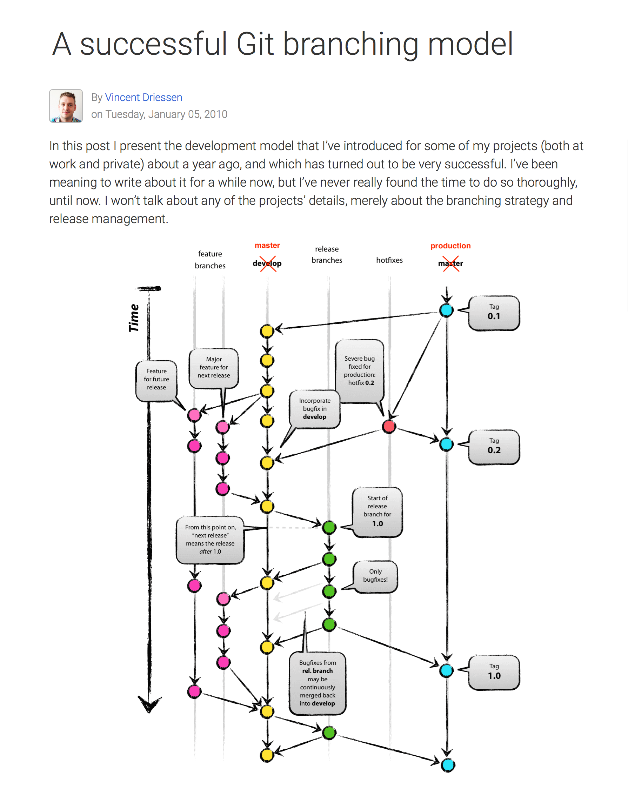

- Tiene origen en un artículo de Vicent Driessen: [A successful Git branching model](http://nvie.com/posts/a-successful-git-branching-model/).
- Igual que el flujo de trabajo de ramas de versiones, es útil cuando
  queremos crear ramas de versiones en las que probar y solucionar
  últimos bugs antes de lanzar una nueva versión.
- No se mantienen múltiples ramas de versiones independientes; sólo
  hay una única versión en producción, como sucede con una aplicación web. Las versiones
  anteriores se mantienen con tags.
- Dos ramas de largo recorrido: 
   - `master` (`develop` en la versión original del artículo), donde
     está la versión más reciente del producto, con _features_ todavía
     no subidas a producción.
   - `production` (`master` en la versión original del artículo),
     donde están las versiones lanzadas en producción.
- Ramas de corto recorrido:
   - Las ramas de _feature_, ramas de _hotfix_ (`hotfix-*`) y ramas de _release_ (`release-*`).
   - En nuestra versión del flujo las integraremos en `master` y
     `production` usando pull requests en GitHub.

<!-- Tres líneas en blanco para la siguiente transparencia -->


## Las ramas principales ##
<!-- .slide: class="image-right" -->

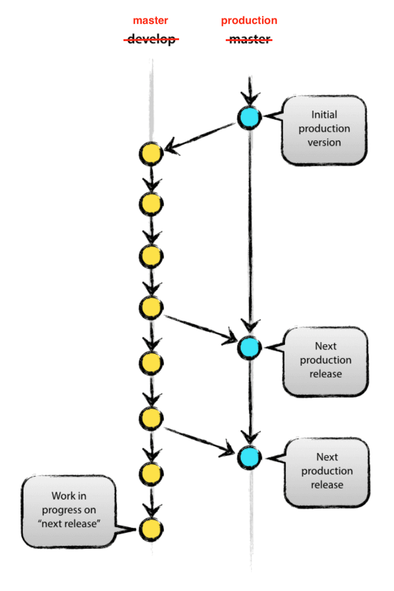

- Las ramas principales de GitFlow son `master` (`develop` en el
  artículo original) y `production` (`master` en el artículo
  original).
- En la rama `production` se encuentra la última versión lista para
  producción.
- En la rama `master` se encuentran los últimos cambios de desarrollo
  listos para integrar en el próximo release. Es la rama en la que se
  realiza diariamente la integración continua.
- Cuando el código fuente en la rama de `master` alcanza un punto
  estable y está listo para ser lanzado, todos los cambios deberían
  mezclarse en `production` y etiquetarse con un número de release.
  
<!-- Tres líneas en blanco para la siguiente transparencia -->


## Ramas de feature ##
<!-- .slide: class="image-right" -->

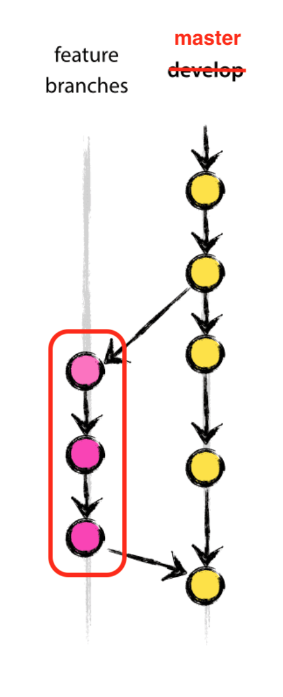

- Salen de `master` y se mezclan en `master`.
- Convención de nombre: cualquier nombre, excepto `master`,
  `production`, `release-*` o `hotfix-*`.
- Se usan para desarrollar nuevas funcionalidades del producto que se
  incluirán en futuros _releases_, integrándose en `master` o se
  descartarán si se tratan de experimentos fallidos.

<!-- Tres líneas en blanco para la siguiente transparencia -->


## Ramas de release ##
<!-- .slide: class="image-right" -->

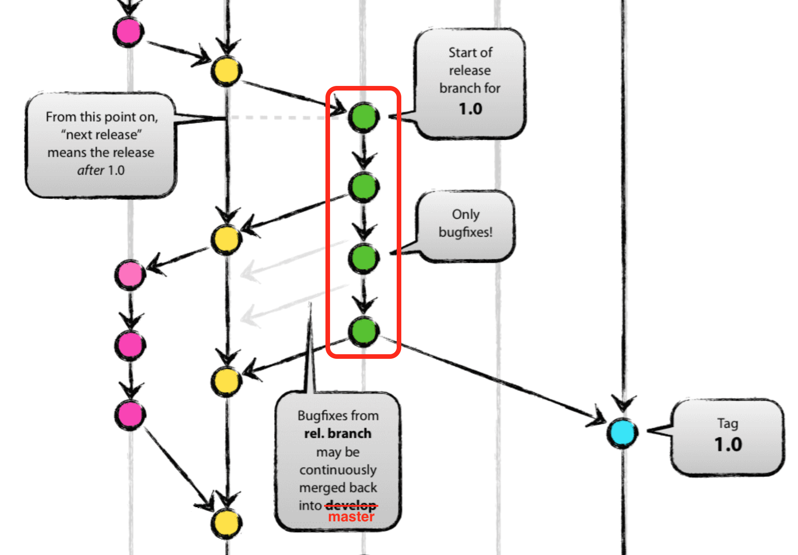

- Salen de `master` y se mezclan en `production` y en `master`.
- Convención de nombre: `release-*`.
- Se usan para la preparación de un nuevo _release_ en
  producción. Permiten corregir bugs de última hora y preparar los
  cambios del número de versión, fecha de release, etc. en una rama
  separada de `master`.
- El momento de abrir la rama es cuando ya se han introducido en
  `master` todas las _features_ que se habían planeado para la nueva
  versión. Las _features_ para futuros releases no se han
  integrado. En la rama de release también pueden desactivarse
  _features_ que en una decisión de última hora decidimos no
  introducir en la release.
- La integración de la rama de _release_ en `production` suele
  conllevar algún conflicto que se arregla fácilmente (por ejemplo, en
  los números de versión).
- La rama de _release_ se mezcla también en `master` y, si es
  necesario, se revierte algún commit (por ejemplo, los de
  desactivación de alguna _feature_).
- Por último, aumentamos el número menor de versión en `master` y
  dejamos la rama preparada para el próximo _release_.


<!-- Tres líneas en blanco para la siguiente transparencia -->


## Ramas de hotfix ##
<!-- .slide: class="image-right" -->

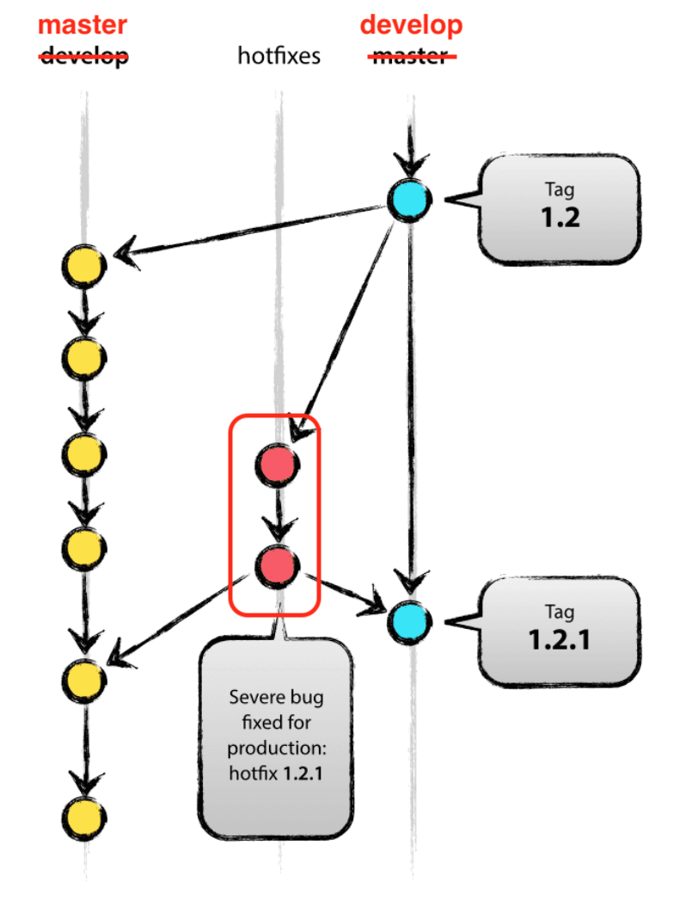

- Salen de `production` y se mezclan en `production` y `master`.
- Convención de nombre: `hotfix-*`.
- Se usan para corregir un error urgente encontrado en producción, que no
  puede esperar su solución hasta el próximo _release_. Si el error no
  es urgente, abriríamos una rama de _feature_ para solucionarlo y
  entregarlo corregido en el siguiente _release_.
- Tras la integración en `production` se incrementa el número de
  _patch_ de la versión.
- También se integra con `master` para incorporar la solución del
  error al próximo _release_.

<!-- Tres líneas en blanco para la siguiente transparencia -->


## ¡Hora de aventuras! ##


<!-- Tres líneas en blanco para la siguiente transparencia -->


## Creamos repositorio para probar GitFlow ##
<!-- .slide: data-background="#cbe0fc"-->

- Vamos a realizar un ejercicio en el que probaremos el ciclo de
  trabajo completo de GitFlow.
- En GitHub cada equipo crea un nuevo repositorio `curso-git-repo3` y
  añade como colaboradores a todos los miembros del equipo.
- Publicamos en ese repositorio el proyecto en el que estamos
  trabajando. Vamos a publicarlo tal y como está en la actualidad, sin
  la historia previa, en la rama `master`.
- Para ello se borra la carpeta `.git` y se inicializa de nuevo:


```txt
$ cd web-ejemplo
$ rm -rf .git
$ git init
```

- Vamos a empezar por la versión `1.1.0`. Ponemos esa versión en el pie de página
  en `index.html`:
  
```txt
# Modificamos el pie de página en 'index.html' para que la versión sea la '1.1.0'
$ git add .
$ git remote add origin https://github.com/domingogallardo/curso-git-repo3.git
$ git push -u origin master
```

- El resto de miembros del equipo se descarga el repositorio:

```txt
$ git clone https://github.com/domingogallardo/curso-git-repo3.git
$ cd curso-git-repo3
```

<!-- Tres líneas en blanco para la siguiente transparencia -->


## Creamos rama 'production' ##
<!-- .slide: data-background="#cbe0fc"-->
<!-- .slide: class="image-right" -->

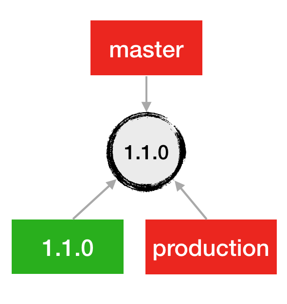

- Creamos la rama `production` en la que etiquetamos la versión
  `1.1.0` y subimos todo al repositorio remoto:

```txt
$ git checkout -b production
$ git tag 1.1.0
$ git push -u origin production
$ git push --tags
```

<!-- Tres líneas en blanco para la siguiente transparencia -->


## Bloqueamos las ramas en GitHub ##
<!-- .slide: data-background="#cbe0fc"-->

- Bloqueamos las ramas en el repositorio remoto con la opción
  **Settings** > **Branches** > **Protected Branches** > **Protect
  this branch** > **Require pull request reviews before merging** 

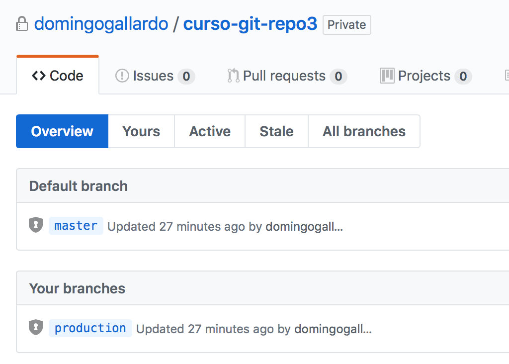

<!-- Tres líneas en blanco para la siguiente transparencia -->


## Cambiamos la versión en 'master' ##
<!-- .slide: data-background="#cbe0fc"-->

- Hacemos un commit en `master` (sin pull request) en el que cambiamos
  la versión de la página web a `1.2.0-SNAPSHOT`:
  
```txt
$ git checkout master
# Cambiamos la versión en master a 1.2.0-SNAPSHOT
$ git commit -am "Cambiada versión a 1.2.0-SNAPSHOT"
$ git push
```

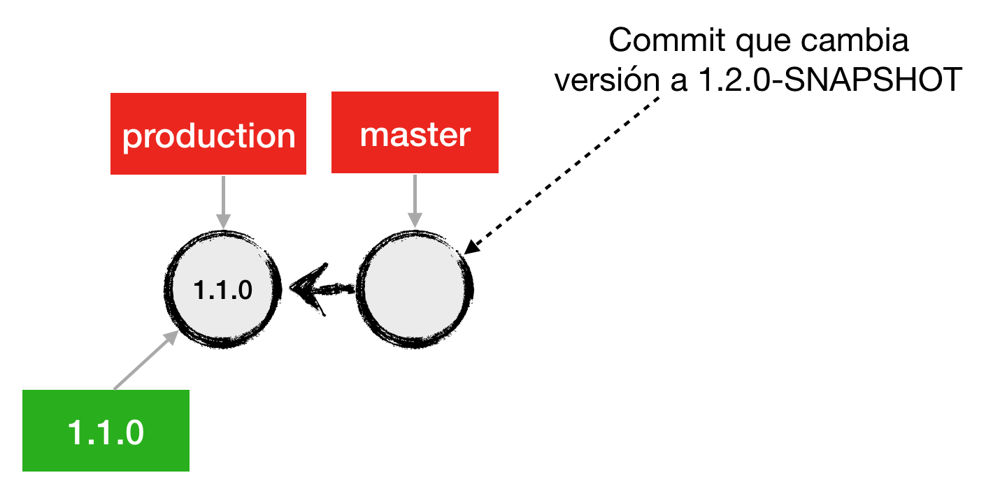

<!-- Tres líneas en blanco para la siguiente transparencia -->


## Creamos dos features en master ##
<!-- .slide: data-background="#cbe0fc"-->

- Creamos dos ramas de _feature_ en `master`: `imagenes-en-paginas` y `juego-javascript`.
- En la primera _feature_ se debe hacer que las imágenes de los pájaros
  enlacen cada una a una página con la imagen del pájaro a tamaño
  completo (de la misma forma que en la web original).
- En la segunda _feature_ se debe modificar el enlace `Equipo` de la
  cabecera por un enlace llamado `Juego` que lleve a una página nueva
  con el [juego JavaScript](https://github.com/domingogallardo2/curso-git-repo3/blob/master/adivina.html) de adivinar un número entre 1 y 100.

```txt
$ git checkout -b <feature> master
$ git push -u origin <feature>
# Se añaden commits en la rama de feature
$ git push
```

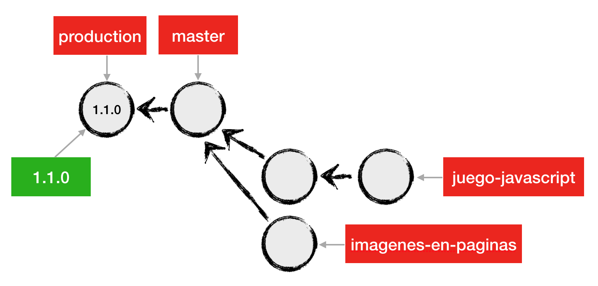

<!-- Tres líneas en blanco para la siguiente transparencia -->


## Integramos una feature en master ##
<!-- .slide: data-background="#cbe0fc"-->
<!-- .slide: class="image-right" -->

- **Abrimos un pull request** con una de las features. Uno de los miembros
  del equipo comprueba que la integración con `master` funciona correctamente:
  
```txt
$ git checkout master
$ git fetch
$ git merge origin/<feature>
```

- Si todo está correcto **se aprueba el pull request**, los miembros del
  equipo actualizan `master` y borran la rama de feature local:

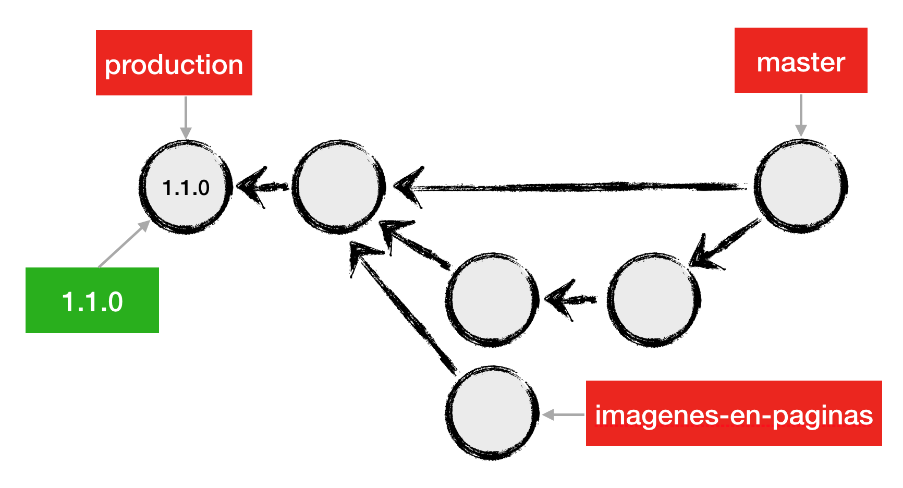

```txt
$ git checkout master
$ git reset --hard origin/master
$ git pull
$ git branch -d <feature>
$ git remote prune origin
```

<!-- Tres líneas en blanco para la siguiente transparencia -->


## Abrimos una rama hotfix en production ##
<!-- .slide: data-background="#cbe0fc"-->
<!-- .slide: class="image-right" -->

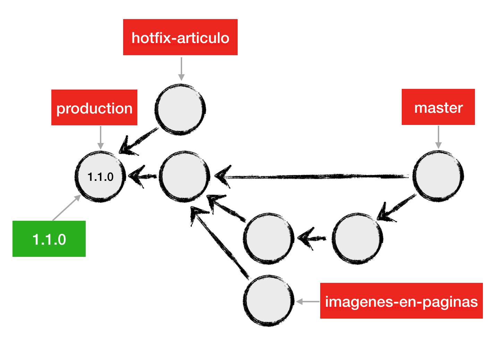

- Abrimos una rama de hotfix en `production`

```txt
$ git checkout hotfix-articulo production
# Modificamos el texto en 'index.html'
$ git commit -am "Arreglado párrafo"
```

- La subimos a GitHub y creamos un pull request de la rama **`hotfix`** en **`production`**.

```txt
$ git push -u origin hotfix-articulo
```

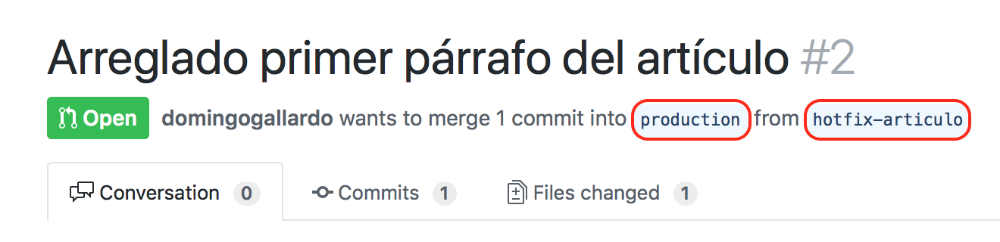


<!-- Tres líneas en blanco para la siguiente transparencia -->


## Integramos el hotfix en production ##
<!-- .slide: data-background="#cbe0fc"-->
<!-- .slide: class="image-right" -->

- Integramos el pull request en la rama `production` **sin borrar la
  rama `hotfix-articulo`**.

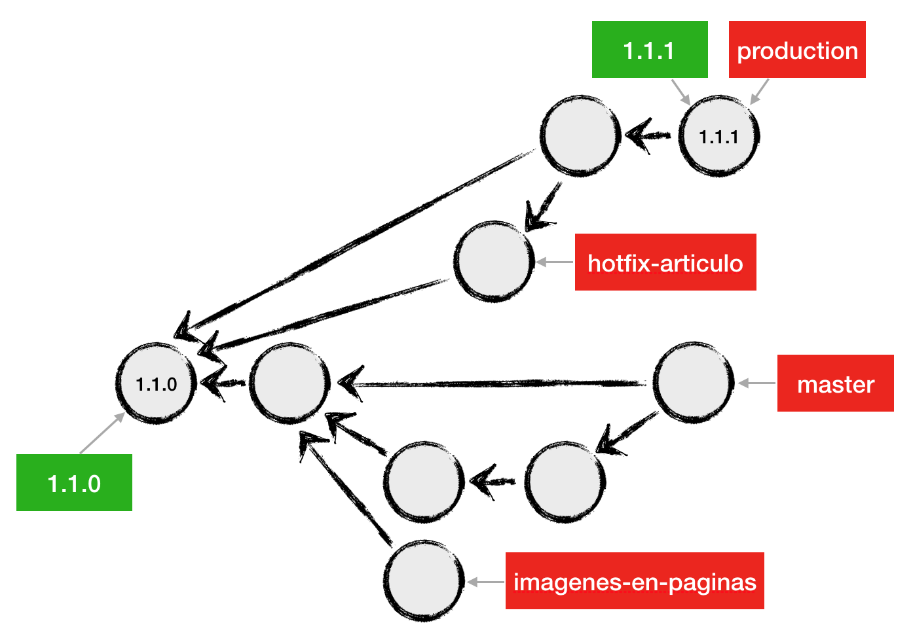

- Actualizamos `production` y hacemos un commit avanzando el número de
  versión a `1.1.1`:

```txt
$ git checkout production
$ git pull
# Actualizamos número versión a 1.1.1
$ git commit -am "Versión 1.1.1"
$ git push
$ git tag 1.1.1
$ git push --tags
```

<!-- Tres líneas en blanco para la siguiente transparencia -->


## Integramos el hotfix en master ##
<!-- .slide: data-background="#cbe0fc"-->
<!-- .slide: class="image-right" -->

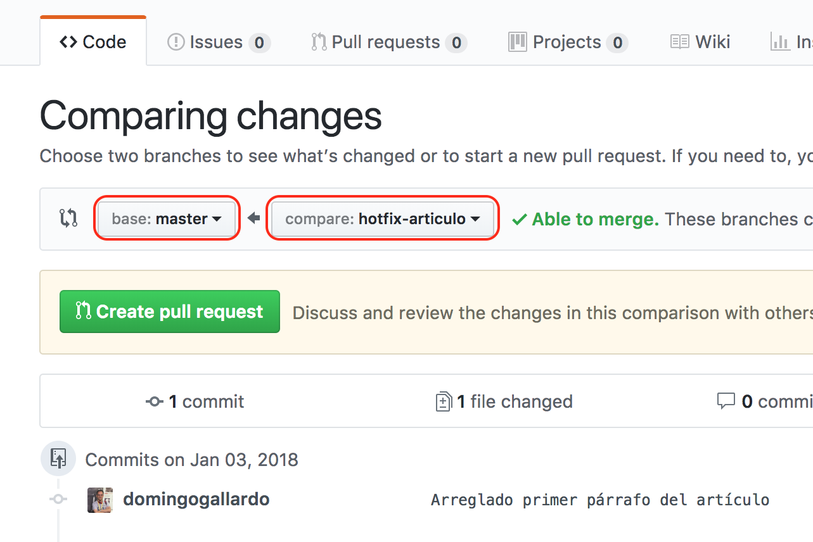

- Creamos un nuevo pull request de la rama `hotfix` contra `master`,
  pinchando en **`Pull requests`** > **`New pull request`**.

- Alguien comprueba que todo funciona bien:

```txt
$ git checkout master
$ git fetch
$ git merge origin/hotfix-articulo
```

- Mezclamos el pull request y borramos la rama en GitHub. Descargamos
  la actualización de `master` y limpiamos la rama local:
  
```txt
$ git reset --hard origin/master
$ git branch -d hotfix-articulo
$ git remote prune origin
```

<!-- Tres líneas en blanco para la siguiente transparencia -->


## Grafo de commits hasta ahora ##
<!-- .slide: data-background="#cbe0fc"-->

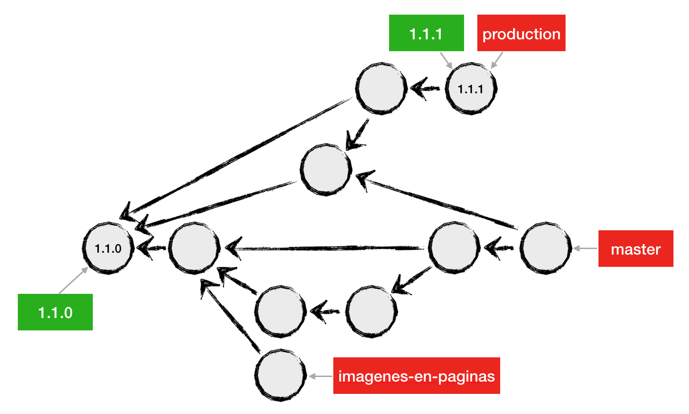

- <!-- .element: class="fragment" --> En `master` se ha incorporado una nueva _feature_ y un _hotfix_. 
- <!-- .element: class="fragment" --> En `production` se ha incorporado un _hotfix_ y se ha avanzado el
  número de versión de _patch_. 
- <!-- .element: class="fragment" --> Una _feature_ todavía está abierta.


<!-- Tres líneas en blanco para la siguiente transparencia -->


## Creamos una rama de release ##
<!-- .slide: data-background="#cbe0fc"-->

```txt
$ git checkout -b release-1.2 master
# Cambiamos el número de versión en 'index.html' a 1.2.0
$ git commit -am "Actualizado a versión 1.2.0"
$ git push -u origin release-1.2
# Ponemos en negrita el enlace 'Juego' en la cabecera de la web
$ git commit -am "Enlace 'Juego' en negrita"
$ git push
```

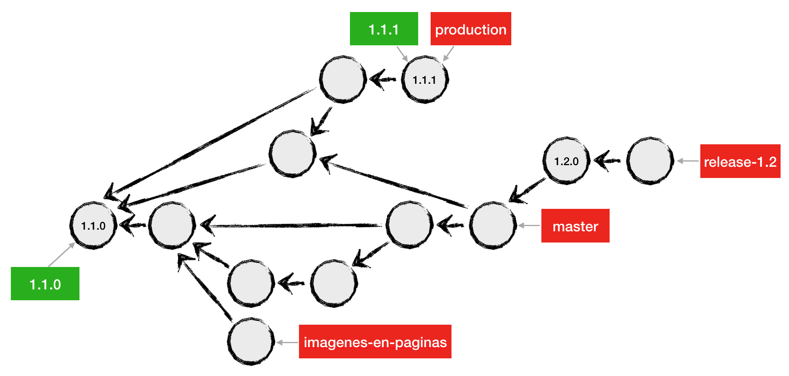

<!-- Tres líneas en blanco para la siguiente transparencia -->


## Pull request de la rama de release ##
<!-- .slide: data-background="#cbe0fc"-->
<!-- .slide: class="image-right" -->

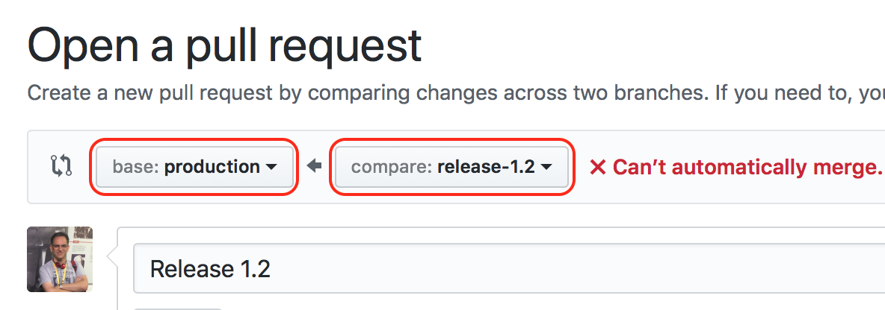

- Creamos un pull request de la rama de _release_ sobre `production`. 

- La misma persona que crea el pull request soluciona el conflicto del
  número de versión:

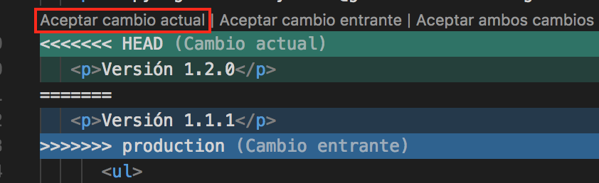


```txt
$ git checkout release-1.2
$ git merge production
# Arreglamos el cambio de versión, aceptando la 1.2.0
$ git add index.html
$ git commit -am "Solución conflicto número de versión"
$ git push
```

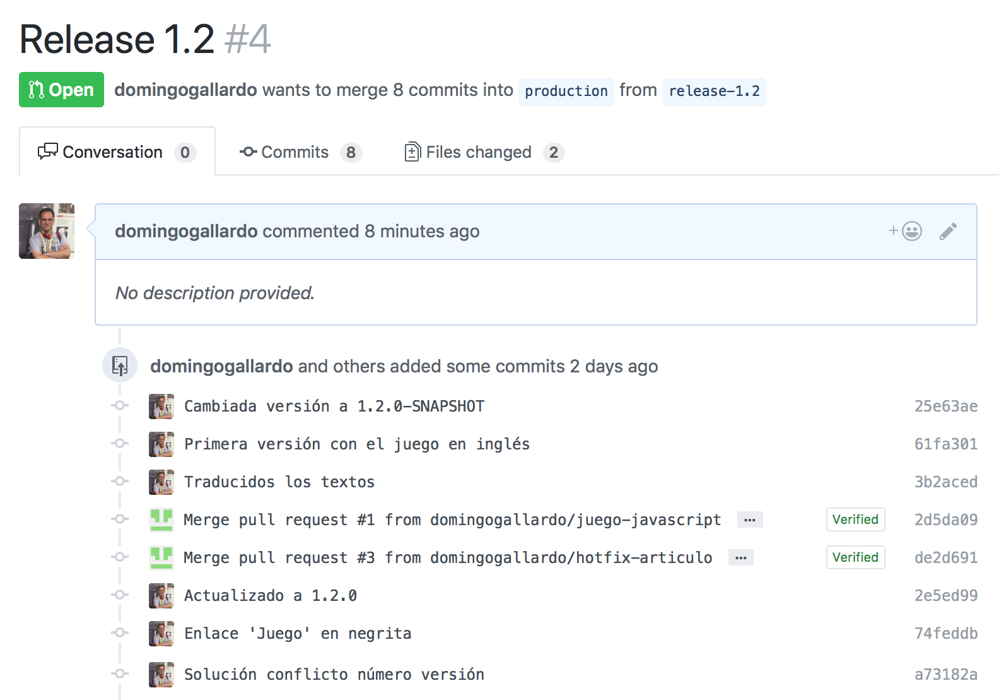

- En la página del pull request podemos ver todos los commits de la
  nueva versión. 

<!-- Tres líneas en blanco para la siguiente transparencia -->


## Integración del pull request ##
<!-- .slide: data-background="#cbe0fc"-->
<!-- .slide: class="image-right" -->

- El revisor del pull request comprueba en sus ramas locales que la
  rama de release se integra correctamente:
  
```txt
$ git checkout production
$ git pull
$ git merge origin/release-1.2
# Carga el 'index.html' en el navegador y comprueba todo OK
```

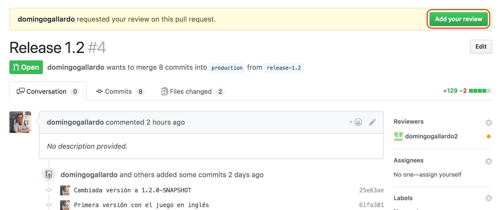

- El revisor acepta el pull request (sin borrar la rama de release) y actualiza la rama local
  `production` y añade la etiqueta de versión:
  
```txt
$ git reset --hard origin/production
$ git pull
$ git tag 1.2.0
$ git push --tags
```


<!-- Tres líneas en blanco para la siguiente transparencia -->


## Integración de la rama de release en master ##
<!-- .slide: data-background="#cbe0fc"-->
<!-- .slide: class="image-right" -->

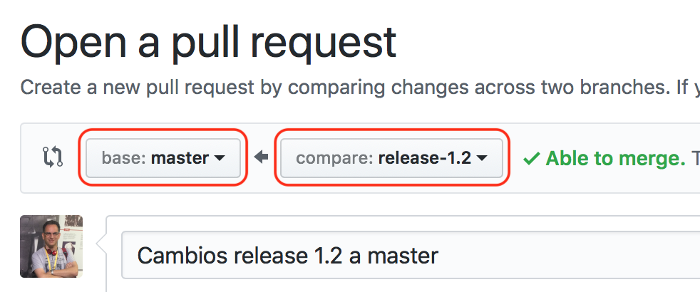

- Para terminar el _release_ tenemos que integrar la rama de `release-1.2`
en `master`.

- Abrimos un nuevo pull request de la rama `release-1.2` sobre `master`.
- Se revisa y se aprueba, borrando la rama `release-1.2`.

```txt
$ git checkout master
$ git fetch
$ git merge origin/release-1.2 
# Comprobamos 'index.html' y aprobamos el pull request
```

- Y actualizamos las ramas locales:

```txt
$ git checkout master
$ git reset --hard origin/master
$ git pull
$ git branch -d release-1.2
$ git remote prune origin
```

- Y ponemos nueva versión en `master` (basta con un commit, no hace falta un
  nuevo pull request):
  
```txt
# Cambiamos el número de versión en 'index.html' a 1.3.0-SNAPSHOT
$ git commit -am "Actualizado a versión 1.3.0-SNAPSHOT"
$ git push
```


<!-- Tres líneas en blanco para la siguiente transparencia -->


## Grafo de commits hasta ahora ##
<!-- .slide: data-background="#cbe0fc"-->

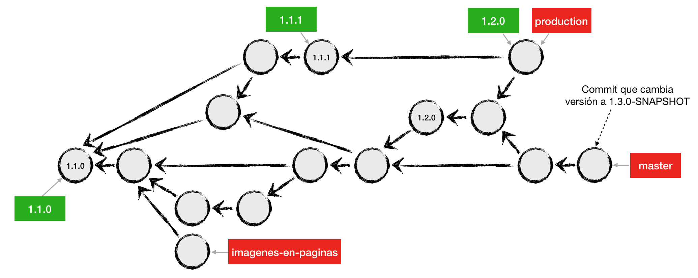

<!-- Tres líneas en blanco para la siguiente transparencia -->


## Integramos nueva feature ##
<!-- .slide: data-background="#cbe0fc"-->

- Por último terminamos la feature que quedaba:
  
```txt
$ git checkout <feature>
# Terminamos la implementación
$ git commit -am <mensaje>
$ git push
```

- Abrimos un nuevo pull request en GitHub, el responsable de revisarlo
  lo prueba y lo integra (borrando la rama), y todo el equipo
  actualiza `master` y borra la rama local:
  
```txt
$ git checkout master
$ git pull
$ git branch -d <feature>
$ git remote prune origin
```

<!-- Tres líneas en blanco para la siguiente transparencia -->


## Grafo final del flujo GitFlow##
<!-- .slide: data-background="#cbe0fc"-->

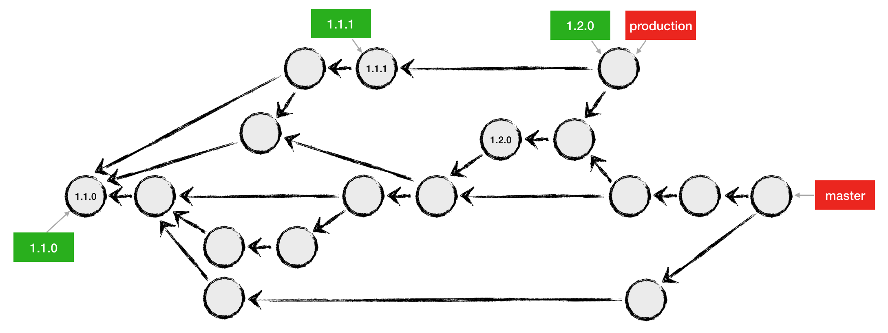


<!-- Tres líneas en blanco para la siguiente transparencia -->


## ¡Buen trabajo! ##


<!-- Tres líneas en blanco para la siguiente transparencia -->


## GitFlow es solo una propuesta ##

- Existen scripts que incorporan GitFlow en forma de comandos de shell
  que llaman a su vez a comandos más básicos de Git. **No es
  recomendable usar estos scripts** porque perdemos la flexibilidad de
  adaptar el flujo a nuestras necesidades.
- Una de las críticas más comunes a GitFlow es que el hecho de usar dos
  ramas desincentiva que el código esté continuamente listo para el
  despliegue en la rama principal.
- [OneFlow](http://endoflineblog.com/oneflow-a-git-branching-model-and-workflow)
  es una **alternativa interesante a GitFlow** en la que:
   1. Se elimina la rama de `production` pero se mantienen ramas de
      _release_ y de _hotfix_, aunque sacándolas e integrándolas en
      `master`.
   2. La integración de las ramas de _release_ se hacen compactando
      todo el desarrollo en un único commit mediante un `rebase -i`
      (o usando la opción de GitHub).
- El flujo de trabajo debe adaptarse a la **gestión de los releases**
  definida por el equipo. ¿El proceso de release hace recomendable
  crear una rama propia en la que consolidar el código? ¿El código en
  `master` y es lo suficientemente estable como para desplegar a
  partir de ahí?.
- Existen casi tantos flujos de trabajo como equipos de
  desarrollo. Por ejemplo, en StackOverflow podemos encontrar casi
  1000 resultados sobre Git [flujos de trabajo en
  Git](https://stackoverflow.com/search?q=%22git+workflow%22).

<!-- Tres líneas en blanco para la siguiente transparencia -->


## Entrega continua con ramas de features  ##

- Una interesante alternativa a GitFlow es la que utilizan empresas
  como GitHub, en la que la que se mantiene una única rama de
  desarrollo y el software está continuamente listo para desplegar.
- Scott Chacon, uno de los fundadores de GitHub, explica en el artículo
  [GitHub Flow](http://scottchacon.com/2011/08/31/github-flow.html)
  las seis importantes reglas de este proceso de desarrollo:

   1. La rama `master` puede ser desplegable en todo momento.
   2. Para desarrollar cualquier cosa nueva, crear a partir de
    `master` una rama con un nombre descriptivo (por ejemplo:
    `parser-linea-comando`).
   3. Realiza commits regularmente en la rama local y sube los
    commits a la rama remota con el mismo nombre en el servidor.
   4. Cuando necesites feedback o ayuda, o cuando la rama esté lista
    para mezclar, abre un pull request.
   5. Cuando alguien haya revisado la nueva _feature_, puedes
    mezclarlo en `master`.
   6. Una vez que está mezclado en `master` puedes y deberías
    desplegar inmediatamente.

- Los puntos 1 y 6 son la base de lo que se denomina entrega continua (_continuous
  delivery_). Las empresas que lo usan realizan despliegues
  continuamente, incluso varios al día.
- En España es remarcable el ejemplo de [CartoDB](). Se puede encontrar
  más información en la charla de [Juan Ignacio Sánchez](https://twitter.com/juanignaciosl), [Continuos
  Integration at CartoDB](https://juanignaciosl.github.io/cartodb/2016/04/01/continuous-integration-at-cartodb.html).

<!-- Tres líneas en blanco para la siguiente transparencia -->


## Revisión de código ##

- Un principio fundamental del desarrollo en equipo es la propiedad
  colectiva del código: el código es del equipo, no de la persona que
  lo escribe.
- La revisión de código es una práctica fundamental de este principio.
- Hemos visto cómo realizar revisiones de código en GitHub. Existen
  también herramientas alternativas que nos permiten realizar
  revisiones de código sin necesitar un servicio externo:
  [Crucible](https://www.atlassian.com/software/crucible) de
  Atlassian, [Upsource](https://www.jetbrains.com/upsource/) de
  JetBrains o una herramienta open source como
  [Gerrit](https://gerritcodereview-test.gsrc.io/index.html). 

<!-- Tres líneas en blanco para la siguiente transparencia -->


## ¿Cuál es vuestro proceso de release? ##


<!-- Tres líneas en blanco para la siguiente transparencia -->


## ¡Integración continua! ##


<!-- Tres líneas en blanco para la siguiente transparencia -->


## Servidor de integración continua ##

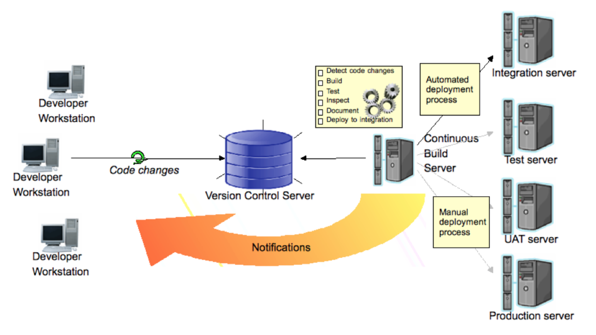

- Un servidor de integración continua realiza una **compilación
  (_build_) automática del repositorio**, lanza todos los tests e
  informa al equipo si no se pasan.
- La compilación se suele realizar cada vez que alguien realiza un
commit en una rama determinada, como `master`.
- También se puede configurar el servidor de integración para que
realiza el `merge` de la rama solicitada y lance los tests en el
proyecto resultante después de la mezcla.

<!-- Tres líneas en blanco para la siguiente transparencia -->


## Jenkins ##
<!-- .slide: class="image-right" -->


- Uno de los servidores de integración continua más usados es
  [Jenkins](https://jenkins.io). 
- Es muy flexible, y está mantenido por una empresa y comunidad muy
  activa, con multitud de plugins y novedades muy interesantes como
  las tuberías declarativas (_declarative pipeline_) en donde se
  definen los _jobs_ a realizar mediante un lenguaje de dominio.

```txt
pipeline {
    agent any 

    stages {
        stage('Build') { 
            steps { 
                sh 'make' 
            }
        }
        stage('Test'){
            steps {
                sh 'make check'
                junit 'reports/**/*.xml' 
            }
        }
        stage('Deploy') {
            steps {
                sh 'make publish'
            }
        }
    }
}
```

<!-- Tres líneas en blanco para la siguiente transparencia -->


## Travis ##
<!-- .slide: class="image-right" -->


- [Travis](https://travis-ci.org) es un servicio de integración
  continua que tiene una completa integración con GitHub.
- Permite realizar _builds_ automáticamente cuando se suben nuevos
  commits o se abren pull requests en GitHub.
- Las acciones a realizar se definen en el fichero de configuración `.travis.yml`

<!-- Tres líneas en blanco para la siguiente transparencia -->


## Volvemos a trabajar individualmente ##
<!-- .slide: data-background="#cbe0fc"-->

- Vamos a volver a trabajar con repositorios remotos individuales.
- Los miembros de los equipos que no tengan el repositorio remoto
  `curso-git-repo3` deben crearlo.
- Sí que tenemos el repositorio local, pero está conectado al
  repositorio remoto del equipo. Tenemos que cambiar la URL de
  `origin`:
  
```txt
$ git remote set-url origin <URL-curso-git-repo3>
```

- Subimos al repositorio la rama `master`:

```txt
$ git push -u origin master
```

<!-- Tres líneas en blanco para la siguiente transparencia -->


## Configuración de Travis ##
<!-- .slide: data-background="#cbe0fc"-->
<!-- .slide: class="image-right" -->

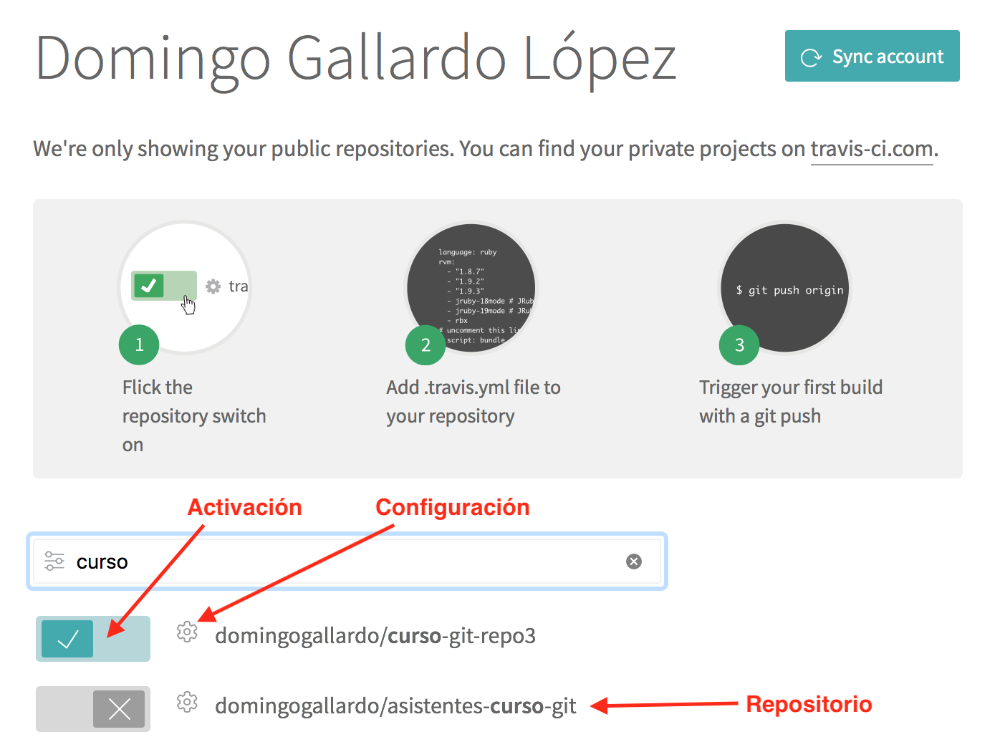

- Nos damos de alta en [Travis](https://travis-ci.org/) usando nuestra cuenta de GitHub.
- Después de unos segundos (puede que tengamos que recargar la página)
  aparecerá la página principal en la que se muestran todos tus
  repositorios en GitHub.
- En la página de configuración del repositorio puedes definir
  características básicas de la ejecución de los _builds_:
   - Si lanzar _builds_ en las actualizaciones de las ramas (lo
     dejamos activado).
   - Si lanzar _builds_ en los pull requests (lo dejamos también activado).
   - Variables de entorno necesarias para la ejecución de los builds
     (por ejemplo, contraseñas de administración de base de datos u
     otras contraseñas que no deben estar en el repositorio).
- Activamos el repositorio `curso-git-repo3`.


<!-- Tres líneas en blanco para la siguiente transparencia -->


## Rama de feature: integración con travis ##
<!-- .slide: data-background="#cbe0fc"-->

- Abrimos desde `master` una rama de _feature_ llamada
  `integracion-travis` y la subimos a GitHub:
  
```txt
$ git checkout -b integracion-travis
$ git push -u origin integracion-travis
```


<!-- Tres líneas en blanco para la siguiente transparencia -->


## Programa C para probar la compilación en Travis ##
<!-- .slide: data-background="#cbe0fc"-->

- Para poder comprobar la compilación que realiza Travis vamos a usar
un ejemplo muy simplificado, en el que ni siquiera utilizamos
tests. Sólo el típico programa _Hola mundo_ en C. 

- Creamos el fichero **`main.c`**:

```c
#include <stdio.h>

int main() 
{
    printf("Hello World!");
}
```

- Y el fichero **`makefile`**:

```makefile
hellomake: main.c
	mkdir -p bin
	gcc -o bin/hellomake main.c -I.
```

- Modificamos el fichero **`.gitignore`**, para que se ignore el
  directorio `bin`:

```txt
.DS_Store
bin
```

<!-- Tres líneas en blanco para la siguiente transparencia -->


## Probamos la compilación  ##
<!-- .slide: data-background="#cbe0fc"-->

- Compilamos en local para comprobar que funciona correctamente:

```txt
$ make
mkdir -p bin
gcc -o bin/hellomake main.c -I.
$ bin/hellomake 
Hello World!
```

- Y subimos todo a la rama de GitHub:

```txt
$ git add .
$ git commit -m "Añadido programa Hello World"
$ git push
```

<!-- Tres líneas en blanco para la siguiente transparencia -->


## Configuración de Travis ##
<!-- .slide: data-background="#cbe0fc"-->

- Añadimos el fichero **.travis.yml**:

```txt
language: C
script: make
branches:
  only:
  - master
```

- En el fichero especificamos el lenguaje de nuestro proyecto, el
  comando que debe lanzar el _build_ en Travis y las ramas que Travis
  va a monitorizar.
  
- Añadimos el cambio y lo subimos:

```txt
$ git add .travis.yml
$ git commit -m "Añadido fichero de configuración de Travis"
$ git push
```

- Como hemos especificado que sólo se monitorice la rama `master`,
  Travis no se lanza al subir commits en la rama de
  _feature_.
  

<!-- Tres líneas en blanco para la siguiente transparencia -->


## Pull request y build en Travis ##
<!-- .slide: data-background="#cbe0fc"-->
<!-- .slide: class="image-right" -->

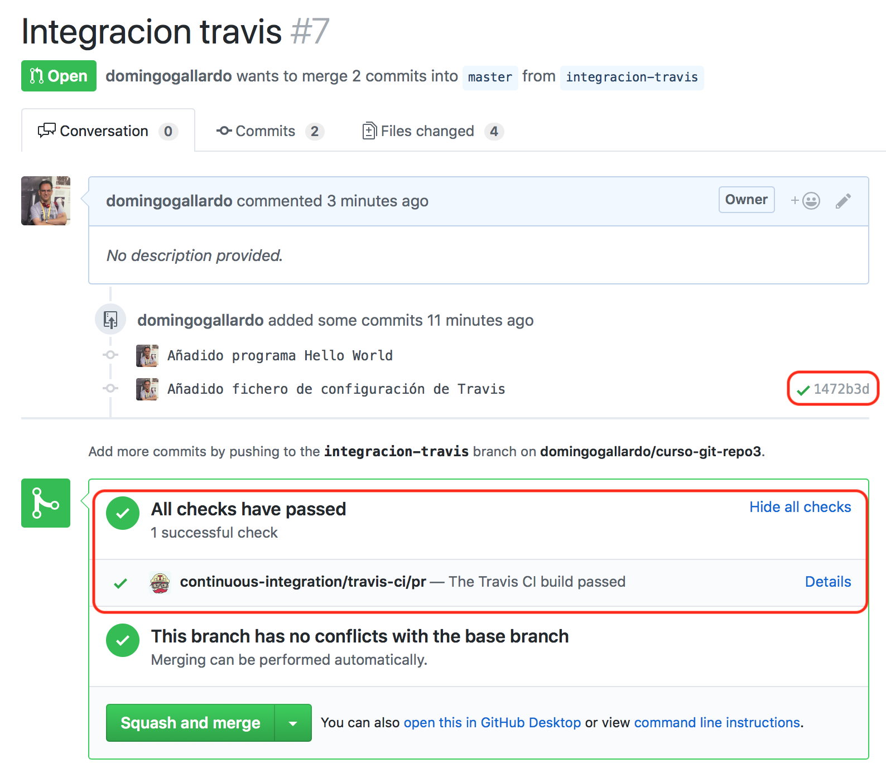

- Para simplificar la integración, eliminamos la restricción de
  revisión en la rama `master`.

- Creamos en GitHub un pull request a partir de la rama
  `integracion-travis` y veremos cómo **se lanza automáticamente un
  build en Travis** y cómo se informa en el pull request del resultado.

- Travis realiza la integración de la rama del pull request en
  `master` y lanza el _build_ en la rama `master` resultante. De esta
  forma es muy sencillo comprobar si la integración pasa todos los
  tests antes de aceptar el pull request.

<!-- Tres líneas en blanco para la siguiente transparencia -->


## Detalles de la compilación en Travis ##
<!-- .slide: data-background="#cbe0fc"-->

- Si entramos en Travis pinchando en el enlace `Details` veremos los
detalles de la compilación. Dejamos esa página abierta en una ventana
para poder consultar futuras compilaciones.

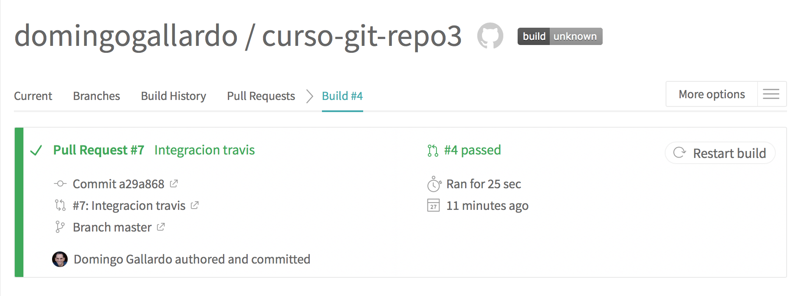

- Pinchamos en las pestañas _Current_, _Branches_, _Build History_ y
  _Pull Requests_ para explorar la información que nos ofrece
  Travis. El servicio guarda la historia de todas las compilaciones realizadas.

<!-- Tres líneas en blanco para la siguiente transparencia -->


## Rompemos el build ##
<!-- .slide: data-background="#cbe0fc"-->
<!-- .slide: class="image-right" -->

- Probamos a romper el build introduciendo un error de compilación en el
  programa `main.c` subiéndolo a la rama.

```diff
#include <stdio.h>

int main() 
{
-    printf("Hello World!");
+    printf("Hello World!")
}
```

```txt
$ git commit -am "Rompemos el build"
$ git push 
```

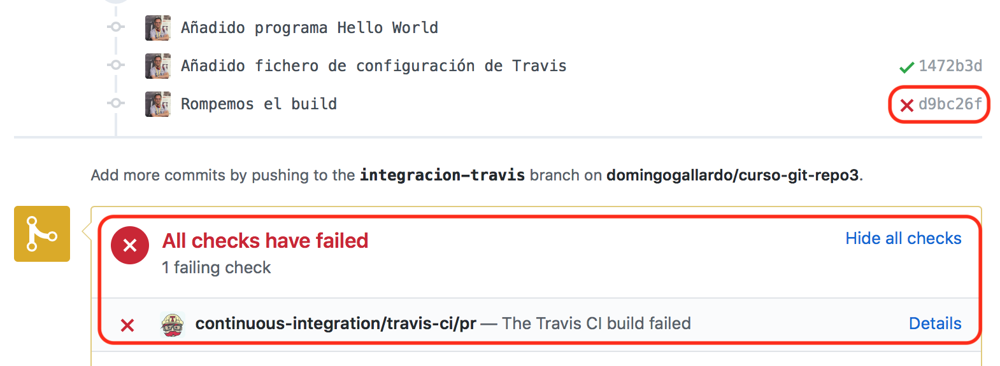

- Recargamos la página del pull request y vemos cómo se muestra que no
se ha completado el build.


<!-- Tres líneas en blanco para la siguiente transparencia -->


## Integramos el pull request  ##
<!-- .slide: data-background="#cbe0fc"-->

- Revertimos el último commit y lo subimos a master:

```
$ git revert HEAD
$ git push
```

- Aceptamos el pull request con la opción _Squash and merge_ y
  borramos la rama.

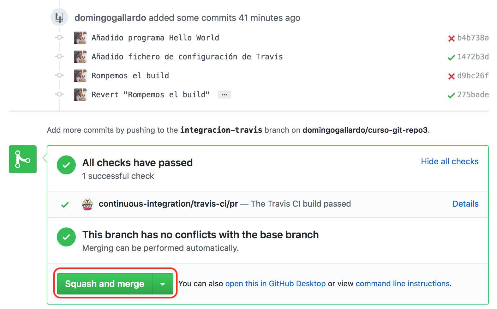

<!-- Tres líneas en blanco para la siguiente transparencia -->


## Ejecución de Travis en la rama master ##
<!-- .slide: data-background="#cbe0fc"-->

- Una vez realizada la integración del pull request, Travis vuelve a
  lanzarse en la rama `master` resultante de la integración. Podemos
  comprobar que el resultado es correcto en la consola de Travis y en
  la historia de commits de la rama `master`.

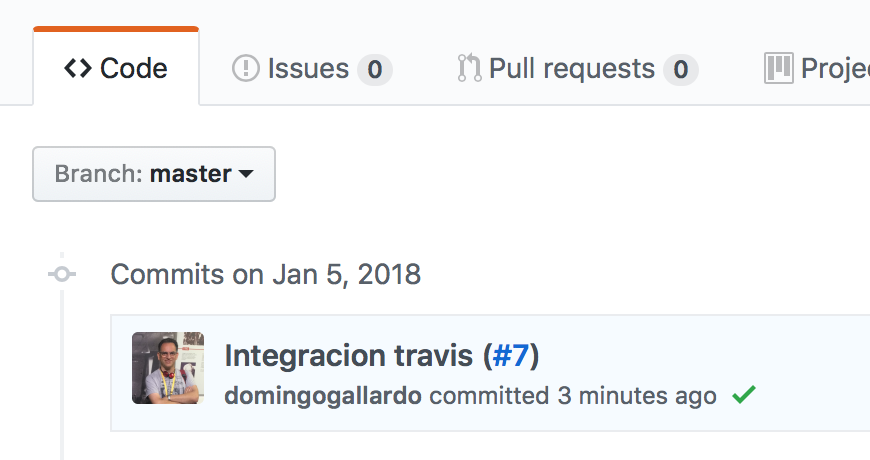
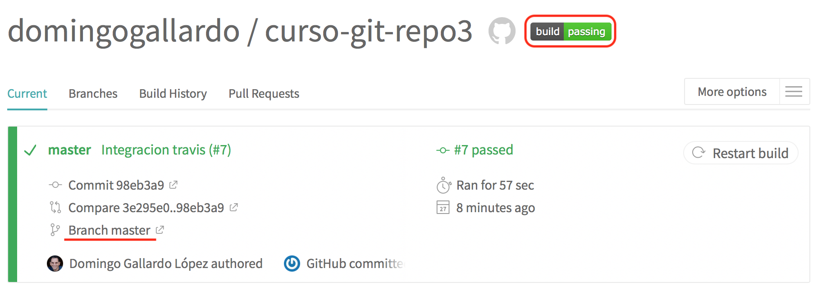

<!-- Tres líneas en blanco para la siguiente transparencia -->


## Esto es sólo la punta del iceberg ##
<!-- .slide: class="image-right" -->
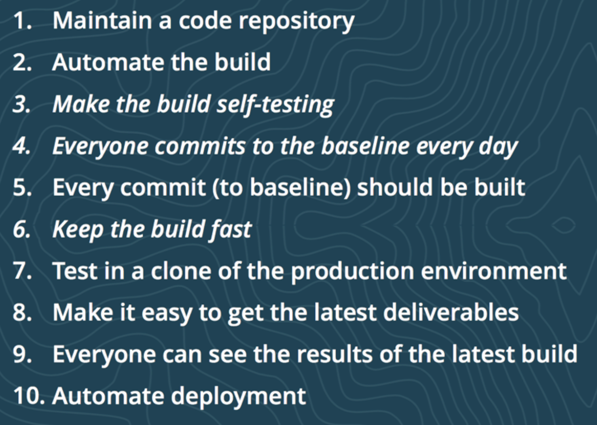

- Sólo hemos arañado la superficie del funcionamiento de Travis y de
  los sistemas de _continuos delivery_.
- Los tests unitarios son fundamentales en el desarrollo de cualquier
  proyecto. Podemos configurar Travis para que los ejecute en
  múltiples lenguajes de programación.
- Travis se puede usar para construir una máquina Docker con la última
  versión del proyecto y publicarla en un repositorio para que el
  equipo de QA lance sobre ella los tests funcionales.
- Travis se puede usar para deplegar en distintos entornos
  (integración o _stage_).
- Podemos ver a la derecha diez consejos de CartoDB sobre integración continua.

<!-- Tres líneas en blanco para la siguiente transparencia -->


## Servicios e instalaciones de Git ##

| Servicio | Precio | Características |
|----------|--------|-----------------|
| [Servidor Git](https://git-scm.com/book/en/v2/Git-on-the-Server-Setting-Up-the-Server) | Gratuito | Acceso a repositorios remotos. Sin pull requests ni otros servicios. |
| [GitHub Team](https://github.com/pricing/team) | $9 por usuario / mes (comenzando en $25 por 5 usuarios) | Cuenta organización. Ilimitados repositorios privados. Permisos de equipo y de usuario. |
| [GitHub Business](https://github.com/pricing/business-hosted) | $21 por usuario / mes | Alojado en GitHub.com. Soporte 24/5 con respuestas en 8 horas. 99.95% Uptime. |
| [GitHub Enterprise](https://github.com/pricing/business-enterprise) | $21 por usuario / mes (min 10 usuarios) | Alojado en servidores de la empresa, AWS, Azure, etc. Soporte 24/7. Múltiples cuentas de organización. |
| [Bitbucket cloud](https://bitbucket.org/product/pricing?tab=host-in-the-cloud) | $2 por usuario / mes (min $10) | Integración con Jira. Repos privados ilimitados. |
| [Bitbucket Server](https://www.atlassian.com/purchase/product/bitbucket) | Hasta 10 usuarios: $10. 10-25 usuarios: $2,000 (ilimitado) | Instalación local. Codigo fuente incluido. |
| [GitLab CE](https://about.gitlab.com/installation/) | Open Source | Instalación manual. Sin soporte. |
| [GitLab Hosted](https://about.gitlab.com/gitlab-com/) | Múltiples planes: gratuito, $4, $19, $99 por usuario / mes | Características dependientes del plan. |
| [GitLab Enterprise Edition](https://about.gitlab.com/products/) | Múltiples planes: gratuito, $39, $199 por usuario / año | Características dependientes del plan. |

<!-- Tres líneas en blanco para la siguiente transparencia -->


## Bibliografía ##

- Libros
   - [Pro Git](https://git-scm.com/book/en/v2) de Scott Chacon and Ben Straub.
   - [Git in Practice](https://www.manning.com/books/git-in-practice) de Mike McQuaid
- Flujos de trabajo
   - [Atlassian - Comparing Workflows](https://www.atlassian.com/git/tutorials/comparing-workflows)
   - [GitFlow](http://nvie.com/posts/a-successful-git-branching-model/)
   - [OneFlow](http://endoflineblog.com/oneflow-a-git-branching-model-and-workflow)
   - [GitHub Flow](http://scottchacon.com/2011/08/31/github-flow.html)
- Chuletas de Git en PDF
   - [GitHub](https://education.github.com/git-cheat-sheet-education.pdf)
   - [Atlassian](https://www.atlassian.com/dam/jcr:8132028b-024f-4b6b-953e-e68fcce0c5fa/atlassian-git-cheatsheet.pdf)
   - [GitLab](https://gitlab.com/gitlab-com/marketing/raw/master/design/print/git-cheatsheet/print-pdf/git-cheatsheet.pdf)

<!-- Tres líneas en blanco para la siguiente transparencia -->


## ¡Esto es todo amigos! ##


